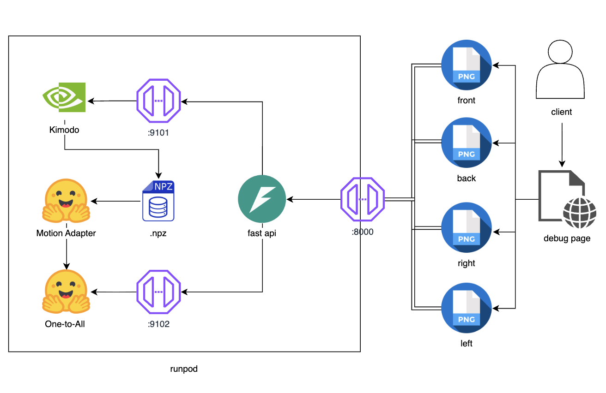
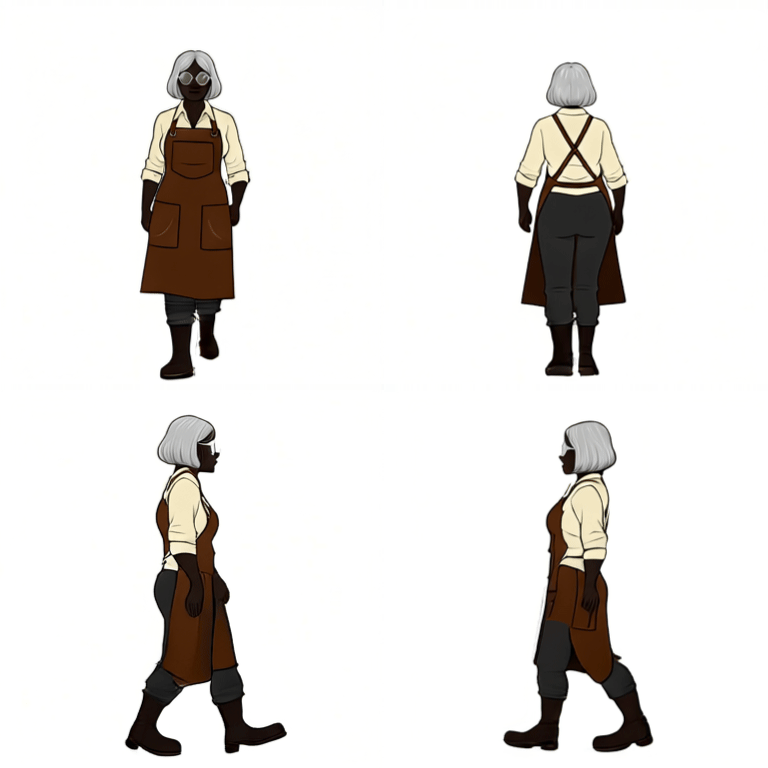
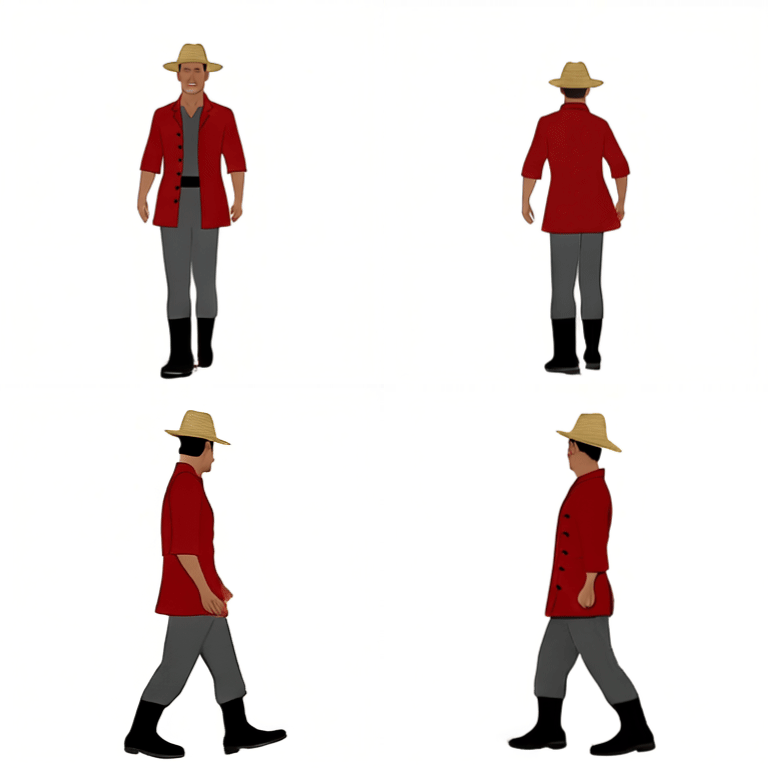
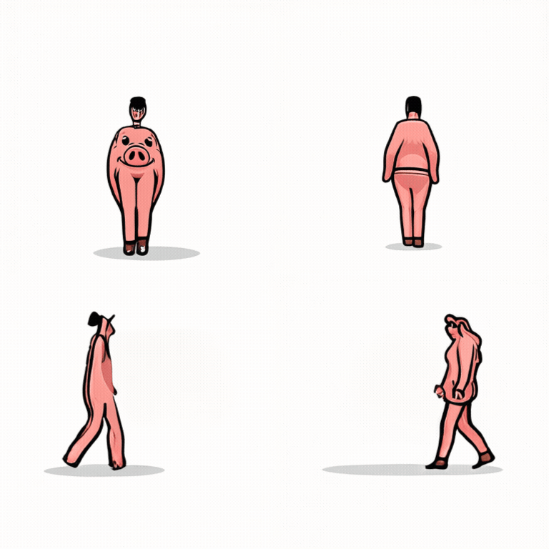
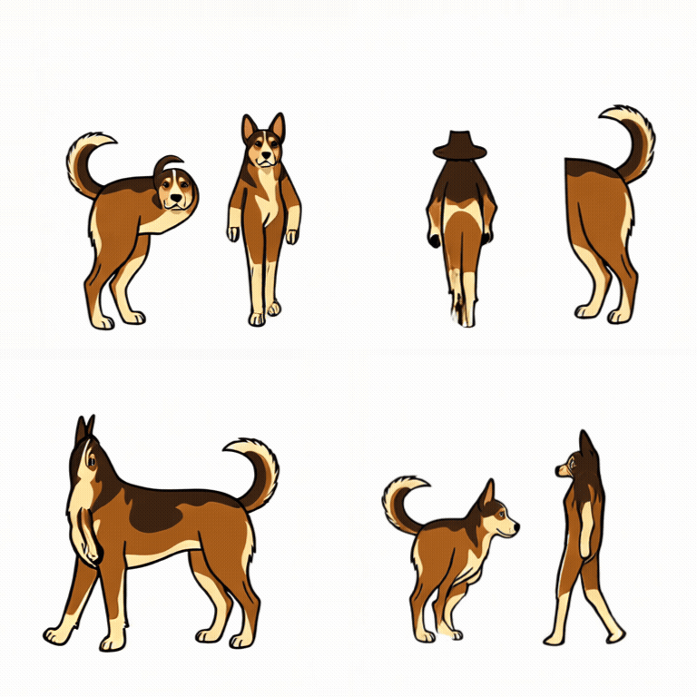
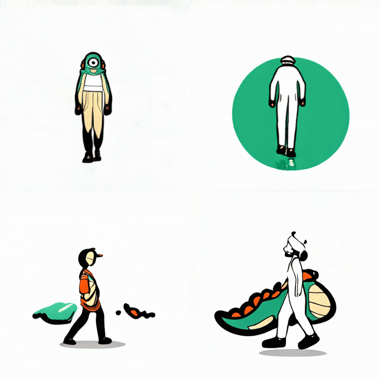
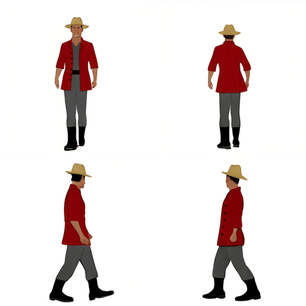
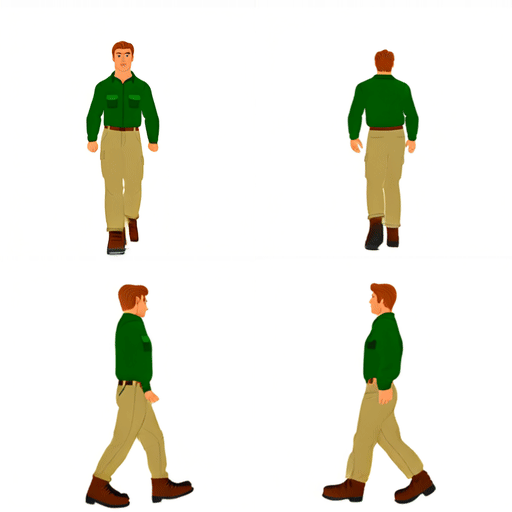
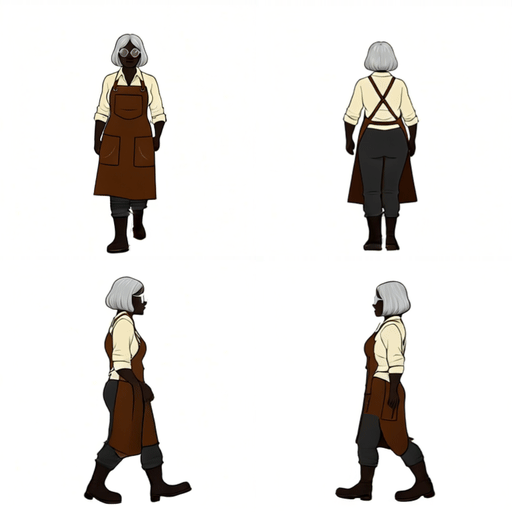

# 2D Assets Generator



- [RunPod Kimodo + One-to-All 4방향 동작 가이드](docs/RUNPOD_KIMODO_ONE_TO_ALL_GUIDE.md)

농장 생활 RPG에 필요한 타일, 오브젝트, 캐릭터, 생명체, 아이템, VFX와 UI 에셋을 항목별로 생성하고 보관하기 위한 로컬 작업 도구입니다.

현재 저장소는 완성된 생성 품질을 보여주는 결과물이 아닙니다. 수천 개의 에셋을 실제로 관리할 수 있는 입력 구조, 저장 방식, 방향 분할과 동작 생성 흐름을 확인하기 위한 작업 현황입니다.

## 현재 화면

### 캐릭터 조건과 4방향 기준 시트

캐릭터의 역할, 성별 표현, 연령, 체형, 머리, 의상과 특징을 선택하거나 랜덤으로 조합합니다. 실제 전송 prompt를 직접 수정할 수 있으며, 생성된 `2×2` 4방향 시트는 캐릭터 인벤토리에 계속 저장됩니다.


### 저장된 4방향 시트 분할과 단일 동작 요청

인벤토리에서 캐릭터 또는 생명체의 `2×2` 시트를 선택하고 `좌상=정면`, `우상=후면`, `좌하=오른쪽`, `우하=왼쪽` 규칙으로 네 방향 이미지를 만듭니다. 동작 요청은 정면·후면·왼쪽·오른쪽 RGB 네 장만 한 번에 보내며 mask와 Driving video를 입력받지 않습니다.


### 에셋 목록과 항목별 이미지 인벤토리

타일·오브젝트·캐릭터·생명체·아이템·VFX·UI·가이드 목록을 유지합니다. 목록의 각 항목마다 prompt와 seed를 편집하고, 생성 이미지 또는 직접 업로드한 이미지를 여러 장 저장하고 선택하거나 제거할 수 있습니다.


## 도구가 다루는 작업

### 기준 에셋 생성과 보관

- 타일, 오브젝트, 캐릭터, 생명체, 아이템, VFX, UI, 가이드의 생성 대상 목록
- 대상마다 독립된 생성 prompt와 seed
- 생성 이미지와 직접 업로드한 이미지의 항목별 인벤토리
- 저장 이미지 선택, 크게 보기와 개별 제거
- 캐릭터 조건 선택과 유형별 랜덤 조합
- 캐릭터 `2×2` 4방향 시트 생성 및 누적 저장

생성 이미지와 메타데이터는 로컬 `tools_test/app/generated/` 아래에 저장합니다. 화면의 인벤토리는 이 파일들을 다시 읽어 구성하므로 최신 결과 하나만 사용하는 구조가 아닙니다.

### 동작 생성 현황

SCAIL-2를 4방향 걷기 생성 모델로 사용하는 계획은 기각했습니다. SCAIL-2는 정지 이미지와 동작 이름에서 걷기를 만드는 모델이 아니라, 이미 동작이 들어 있는 Driving RGB video를 Reference 캐릭터로 전이하는 모델입니다.

| 프로젝트가 필요로 하는 것 | SCAIL-2가 요구하는 것 |
|---|---|
| 4방향 정지 이미지에서 걷기 phase 생성 | 동작이 완성된 방향별 Driving RGB video |
| 동작 이름·포즈 조건으로 motion 설계 | Driving video를 VAE로 encode한 motion condition |
| 캐릭터별 높이·발 기준선·외형 고정 | 새 noise에서 생성하므로 pixel 고정 보장 없음 |
| 바로 분리 가능한 스프라이트 프레임 | 생성 영상의 별도 검수·추출·정렬 필요 |

`pose-free`는 Driving video가 없다는 뜻이 아니라 OpenPose·skeleton 같은 중간 pose representation 없이 RGB video를 직접 사용한다는 뜻입니다. Reference/Driving mask는 동작을 만들지 않고 캐릭터 binding을 지정합니다. Prompt도 gait planner가 아니라 생성될 영상의 설명입니다.

전체 기각 사유와 공식 코드 근거는 [SCAIL-2 4방향 걷기 생성 경로 기각 기록](docs/failures/SCAIL2_WALK_CYCLE_STRATEGY.md)에 정리했습니다.

현재 검증 중인 구조는 준비된 `front`, `back`, `left`, `right` 네 이미지를 한 작업으로 보내고, 하나의 3D 보행 cycle을 Motion Adapter가 네 방향 pose로 변환한 뒤 One-to-All이 각 방향 원본에 적용하는 방식입니다. 첫 종단 테스트에서는 방향별 8장, 총 32 PNG와 `sprite_sheet.png`, `metadata.json`이 든 `result.zip` 생성까지 성공했지만 제작 품질은 통과하지 못했습니다. V3 결과의 `latest_motion.npz`를 분석한 결과, 선택된 phase의 41%에서 발이 몸 중심선을 넘고 최대 13.4cm crossover, 약 67cm 측면 drift와 30.5° heading 변화가 확인되어 원본 생성 모션 자체가 neutral straight walk가 아니었던 것으로 판정했습니다. 이 실패 기록은 그대로 보존합니다.

현재 적용 대상 서버 소스 묶음은 [sprite_pipeline_fastapi_full_v8.zip](sprite_pipeline_fastapi_full_v8.zip)입니다. SHA-256은 `d56eabb1b71eb097f266686d636b5840f99739878726bc3020ebd14cfb01d917`입니다. V8은 V7의 공식 Kimodo fixture, closed control loop와 3서비스 구조를 유지하면서 One-to-All 렌더 이후의 공통 CIE Lab 팔레트 안정화와 최종 PNG의 위치·발 기준선·높이·색상 loop QC를 추가한 오버레이입니다. 패키지의 결정론적 테스트 17개와 V7 결과 오프라인 backtest를 통과했고, 실제 L40S에서 사람 캐릭터 네 종을 새로 종단 실행한 결과 두 종은 결과 ZIP 생성과 appearance·loop QC를 통과했으며 두 종은 2차 렌더 뒤 hard gate가 거부했습니다. 추가 동물·생물 8종 테스트에서는 API상 3건 통과·5건 거절이었지만 통과 결과도 모두 사람형 변형 또는 개체 복제로 실제 에셋 품질은 `0/8`이었습니다. V2·V3·V5·V6·V7 ZIP은 [이전 버전 보관소](archives/pipeline-versions/)로 옮겼고, 관련 결과 문서는 `docs/test-records/`에 그대로 유지합니다. V1 ZIP은 [`failures/artifacts/`](failures/artifacts/)에 보존하며 V4는 배포하지 않았습니다.

### V8 appearance·loop QC 오버레이

V8은 V7의 16개 고유 걷기 phase와 첫 control을 복사한 17번째 control을 그대로 사용합니다. One-to-All 렌더 뒤 네 방향 원본에서 얻은 공통 팔레트로 프레임별 색상과 밝기 흔들림을 제한적으로 보정하고, `even_start`, `odd`, `even_end` 후보의 `8→1` 실루엣 위치·발 기준선·높이·색상 seam까지 검사합니다. Appearance 또는 loop QC가 실패하면 Kimodo와 Motion Adapter는 유지하고 One-to-All만 다른 seed로 재시도합니다.

패키지 설치, 세 서비스 실행과 GPU 판정 조건은 기존 단일 문서인 [RunPod Kimodo + One-to-All 4방향 동작 가이드](docs/RUNPOD_KIMODO_ONE_TO_ALL_GUIDE.md)에 V8 기준으로 통합했습니다. 실제 캐릭터 네 종의 V8 성공·거부 결과와 QC 수치는 [V8 다른 캐릭터 종단 검증 기록](docs/test-records/V8_OTHER_CHARACTERS_2026-08-20.md)에 정리했습니다. V7 결과와 색상·loop·재현성 검토도 [V7 다른 캐릭터 3종 종단 검증 기록](docs/test-records/V7_OTHER_CHARACTERS_2026-08-19.md)에 그대로 보존합니다.

### V8 실제 4방향 걷기 결과

실제 L40S V8 서버에 서로 다른 체형·복장·색상의 캐릭터 네 종을 같은 공식 Kimodo motion과 seed `4821`로 요청했습니다. 은색 단발 대장장이와 밀짚모자 상점 주인은 1차 렌더에서 32 PNG와 결과 ZIP 생성까지 통과했습니다. 나머지 두 입력은 두 차례 렌더 뒤 위치 또는 밝기 일관성이 V8 기준을 넘어서 결과 ZIP을 내보내지 않았습니다.

| 테스트 캐릭터 | 결과 | 기록 |
|---|---|---|
| 은색 단발 대장장이 | appearance·loop QC 통과, 32 PNG | [ZIP](docs/test-records/v8-other-characters/blacksmith/result.zip) |
| 밀짚모자 상점 주인 | appearance·loop QC 통과, 32 PNG | [ZIP](docs/test-records/v8-other-characters/shopkeeper/result.zip) |
| 빨간 스카프 여행자 | 후면 centroid seam hard gate 초과 | [실패 상태](docs/test-records/v8-other-characters/red-scarf-traveler/status.json) |
| 초록색 여행자 | 정면 centroid seam과 세 방향 luma hard gate 초과 | [실패 상태](docs/test-records/v8-other-characters/green-traveler/status.json) |





성공한 두 ZIP은 각각 72개 파일을 포함하며 CRC 검사를 통과했습니다. 실패 작업도 입력 이미지, job ID, 종료 stage와 임계값 초과 수치를 함께 남겼습니다. 전체 체크섬과 방향별 appearance·loop 수치는 [V8 검증 기록](docs/test-records/V8_OTHER_CHARACTERS_2026-08-20.md)에서 확인할 수 있습니다.

### V8 동물·생물 8종 테스트

같은 사람용 Kimodo fixture와 V8 경로에 소·양·돼지·개·녹색 생물·공룡·도마뱀·고양이를 요청했습니다. API hard gate는 돼지·개·공룡을 통과시키고 나머지 5종을 거절했습니다. 그러나 통과한 결과도 실제 이미지를 확인하면 사족 체형이 사람형으로 바뀌거나 한 프레임에 개체가 복제되어 동물 에셋으로 사용할 수 없습니다.

| 동물·생물 | API 결과 | 실제 에셋 판정 |
|---|---|---|
| 돼지 | appearance·loop QC 통과 | 사람형 직립 체형으로 변형, 실패 |
| 개 | appearance·loop QC 통과 | 개체 복제·직립 변형, 실패 |
| 공룡 | appearance·loop QC 통과 | 사람형 보행자와 외형 분리, 실패 |
| 소·양·고양이·녹색 생물·도마뱀 | 2차 렌더 뒤 hard gate 거절 | 결과 ZIP 미제공 |







현재 V8 QC는 루프·색상·위치 수치를 검사하지만 종, 사족 형태와 개체 수를 검사하지 않습니다. 따라서 사람용 motion fixture와 adapter를 동물에 그대로 적용하는 경로는 기각하고, 동물용 motion·skeleton·projection과 의미 보존 QC를 별도로 설계해야 합니다. 성공 ZIP 3건, 거절 상태 5건, 체크섬과 상세 판정은 [V8 동물·생물 8종 종단 검증 기록](docs/test-records/V8_CREATURES_2026-08-20.md)에 보존했습니다. 현재 API는 실패 작업의 `/result`를 HTTP 409로 차단하므로, 거절 렌더 원본은 RunPod의 `jobs/<JOB_ID>/rendered/attempt_00`, `attempt_01`에만 남습니다.

### V7 실제 4방향 걷기 결과

배치는 `좌상=front`, `우상=back`, `좌하=left`, `우하=right`입니다. 세 작업 모두 같은 공식 Kimodo motion과 seed `4821`을 사용했으며 V7 loop QC를 통과했습니다. 대장장이는 같은 입력과 seed로 재실행했을 때 출력 PNG 32장이 모두 바이트 단위로 동일했습니다.

| 테스트 캐릭터 | 결과 | 기록 |
|---|---|---|
| 밀짚모자 상점 주인 | 32 PNG·loop QC 통과, 세 작업 중 loop 경계가 가장 안정적 | [ZIP](docs/test-records/v7-other-characters/shopkeeper/result.zip) |
| 짧고 다부진 초록색 여행자 | 색상 유지·loop QC 통과, 정면 seam은 임계값에 가까움 | [ZIP](docs/test-records/v7-other-characters/short-traveler/result.zip) |
| 은색 단발 대장장이 | 색상 유지·loop QC 통과, 동일 seed 재현성 확인 | [ZIP](docs/test-records/v7-other-characters/blacksmith/result.zip) |







전체 job ID, 체크섬, loop QC 수치와 색상 비교는 [V7 다른 캐릭터 3종 종단 검증 기록](docs/test-records/V7_OTHER_CHARACTERS_2026-08-19.md)에 정리했습니다. 이 결과는 V7의 실제 종단 실행 가능성과 이번 표본의 색상 일관성을 확인한 기록이며, 모든 캐릭터·생명체의 제작 품질이 확정됐다는 뜻은 아닙니다.

## 현재 유지하는 흐름

```text
로컬 :3000 화면
  ├─ 기준 에셋 목록과 항목별 인벤토리
  ├─ 캐릭터 조건·랜덤 4방향 시트 생성
  ├─ 저장된 2×2 시트 선택과 네 방향 RGB 분할
  ├─ 아이템 착용 4방향 이미지 검증
  └─ 생성·업로드 결과 저장, 선택, 제거와 히스토리
                         │
                         ▼
로컬 Next API proxy
  ├─ 이미지 모델 endpoint와 token은 서버 환경변수에서만 읽음
  ├─ 기준 에셋 생성 요청과 원본 결과 저장을 중계
  └─ 4방향 RGB 한 작업 전송과 result.zip 다운로드 중계
                         │
                         ▼
RunPod On-Demand Pod
  ├─ 기준 이미지·4방향 시트·아이템 착용 이미지 생성 endpoint
  └─ 공식 Kimodo walk fixture → Motion Adapter → One-to-All 동작 pipeline endpoint
       └─ V8 closed control loop·cardinal hard gate·위치/팔레트 안정화·appearance/loop QC
```

SCAIL-2 API adapter와 RunPod 가이드는 성공한 생성 기능이 아니라 `docs/failures/`와 `failures/runpod/`의 실험 기록으로 남깁니다. Kimodo + Motion Adapter + One-to-All V5 파이프라인은 공식 motion 기준 gait/방향 validation과 32 PNG 패킹까지 성공했습니다. V6는 정면·후면의 실제 3D 방향 보정을 강화했고, V7은 실제 L40S에서 캐릭터 3종의 종단 결과와 이번 표본의 색상 일관성·동일 seed 재현성을 확인했습니다. V8은 V7 결과의 색상·위치 경계 사례를 추가로 보정하고 거부하는 현재 적용 대상입니다. 실제 L40S 신규 표본 네 종 중 두 종의 결과 ZIP 생성과 두 종의 hard gate 거부를 확인했으며, 거부된 체형과 밝기 변동 사례의 성공률 개선이 다음 과제입니다.

## 로컬 실행

```bash
cd tools_test
cp .env.example .env.local
npm install
npm run dev
```

브라우저에서 `http://localhost:3000`을 엽니다.

```dotenv
# 기준 에셋 이미지 endpoint
RUNPOD_BASE_URL=
RUNPOD_API_KEY=
RUNPOD_MODEL_ID=

# 4방향 동작 pipeline endpoint
MOTION_PIPELINE_BASE_URL=
MOTION_PIPELINE_API_TOKEN=

```

실제 endpoint와 token은 코드, README와 manifest에 기록하지 않습니다.

## 에셋 범위 문서

- [기능 기획서](docs/PRODUCT_PLAN.md)
- [마스터 에셋 카탈로그](docs/ASSET_CATALOG.md)
- [타일 카탈로그](docs/TILE_CATALOG.md)
- [오브젝트 카탈로그](docs/OBJECT_CATALOG.md)
- [캐릭터·오브젝트 상대 크기 규격](docs/SCALE_SYSTEM.md)
- [현재 V8 서버 소스 ZIP](sprite_pipeline_fastapi_full_v8.zip)
- [V8 다른 캐릭터 종단 검증 기록](docs/test-records/V8_OTHER_CHARACTERS_2026-08-20.md)
- [V8 동물·생물 8종 종단 검증 기록](docs/test-records/V8_CREATURES_2026-08-20.md)
- [V7 다른 캐릭터 3종 종단 검증 기록](docs/test-records/V7_OTHER_CHARACTERS_2026-08-19.md)
- [이전 V2·V3·V5·V6·V7 서버 ZIP 보관소](archives/pipeline-versions/README.md)
- [Kimodo + Motion Adapter + One-to-All V5 성공 기록](docs/test-records/KIMODO_ONE_TO_ALL_V5_2026-08-16.md)
- [V6 다른 캐릭터 3종 검증 기록](docs/test-records/V6_OTHER_CHARACTERS_2026-08-18.md)
- [Kimodo + Motion Adapter + One-to-All 종단 테스트 기록](docs/test-records/KIMODO_ONE_TO_ALL_2026-08-15.md)
- [Kimodo → Motion Adapter → One-to-All 추후 개선 사항](docs/KIMODO_ONE_TO_ALL_FUTURE_IMPROVEMENTS.md)
- [실패·기각 기록 목록](docs/failures/README.md)
- [SCAIL-2 4방향 걷기 생성 경로 기각 기록](docs/failures/SCAIL2_WALK_CYCLE_STRATEGY.md)
- [기각된 RunPod SCAIL-2 실행 실험 기록](docs/failures/RUNPOD_SCAIL2_GUIDE.md)

## 현재 검수 기준

- 네 방향 모두 같은 캐릭터 정체성, 의상, 색상, 비율과 화면상 크기를 유지해야 합니다.
- 네 방향 모두 같은 ground baseline을 사용해야 합니다.
- 생성 prompt에는 픽셀화를 요구하지 않습니다.
- 생성 결과 전체를 검수하기 전에 픽셀화·최종 리사이즈·스프라이트 패킹을 자동으로 시작하지 않습니다.
- 실패 결과도 입력, prompt, seed와 실행 시간을 함께 남겨 다음 실험에서 비교합니다.
