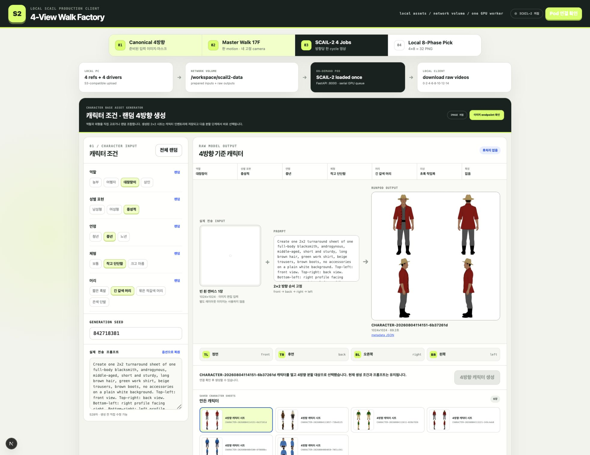
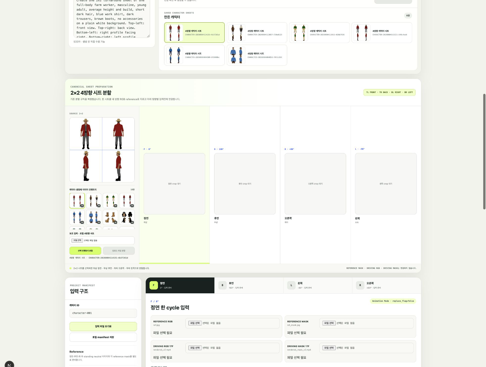
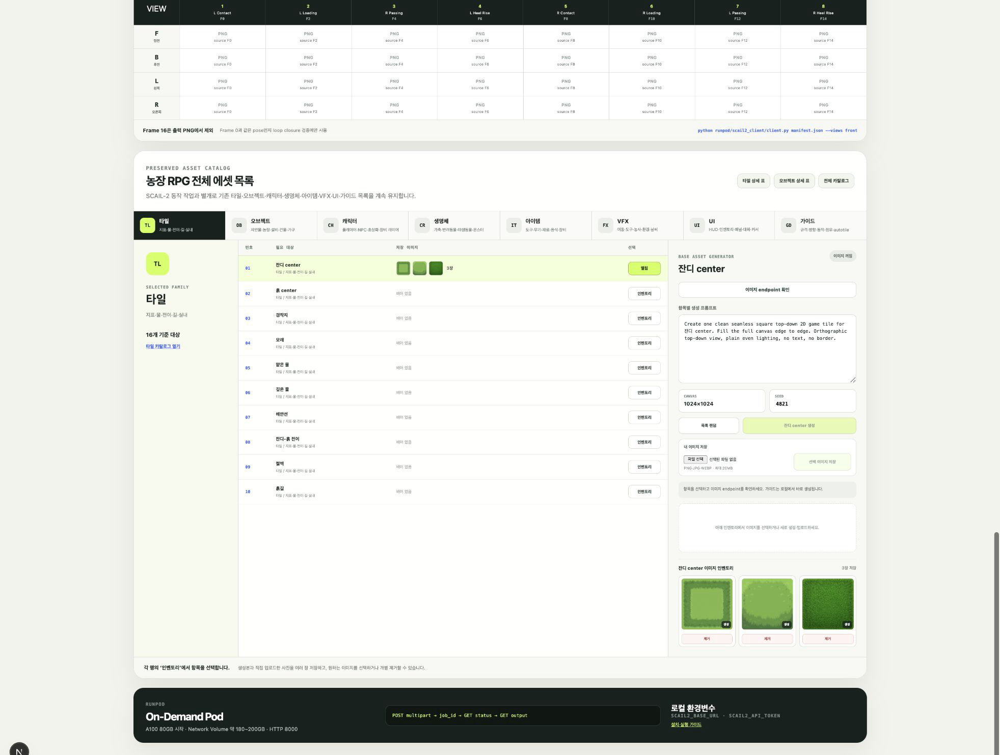

# 2D Assets Generator

농장 생활 RPG에 필요한 타일, 오브젝트, 캐릭터, 생명체, 아이템, VFX와 UI 에셋을 항목별로 생성하고 보관하기 위한 로컬 작업 도구입니다.

현재 저장소는 완성된 생성 품질을 보여주는 결과물이 아닙니다. 수천 개의 에셋을 실제로 관리할 수 있는 입력 구조, 저장 방식, 방향 분할과 동작 생성 흐름을 확인하기 위한 작업 현황입니다.

## 현재 화면

### 캐릭터 조건과 4방향 기준 시트

캐릭터의 역할, 성별 표현, 연령, 체형, 머리, 의상과 특징을 선택하거나 랜덤으로 조합합니다. 실제 전송 prompt를 직접 수정할 수 있으며, 생성된 `2×2` 4방향 시트는 캐릭터 인벤토리에 계속 저장됩니다.



### 저장된 4방향 시트 분할과 단일 동작 요청

인벤토리에서 캐릭터 또는 생명체의 `2×2` 시트를 선택하고 `좌상=정면`, `우상=후면`, `좌하=오른쪽`, `우하=왼쪽` 규칙으로 네 방향 이미지를 만듭니다. 동작 요청은 정면·후면·왼쪽·오른쪽 RGB 네 장만 한 번에 보내며 mask와 Driving video를 입력받지 않습니다.



### 에셋 목록과 항목별 이미지 인벤토리

타일·오브젝트·캐릭터·생명체·아이템·VFX·UI·가이드 목록을 유지합니다. 목록의 각 항목마다 prompt와 seed를 편집하고, 생성 이미지 또는 직접 업로드한 이미지를 여러 장 저장하고 선택하거나 제거할 수 있습니다.



## 도구가 다루는 작업

### 기준 에셋 생성과 보관

- 타일, 오브젝트, 캐릭터, 생명체, 아이템, VFX, UI, 가이드의 생성 대상 목록
- 대상마다 독립된 생성 prompt와 seed
- 생성 이미지와 직접 업로드한 이미지의 항목별 인벤토리
- 저장 이미지 선택, 크게 보기와 개별 제거
- 캐릭터 조건 선택과 유형별 랜덤 조합
- 캐릭터 `2×2` 4방향 시트 생성 및 누적 저장

생성 이미지와 메타데이터는 로컬 `tools_test/app/generated/` 아래에 저장합니다. 화면의 인벤토리는 이 파일들을 다시 읽어 구성하므로 최신 결과 하나만 사용하는 구조가 아닙니다.

### 동작 생성 현황

SCAIL-2를 4방향 걷기 생성 모델로 사용하는 계획은 기각했습니다. SCAIL-2는 정지 이미지와 동작 이름에서 걷기를 만드는 모델이 아니라, 이미 동작이 들어 있는 Driving RGB video를 Reference 캐릭터로 전이하는 모델입니다.

| 프로젝트가 필요로 하는 것 | SCAIL-2가 요구하는 것 |
|---|---|
| 4방향 정지 이미지에서 걷기 phase 생성 | 동작이 완성된 방향별 Driving RGB video |
| 동작 이름·포즈 조건으로 motion 설계 | Driving video를 VAE로 encode한 motion condition |
| 캐릭터별 높이·발 기준선·외형 고정 | 새 noise에서 생성하므로 pixel 고정 보장 없음 |
| 바로 분리 가능한 스프라이트 프레임 | 생성 영상의 별도 검수·추출·정렬 필요 |

`pose-free`는 Driving video가 없다는 뜻이 아니라 OpenPose·skeleton 같은 중간 pose representation 없이 RGB video를 직접 사용한다는 뜻입니다. Reference/Driving mask는 동작을 만들지 않고 캐릭터 binding을 지정합니다. Prompt도 gait planner가 아니라 생성될 영상의 설명입니다.

전체 기각 사유와 공식 코드 근거는 [SCAIL-2 4방향 걷기 생성 경로 기각 기록](docs/failures/SCAIL2_WALK_CYCLE_STRATEGY.md)에 정리했습니다.

다음 예정 구조는 Kimodo가 자연스러운 3D 동작 하나를 만들고, Motion Adapter가 캐릭터 체형과 네 방향 pose로 변환하며, One-to-All이 준비된 네 방향 원본 이미지에 pose를 적용하는 방식입니다. 로컬 화면은 `front`, `back`, `left`, `right` 네 이미지를 한 작업으로 보내고 서버가 반환한 `result.zip`을 직접 내려받습니다. 설치와 API 계약은 [RunPod Kimodo + One-to-All 4방향 동작 가이드](docs/RUNPOD_KIMODO_ONE_TO_ALL_GUIDE.md)에 기록했습니다.

## 현재 유효한 흐름

```text
로컬 :3000 화면
  ├─ 기준 에셋 목록과 항목별 인벤토리
  ├─ 캐릭터 조건·랜덤 4방향 시트 생성
  ├─ 저장된 2×2 시트 선택과 네 방향 RGB 분할
  ├─ 아이템 착용 4방향 이미지 검증
  └─ 생성·업로드 결과 저장, 선택, 제거와 히스토리
                         │
                         ▼
로컬 Next API proxy
  ├─ 이미지 모델 endpoint와 token은 서버 환경변수에서만 읽음
  ├─ 기준 에셋 생성 요청과 원본 결과 저장을 중계
  └─ 4방향 RGB 한 작업 전송과 result.zip 다운로드 중계
                         │
                         ▼
RunPod On-Demand Pod
  ├─ 기준 이미지·4방향 시트·아이템 착용 이미지 생성 endpoint
  └─ Kimodo → Motion Adapter → One-to-All 동작 pipeline endpoint
```

SCAIL-2 API adapter와 RunPod 가이드는 성공한 생성 기능이 아니라 `docs/failures/`의 실험 기록으로 남깁니다. 새 동작 pipeline도 아직 성공 결과가 아니라 구현·검증할 예정 구조입니다.

## 로컬 실행

```bash
cd tools_test
cp .env.example .env.local
npm install
npm run dev
```

브라우저에서 `http://localhost:3000`을 엽니다.

```dotenv
# 기준 에셋 이미지 endpoint
RUNPOD_BASE_URL=
RUNPOD_API_KEY=
RUNPOD_MODEL_ID=

# 4방향 동작 pipeline endpoint
MOTION_PIPELINE_BASE_URL=
MOTION_PIPELINE_API_TOKEN=

```

실제 endpoint와 token은 코드, README와 manifest에 기록하지 않습니다.

## 에셋 범위 문서

- [기능 기획서](docs/PRODUCT_PLAN.md)
- [마스터 에셋 카탈로그](docs/ASSET_CATALOG.md)
- [타일 카탈로그](docs/TILE_CATALOG.md)
- [오브젝트 카탈로그](docs/OBJECT_CATALOG.md)
- [캐릭터·오브젝트 상대 크기 규격](docs/SCALE_SYSTEM.md)
- [RunPod Kimodo + One-to-All 4방향 동작 가이드](docs/RUNPOD_KIMODO_ONE_TO_ALL_GUIDE.md)
- [SCAIL-2 4방향 걷기 생성 경로 기각 기록](docs/failures/SCAIL2_WALK_CYCLE_STRATEGY.md)
- [기각된 RunPod SCAIL-2 실행 실험 기록](docs/failures/RUNPOD_SCAIL2_GUIDE.md)

## 현재 검수 기준

- 네 방향 모두 같은 캐릭터 정체성, 의상, 색상, 비율과 화면상 크기를 유지해야 합니다.
- 네 방향 모두 같은 ground baseline을 사용해야 합니다.
- 생성 prompt에는 픽셀화를 요구하지 않습니다.
- 생성 결과 전체를 검수하기 전에 픽셀화·최종 리사이즈·스프라이트 패킹을 자동으로 시작하지 않습니다.
- 실패 결과도 입력, prompt, seed와 실행 시간을 함께 남겨 다음 실험에서 비교합니다.
