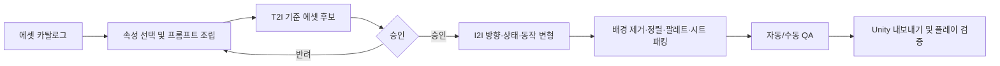

# 2D Assets Generator

생성형 이미지 모델을 이용해 **게임에 바로 투입할 수 있는 일관된 2D 에셋 묶음**을 설계·생성·검수·내보내는 도구입니다.

농장 생활 RPG 한 작품에도 타일, 자연물, 건물, 가구, 아이템, 캐릭터, 방향별 동작 등 수천 개의 에셋과 변형이 필요합니다. 이 프로젝트의 목표는 한 장의 그림을 만드는 데서 끝나지 않고, 에셋 카탈로그 전체를 반복 가능하게 생산하는 파이프라인을 만드는 것입니다.

> 현재 단계: 제품 기획·에셋 카탈로그 설계와 로컬 디버깅 도구 구현. `tools_test`에서 Endpoint 없이 유형 선택, 규격 가이드, 방향·동작, 히스토리를 확인할 수 있습니다.

## 목표

### 1. 기준 에셋 생성기 — Text-to-Image

에셋 종류와 속성을 폼에서 선택하면 구조화된 프롬프트를 자동으로 조립하고 기준 이미지를 생성합니다.

- 대상: 지형/타일, 자연물, 오브젝트, 건물, 아이템, 캐릭터, 동물, 몬스터, UI, VFX
- 예: `캐릭터`를 선택하면 성별 표현, 연령대, 체형, 피부색, 머리, 의상, 직업, 소품 등의 조건이 활성화됩니다.
- 각 조건은 직접 선택하거나 랜덤으로 뽑을 수 있으며, 특정 조건을 잠근 뒤 나머지만 다시 랜덤 선택할 수 있습니다.
- 캐릭터는 얼굴/머리/의상 같은 그룹별 랜덤과 전체 랜덤을 지원합니다.
- 사용자는 자동 생성된 프롬프트를 확인하고 직접 수정할 수 있습니다.
- 같은 스타일 프리셋, 팔레트, seed, 모델 설정을 프로젝트 단위로 고정합니다.
- 캐릭터와 모든 오브젝트는 Unity 규격 프리셋 체크박스를 선택하면 width/height, ratio, PPU, pivot, cell footprint가 자동으로 정해집니다.
- 여러 후보를 생성한 뒤 승인한 결과만 기준 에셋로 등록합니다.

기본 T2I 파이프라인은 [`QwenImagePipeline`](https://huggingface.co/docs/diffusers/api/pipelines/qwenimage)의 `Qwen/Qwen-Image`를 사용합니다.

### 2. 방향·동작·스프라이트 생성기 — Image-to-Image

승인된 기준 캐릭터나 오브젝트를 입력하면 정체성과 스타일을 유지하면서 방향, 상태, 동작 프레임을 생성합니다. 캐릭터가 입력되기 전에는 방향과 동작 옵션이 비활성화되며, 캐릭터를 넣는 순간 관련 옵션이 활성화됩니다.

- 입력 1: 생성하려는 방향과 같은 방향으로 승인된 기준 캐릭터/오브젝트 이미지
- 입력 2: 흰 배경 위에 실제 출력 규격 ratio의 검은 사각형 윤곽선과 선택적 동작 포즈를 그린 레이아웃 가이드
- 입력 3(선택): 무기, 도구, 의상 또는 스타일 참조 이미지
- 방향: 정면, 후면, 좌측, 우측
- 캐릭터 동작: 빈손 걷기, 한손 무기 들기, 양손 무기 들기, 도구 휘두르기, 활 쏘기, 물건을 앞에 들기, 물건을 머리 위에 들기
- 오브젝트 규격: 오브젝트마다 실제 width/height, ratio, 윤곽선 크기와 위치, 바닥선, 여백 저장
- 오브젝트 상태: 열림/닫힘, 켜짐/꺼짐, 비어 있음/가득 참, 미완료/완료, 손상/수리 등
- 결과: 투명 PNG, 프레임 이미지, 스프라이트 시트, 프레임 메타데이터

입력 2의 바깥 사각형은 생성 대상의 규격을 지시합니다. 흰 캔버스 위에 **검은색 윤곽선만** 그리고 내부는 흰색으로 비워 둡니다. 윤곽선의 가로:세로 비율은 실제 출력 규격과 같아야 합니다. 실제 규격이 1:1이면 정사각형, 2:3이면 2:3 직사각형으로 구성합니다. 프레임의 아랫변은 공통 바닥선입니다.

캐릭터는 도구 1의 정면 중립 이미지를 시작점으로 정면·후면·좌측·우측의 무동작 기준 이미지를 먼저 만들고 각각 승인합니다. 이후 동작 생성에서는 선택한 방향과 같은 방향의 승인 이미지를 입력 1로 사용합니다. 따라서 좌측 동작을 만들 때 정면 이미지를 계속 참조하지 않습니다.

방향이나 동작을 선택하면 이 사각형 안에 해당 방향·동작의 포즈 표시를 추가합니다. 스프라이트 rect 정렬을 위해 바깥 윤곽선과 바닥선은 유지하지만, 정면·후면은 넓은 실루엣, 좌·우 측면은 좁고 겹친 실루엣으로 점유 폭과 관절 배치를 다르게 표시합니다. 빈손 걷기·무기 들기·도구 휘두르기·활 쏘기·운반 동작도 같은 방향 규격 안에서 내부 포즈를 바꿉니다.

오브젝트 I2I에서는 오브젝트마다 저장된 실제 규격과 레이아웃 값을 불러와 가이드를 자동 생성합니다. 같은 오브젝트의 열림/닫힘, 작동 전/후를 만들 때도 동일한 ratio와 바닥선을 사용하므로 크기와 배치가 흔들리지 않습니다.

오브젝트를 선택할 때마다 선택된 object family의 scale/layout profile에 맞춰 바깥 사각형 윤곽선의 크기와 ratio가 즉시 다시 그려집니다.

캐릭터와 오브젝트 모두 선택된 Unity 규격 프리셋에서 실제 출력 크기와 레이아웃 가이드 ratio를 가져옵니다.

기본 편집 파이프라인은 `QwenImageEditPlusPipeline`과 [`Qwen/Qwen-Image-Edit-2509`](https://huggingface.co/Qwen/Qwen-Image-Edit-2509)를 사용합니다. 2509가 권장하는 1~3장 참조 입력을 위 세 슬롯에 대응시킵니다.

### 3. 생성 디버거와 Unity 검증

모든 결과를 재현하고 게임 안에서 즉시 확인할 수 있게 합니다.

- 원본/가이드/결과 나란히 비교, 확대, 배경색 전환, 프레임 애니메이션 미리보기
- prompt, negative prompt, seed, steps, CFG, 모델/revision, 입력 해시, 처리 시간 기록
- 승인/반려/재생성 및 세대 간 비교
- 옵션, prompt, 참조 이미지, 레이아웃 규격, seed, 결과를 generation 히스토리로 저장하고 이전 설정 재사용
- 결과 카드와 히스토리에 생성 대기/진행/완료/실패와 기준 선택/후처리/시트 생성/Unity 확인 상태를 분리해 표시
- 타일 경계, 캐릭터 실루엣, 방향 일관성, 프레임 떨림, 알파 가장자리 자동 검사
- Unity용 PNG와 manifest 내보내기
- Unity에서 slice, pivot, PPU, 정렬 기준, 충돌 영역, 애니메이션 루프 확인

## 전체 흐름

## 에셋 범위

- 타일: 지표면, 경작지, 물, 해안, 절벽, 길, 다리, 계단, 실내 바닥/벽, 계절 및 전이 타일
- 월드 오브젝트: 나무, 바위, 잡초, 작물, 울타리, 건물, 제작 설비, 가구, 마을/광산 소품
- 생명체: 플레이어, NPC, 가축, 야생동물, 몬스터
- 아이템: 도구, 무기, 씨앗, 작물, 음식, 광물, 제작 재료, 장비, 퀘스트 물품
- 표현 요소: 초상화, 아이콘, 커서, 상태 표시, 타격/채집/물/날씨 VFX

전체 제작 체크리스트와 변형 규칙은 다음 카탈로그에 정의합니다.

- [마스터 에셋 카탈로그](docs/ASSET_CATALOG.md)
- [타일 카탈로그](docs/TILE_CATALOG.md)
- [오브젝트 카탈로그](docs/OBJECT_CATALOG.md)
- [캐릭터·오브젝트 상대 크기 규격](docs/SCALE_SYSTEM.md)

## 구현 원칙

- **카탈로그 우선:** 개별 프롬프트가 아니라 `무엇이 몇 개 필요한가`를 먼저 정의합니다.
- **재현 가능성:** 승인된 에셋은 동일한 입력과 설정으로 다시 만들 수 있어야 합니다.
- **정체성 우선:** 캐릭터의 얼굴, 비율, 팔레트, 의상 특징은 방향과 동작이 바뀌어도 유지되어야 합니다.
- **생성과 후처리 분리:** 모델은 원화를 만들고, 크롭·정렬·축소·팔레트·시트 패킹은 결정론적 코드가 담당합니다.
- **게임 엔진 기준 검수:** 보기 좋은 단일 이미지가 아니라 실제 타일링과 애니메이션에서 통과해야 완료입니다.
- **스타일 독창성:** 특정 상용 게임의 에셋을 복제하지 않고 장르의 기능적 요구만 참고합니다.

## 실행 구조

- 생성 도구: 로컬에서 실행
- 모델 추론: 로컬 도구가 RunPod Endpoint를 호출
- 선택적 웹 배포: Vercel
- 모델: `Qwen/Qwen-Image`, `Qwen/Qwen-Image-Edit-2509`
- UI 프레임워크: 미정
- Unity 연동: 생성된 이미지와 메타데이터를 로컬 Unity 디버깅 도구에서 확인

## 문서

- [제품 기획서](docs/PRODUCT_PLAN.md)
- [마스터 에셋 카탈로그](docs/ASSET_CATALOG.md)
- [타일 카탈로그](docs/TILE_CATALOG.md)
- [오브젝트 카탈로그](docs/OBJECT_CATALOG.md)
- [캐릭터·오브젝트 상대 크기 규격](docs/SCALE_SYSTEM.md)

세부 입력 옵션, RunPod 요청 구조, 레이아웃 규격과 Unity 디버깅 방식은 제품 기획서에 기록합니다.
