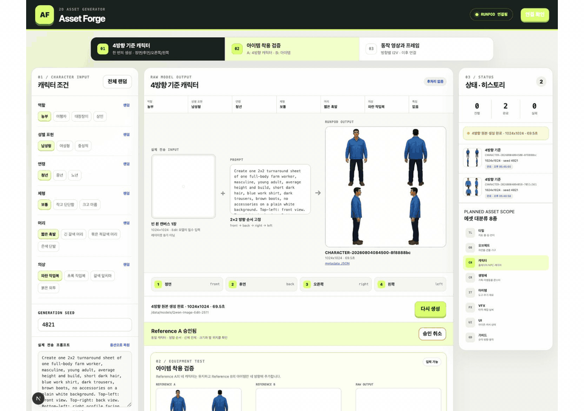

# 2D Assets Generator

농장 생활 RPG에 필요한 타일, 오브젝트, 캐릭터, 아이템과 변형 에셋을 대량으로 만드는 로컬 생성 도구입니다. 이미지 모델은 RunPod에서 실행하고, 로컬 화면에서 입력·원본 출력·승인 상태·히스토리를 확인합니다.



[생성 에셋 갤러리](tools_test/public/assets/catalog/README.md)는 캐릭터·오브젝트·생명체 등 폴더별 최신 원본을 README 안에서 바로 보여줍니다.

## 현재 생성 순서

### 1. 4방향 기준 캐릭터

캐릭터를 한 방향씩 따로 만들지 않고 첫 생성에서 한 장의 `2×2` 방향 시트를 요청합니다.

| 셀 | 방향 |
|---:|---|
| 1 | 정면 |
| 2 | 후면 |
| 3 | 오른쪽 측면 |
| 4 | 왼쪽 측면 |

- 입력: 캐릭터 옵션으로 만든 짧은 prompt와 빈 흰 캔버스 1장
- 출력: 동일 캐릭터의 정면·후면·오른쪽·왼쪽이 들어간 원본 1장
- 필수 검사: 외형, 의상, 색상, 비율, 크기, 발 위치, 신체 잘림 여부
- 생성 중에는 크롭, 리사이즈, 픽셀화, 배경 제거를 하지 않음
- 사용자가 네 방향을 확인하고 승인한 결과만 `Reference A`로 사용

현재 RunPod는 `Qwen-Image-Edit-2511`을 vLLM Omni로 실행합니다. Edit 모델이 이미지 입력을 요구하므로 1단계에서도 빈 흰 캔버스 한 장을 보내지만, 이것은 포즈·윤곽 레이아웃 `Reference B`가 아닙니다.

### 2. 아이템 착용 검증

1단계에서 승인한 방향 시트에 무기·도구·장비가 일관되게 추가되는지 확인합니다.

| 입력 | 내용 |
|---|---|
| Reference A | 승인한 4방향 캐릭터 시트 |
| Reference B | 실제 아이템 이미지 |
| prompt | 캐릭터를 바꾸지 않고 B의 아이템만 네 방향에 추가 |
| 출력 | 아이템을 착용한 4방향 원본 시트 |

이 단계의 `Reference B`는 레이아웃 윤곽선이 아니라 실제 아이템입니다.

### 3. 방향별 동작

4방향 기준과 아이템 착용 결과가 안정된 뒤 영상 모델을 연결합니다.

1. 승인된 방향 셀을 시작 이미지로 사용
2. 걷기, 무기 사용, 도구 휘두르기, 활 쏘기, 운반 동작을 방향별 영상으로 생성
3. 영상에서 프레임 후보 추출
4. 모든 원본 프레임을 검수
5. 검수가 끝난 뒤에만 수동 후처리와 스프라이트 시트 생성

## 에셋 범위

- 타일: 지표면, 경작지, 물, 해안, 절벽, 길, 다리, 계단, 실내 바닥·벽, 계절·전이 타일
- 오브젝트: 자연물, 작물, 울타리, 건물, 제작 설비, 가구, 마을·광산 소품
- 캐릭터·생명체: 플레이어, NPC, 가축, 야생동물, 몬스터
- 아이템: 도구, 무기, 씨앗, 작물, 음식, 광물, 제작 재료, 장비, 퀘스트 물품
- 표현 요소: 초상화, 아이콘, 커서, 상태 표시, 타격·채집·물·날씨 VFX

세부 목록과 실제 규격은 아래 문서에서 관리합니다.

- [기능 기획서](docs/PRODUCT_PLAN.md)
- [마스터 에셋 카탈로그](docs/ASSET_CATALOG.md)
- [타일 카탈로그](docs/TILE_CATALOG.md)
- [오브젝트 카탈로그](docs/OBJECT_CATALOG.md)
- [캐릭터·오브젝트 상대 크기 규격](docs/SCALE_SYSTEM.md)
- [RunPod Qwen-Image-Edit-2511 실행 가이드](docs/RUNPOD_QWEN_IMAGE_EDIT.md)

## 로컬 도구 실행

```bash
cd tools_test
cp .env.example .env.local
# .env.local에 RunPod endpoint와 필요한 인증 정보 입력
npm install
npm run dev
```

브라우저에서 `http://localhost:3000`을 엽니다. Endpoint와 키는 코드에 넣지 않고 `.env.local`에서만 읽습니다.

## 저장 원칙

- RunPod 입력 이미지, prompt, seed, model, 요청 ID, 출력 원본, 경과 시간을 generation 단위로 저장
- 1단계와 2단계의 실제 전송 이미지를 화면에 표시
- 생성 실패와 완료 상태를 히스토리에 분리해 표시
- 원본 생성을 모두 끝내기 전 자동 후처리 금지
- 모델 prompt에 픽셀화 지시를 넣지 않음
