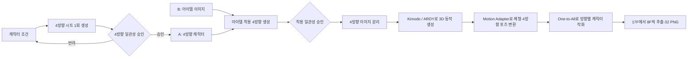

# 2D Assets Generator 기능 기획서

## 1. 목적

농장 생활 RPG에 필요한 수천 개의 2D 에셋을 생성하고 검수하는 로컬 도구를 만든다. 이미지 모델은 RunPod에서 실행한다. 로컬 화면은 옵션 입력, 모델 요청, 원본 결과 비교, 승인, 히스토리, 이후 Unity 검증을 담당한다.

현재 검증 순서는 아래와 같다.



## 2. 1단계 — 4방향 기준 캐릭터 생성

### 2.1 목표

같은 캐릭터의 네 방향을 한 번의 모델 요청으로 생성한다. 방향을 네 번 따로 생성하면서 얼굴, 의상, 체형과 높이가 달라지는 문제를 줄이기 위한 기준 실험이다.

### 2.2 입력과 출력

| 구분 | 내용 |
|---|---|
| 모델 | RunPod의 `Qwen-Image-Edit-2511` |
| 이미지 입력 | 1024×1024 빈 흰 캔버스 1장 |
| prompt | 캐릭터 설명 + 2×2 셀 순서 + 네 방향 일관성 조건 |
| 출력 | 1024×1024 4방향 원본 시트 1장 |
| 셀 순서 | 정면, 후면, 오른쪽 측면, 왼쪽 측면 |
| 생성 중 처리 | 없음. 크롭·리사이즈·픽셀화·반전·배경 제거 금지 |

`Qwen-Image-Edit-2511`은 Edit 모델이라 이미지 입력이 필요하다. 빈 흰 캔버스는 이 API 조건을 충족하기 위한 입력이고 방향·포즈·윤곽 레이아웃이 아니다. 1단계에는 별도의 `Reference B`를 사용하지 않는다.

### 2.3 prompt 규칙

prompt는 아래 내용만 짧게 전달한다.

1. 동일한 전신 캐릭터 한 명
2. 2×2 셀 순서: front, back, right, left
3. 외형, 의상, 색상, 신체 비율, 크기, 발 위치 동일
4. 한 셀에 한 캐릭터
5. 글자, 패널 테두리, 손에 든 아이템, 그림자, 신체 잘림 없음

prompt에 `pixel`, `pixel art`, 출력 pixel 규격, 레이아웃 윤곽선 설명을 넣지 않는다. 픽셀화와 Unity 규격 변환은 승인된 원본을 모두 확보한 뒤 별도로 한다.

### 2.4 캐릭터 옵션

| 분류 | 화면 옵션 |
|---|---|
| 역할 | 플레이어, 농부, 상인, 대장장이, 주민 등 |
| 성별 표현 | 남성형, 여성형, 중성적 |
| 연령 | 청년, 중년, 노년 |
| 체형 | 보통, 작고 단단함, 크고 마름 등 |
| 얼굴·머리 | 피부색, 얼굴형, 눈, 머리 모양·길이·색, 수염 |
| 의상 | 상의, 하의, 신발, 겉옷, 모자 |
| 특징 | 안경, 목도리, 액세서리, 좌우 비대칭 요소 |
| 랜덤 | 개별 랜덤, 그룹 랜덤, 전체 랜덤, 옵션 잠금, option seed |
| 생성 | prompt 직접 수정, generation seed, steps, CFG |

랜덤은 유형별 선택 목록 안에서만 값을 고른다. 사용자가 선택한 값과 실제 prompt를 요청 전 화면에 표시한다.

### 2.5 승인 검사

| 검사 | 통과 기준 |
|---|---|
| 인물 수 | 네 셀에 각각 한 명 |
| 방향 | 정면, 후면, 오른쪽, 왼쪽 순서가 맞음 |
| 정체성 | 얼굴, 머리, 의상, 색상, 주요 특징이 같은 인물로 보임 |
| 비율 | 머리·몸통·팔다리 비율이 방향마다 크게 달라지지 않음 |
| 크기 | 네 캐릭터의 전신 높이와 발 위치가 비슷함 |
| 전신 | 머리, 손, 발이 잘리지 않음 |
| 배경 | 단순한 흰 배경이며 글자와 패널 테두리가 없음 |

검사가 끝난 뒤 사용자가 승인 버튼을 눌러야 결과를 `Reference A`로 지정한다.

## 3. 2단계 — 아이템 착용 검증

### 3.1 목표

승인한 네 방향 캐릭터의 외형은 그대로 유지하면서 같은 아이템이 네 방향에 일관되게 추가되는지 확인한다.

### 3.2 입력과 출력

| 입력 | 내용 |
|---|---|
| Reference A | 승인한 4방향 캐릭터 시트 |
| Reference B | 사용자가 올린 무기·도구·장비 이미지 |
| prompt | A의 캐릭터를 바꾸지 않고 B의 아이템만 네 셀에 추가 |
| 출력 | 아이템을 착용한 4방향 원본 시트 |

기존의 검은 사각형·포즈 레이아웃 이미지는 이 단계의 Reference B가 아니다. B는 실제 아이템 에셋이다.

### 3.3 검사

| 검사 | 통과 기준 |
|---|---|
| 캐릭터 보존 | A의 얼굴, 머리, 의상, 색상, 체형 유지 |
| 아이템 보존 | B의 형태와 색상 유지 |
| 방향 | 네 방향에서 아이템의 앞·뒤·좌·우 배치가 자연스러움 |
| 크기 | 캐릭터 대비 아이템 크기가 네 셀에서 동일함 |
| 셀 구조 | A의 셀 순서, 캐릭터 크기, 발 위치와 배경 유지 |

## 4. 3단계 — 예정 동작 생성 구조

일반 I2V 영상 생성, Qwen 프레임별 독립 생성과 SCAIL-2 동작 전이는 기각한다. SCAIL-2 기각 이유는 [SCAIL-2 동작 생성 경로 기각 기록](SCAIL2_WALK_CYCLE_STRATEGY.md)에 보존한다.

다음 구조로 동작 생성을 구성할 예정이다.

```text
[1. 동작 만들기]
Kimodo / ARDY
        ↓
걷는 사람의 뼈 움직임 생성
        ↓
[2. 우리 캐릭터용으로 변환]
Motion Adapter
        ↓
같은 걷기를 Front / Back / Left / Right
4방향 포즈로 변환
        ↓
[3. 캐릭터 그림 입히기]
One-to-All
        ↓
각 방향 원본 이미지에
그 방향의 포즈를 적용해 애니메이션 생성
        ↓
[4. 결과 자르기]
17프레임 → 8프레임 × 4방향
        ↓
32 PNG
```

### 4.1 Kimodo / ARDY — 동작 만들기

캐릭터 이미지를 입력하지 않고 `자연스럽게 걷기` 같은 요청으로 하나의 3D 뼈 움직임을 만든다.

### 4.2 Motion Adapter — 캐릭터 체형과 4방향 포즈

Kimodo / ARDY가 만든 하나의 동작을 캐릭터의 팔 길이, 다리 길이, 몸통 길이와 어깨 폭에 맞춘다. 같은 phase를 Front / Back / Left / Right 포즈로 변환하고 발 위치와 카메라를 고정한다.

```text
같은 3번째 phase
├─ front_3
├─ back_3
├─ left_3
└─ right_3
```

### 4.3 One-to-All — 캐릭터 그림 입히기

각 방향 원본 이미지와 해당 방향 pose sequence를 입력해 캐릭터 애니메이션을 만든다.

```text
front.png + Front pose sequence → Front animation
back.png  + Back pose sequence  → Back animation
left.png  + Left pose sequence  → Left animation
right.png + Right pose sequence → Right animation
```

One-to-All에는 걷기 자체를 설계시키지 않고 같은 캐릭터 외형을 유지하면서 주어진 포즈대로 그리는 역할을 맡길 예정이다.

### 4.4 결과 자르기

방향별 17프레임에서 8프레임을 추출한다.

```text
Front 8 + Back 8 + Left 8 + Right 8 = 32 PNG
```

### 4.5 동작 목록

| ID | 동작 | 필요한 결과 |
|---|---|---|
| `walk_empty` | 빈손 걷기 | 접촉·통과 자세가 포함된 반복 동작 |
| `weapon_1h` | 한손 무기 사용 | 준비, 사용, 회수 |
| `weapon_2h` | 양손 무기 사용 | 준비, 사용, 회수 |
| `tool_swing` | 도구 휘두르기 | 준비, 타격, 회수 |
| `bow_shoot` | 활 쏘기 | 들기, 당기기, 발사 |
| `carry_front` | 물건을 앞에 들기 | 앞쪽 양손 운반 |
| `carry_overhead` | 물건을 머리 위에 들기 | 머리 위 양손 운반 |

## 5. 캐릭터 외 에셋

동일한 생성·승인·변형 구조를 아래 대분류에 적용한다.

| 대분류 | 기준 생성 | 이후 변형 |
|---|---|---|
| 타일 | 재질·계절·시점 기준 타일 | edge, corner, transition, autotile, 애니메이션 |
| 오브젝트 | family별 기준 오브젝트 | 열림·닫힘, 작동, 성장, 파손, 방향 |
| 캐릭터 | 4방향 기준 시트 | 장비, 의상, 표정, 동작 |
| 생명체 | 4방향 또는 필요한 방향 기준 | 이동, 공격, 피격, 수면 |
| 아이템 | 단일 기준 아이콘·월드 오브젝트 | 등급, 상태, 장착 방향 |
| VFX | 효과 기준 프레임 | 방향, 강도, 반복 프레임 |
| UI | 아이콘·패널 기준 | 상태, 크기, 테마 |
| 가이드 | 크기·방향·동작 기준 | 엔진 검증용 오버레이 |

타일과 오브젝트의 전체 제작 목록은 문서에서 표로 관리한다.

- [타일 카탈로그](TILE_CATALOG.md)
- [오브젝트 카탈로그](OBJECT_CATALOG.md)
- [마스터 에셋 카탈로그](ASSET_CATALOG.md)
- [캐릭터·오브젝트 상대 크기 규격](SCALE_SYSTEM.md)

## 6. Unity 규격

Unity 자체가 캐릭터와 오브젝트의 고정 pixel 크기를 정해 주지는 않는다. 프로젝트에서 공통 PPU와 cell 크기를 먼저 정하고 상대 비율을 유지한다.

| 설정 | 사용처 |
|---|---|
| `pixels_per_cell` | 타일 한 칸의 원본 pixel 크기 |
| `asset_ppu` | 모든 Sprite와 Pixel Perfect Camera의 공통 PPU |
| `visual_cells_x/y` | 그림이 차지하는 상대 크기 |
| `footprint_cells_x/y` | 배치·충돌 바닥 크기 |
| `pivot` | 캐릭터 발, 오브젝트 바닥, 타일 중심 |
| `reference_resolution` | 원본 화면 해상도 |

승인된 원본을 후처리할 때만 아래 관계로 최종 규격을 계산한다.

```text
target_width_px = visual_cells_x × pixels_per_cell
target_height_px = visual_cells_y × pixels_per_cell
```

## 7. 로컬 화면

| 영역 | 표시 내용 |
|---|---|
| 캐릭터 조건 | 유형별 옵션, 랜덤, seed, 실제 전송 prompt |
| 4방향 요청 | 실제 전송 흰 캔버스, prompt, RunPod 원본 |
| 방향 순서 | 정면, 후면, 오른쪽, 왼쪽 셀 순서 |
| 승인 | 4방향 기준 A 승인·취소 |
| 아이템 착용 | Reference A, Reference B, 원본 출력 |
| 기각된 SCAIL-2 실험 | 방향별 reference·driving·mask와 job 화면을 실패 기록으로만 표시 |
| 예정 동작 생성 | Kimodo/ARDY 동작, Motion Adapter 4방향 포즈, One-to-All 방향별 결과, 32 PNG |
| 상태·히스토리 | 진행, 완료, 실패, generation ID, 크기, seed, 시간 |
| 카탈로그 | 전체 8개 대분류와 문서 목록 |

브라우저와 서버 콘솔에는 prompt 본문이나 API key를 찍지 않는다. 요청 ID, 모델, 참조 파일명·바이트, prompt 길이, seed, steps, 입력·출력 크기, 경과 시간, 오류를 출력한다.

## 8. Generation 저장

| 필드 | 내용 |
|---|---|
| 식별 | generation ID, 요청 ID, 생성 시각, 단계 |
| 입력 | 실제 전송 이미지 파일명·크기·bytes, Reference A/B 관계 |
| prompt | 최종 prompt와 negative prompt |
| 설정 | 모델, seed, steps, CFG, 요청 크기 |
| 출력 | RunPod 원본 파일, 실제 출력 크기·bytes |
| 상태 | 생성 중, 완료, 실패, 승인, 반려 |
| 처리 | `postprocessed: false/true`, 처리 실행 시각과 방법 |

## 9. 구현 순서

1. 4방향 캐릭터를 한 번에 생성하고 원본을 화면에 표시
2. 4방향 승인 결과를 Reference A로 지정
3. 실제 아이템을 Reference B로 넣어 착용 일관성 검증
4. 여러 캐릭터·아이템 조합으로 성공률 기록
5. 승인한 4방향 시트를 네 방향 입력으로 자동 분리
6. Kimodo/ARDY로 하나의 3D 동작 생성
7. Motion Adapter로 캐릭터 체형에 맞춘 4방향 pose sequence 생성
8. One-to-All로 네 방향 원본 이미지에 pose sequence 적용
9. 전 프레임 승인 뒤 픽셀화·최종 리사이즈·스프라이트 시트 생성
10. 같은 구조를 생명체 동작에 검증하고 타일·오브젝트·아이템 카탈로그는 기존 이미지 생성 경로 유지
11. Unity import·slice·pivot·animation 검증 연결
