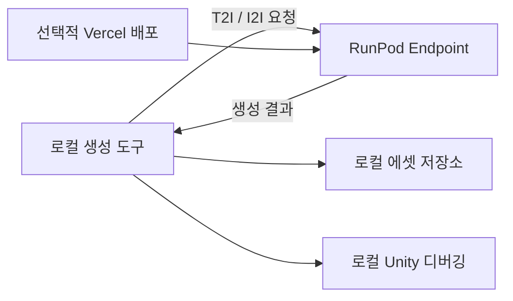

# 2D Assets Generator 기능 기획서

## 1. 목표

타일, 오브젝트, 캐릭터처럼 게임에 필요한 대량의 2D 에셋을 일정한 규격으로 생성하고, 방향·상태·동작 변형과 스프라이트 시트까지 만드는 생성 도구를 구현한다.

생성 도구는 로컬에서 실행한다. 이미지 생성은 RunPod Endpoint로 요청하며, 웹으로 제공해야 할 경우 Vercel에 배포한다. 생성된 에셋은 로컬 Unity 프로젝트에서 바로 확인한다.



### 1.1 Unity 규격을 정하는 방식

Unity는 캐릭터나 오브젝트에 하나의 고정 pixel 크기를 권장하지 않는다. 대신 [Unity 6 Pixel Perfect Camera 문서](https://docs.unity3d.com/kr/current/Manual/urp/2d-pixelperfect.html)는 씬의 모든 Sprite `Pixels Per Unit`을 Pixel Perfect Camera의 `Asset Pixels Per Unit`과 동일하게 맞추고, 픽셀 아트 Sprite에 Point filter, 무압축, 픽셀 단위 pivot을 사용하도록 안내한다. `Reference Resolution`은 에셋이 설계된 원본 화면 해상도다.

따라서 생성기에서 임의의 숫자를 Unity 권장 크기로 표시하지 않는다. 먼저 프로젝트의 Unity 규격을 한 번 설정하고, 캐릭터와 모든 오브젝트의 규격 체크박스가 이 값으로 실제 출력 크기를 계산하도록 한다.

| 프로젝트 Unity 규격 | 설명 |
|---|---|
| `asset_ppu` | Pixel Perfect Camera와 모든 Sprite에 공통으로 적용할 PPU |
| `reference_resolution_x/y` | 에셋이 설계되는 원본 화면 해상도 |
| `pixels_per_cell` | Tilemap 한 cell에 대응하는 pixel 수 |
| `filter_mode` | 픽셀 아트일 때 `Point` |
| `compression` | 픽셀 아트일 때 `None` |
| `pivot_unit` | 픽셀 단위 |

### 1.2 규격 프리셋 체크박스

| 대상 | 체크박스 예시 | 자동으로 정해지는 값 |
|---|---|---|
| 캐릭터 | `character.standard`, `character.small`, `character.tall`, 프로젝트가 추가한 규격 | sprite width/height, ratio, PPU, pivot, 바닥선, guide frame |
| 단일 셀 오브젝트 | `object.1x1` | 1×1 visual canvas와 footprint, ratio |
| 세로 오브젝트 | `object.1x2`, `object.1x3` | visual canvas width/height와 바닥 footprint |
| 가로 오브젝트 | `object.2x1`, `object.3x1` | visual canvas width/height와 sorting point |
| 대형 오브젝트 | `object.2x2`, `object.3x2` 등 | multi-cell visual canvas, pivot, collision footprint |
| 건물 | 해당 building footprint 프리셋 | 외형 rect, entrance cell, pivot, sorting point |
| 직접 규격 | `custom` | 사용자가 입력한 width/height를 검증 후 저장 |

프리셋을 클릭하면 다음 관계로 실제 pixel 규격을 결정한다.

```text
target_width_px = visual_cells_x × pixels_per_cell
target_height_px = visual_cells_y × pixels_per_cell
target_ratio = target_width_px / target_height_px
```

`visual_cells`는 그림 canvas 크기이고 `footprint_cells`는 바닥 충돌/배치 크기다. 나무처럼 그림은 3×5T지만 바닥은 1×1 cell인 경우 두 값을 분리한다. 선택된 규격은 T2I 출력, I2I 레이아웃 가이드, 후처리, Unity import에 동일하게 적용한다.

## 2. 도구 1 — 기준 에셋 생성기(T2I)

### 2.1 동작

1. 에셋 종류를 선택한다.
2. 선택한 종류에 맞는 옵션만 화면에 활성화한다.
3. 옵션 값을 조합해 prompt를 자동 작성한다.
4. 자동 작성된 prompt를 사용자가 직접 확인하고 수정할 수 있다.
5. 로컬 도구가 RunPod Endpoint에 T2I 요청을 보낸다.
6. 생성 후보를 비교하고 사용할 기준 에셋을 선택한다.
7. 선택한 기준 에셋과 생성 설정을 함께 저장한다.

### 2.2 공통 옵션

| 분류 | 옵션 |
|---|---|
| 에셋 | category, asset ID, 이름, 태그 |
| 규격 | Unity 규격 프리셋 체크박스, 실제 width/height, ratio, tile cell 수, 출력 배율 |
| 스타일 | 시점, 팔레트, 외곽선, 명암 단계, 광원 방향 |
| 배치 | 캔버스 크기, 점유율, 여백, 바닥 접점, 그림자 |
| 랜덤 | 개별 옵션 랜덤, 그룹 랜덤, 전체 랜덤, 옵션 잠금, option seed |
| 생성 | prompt 추가문, negative prompt, generation seed, steps, CFG, 후보 수 |

### 2.3 캐릭터 선택 시 활성화할 옵션

| 분류 | 옵션 |
|---|---|
| Unity 규격 | character 규격 프리셋 체크박스, PPU, pivot, visual overflow |
| 기본 | 성별 표현, 연령대, 키, 체형, 피부색 |
| 얼굴 | 얼굴형, 눈, 눈썹, 기본 표정 |
| 머리 | 머리 모양, 길이, 색, 수염 |
| 의상 | 상의, 하의, 신발, 겉옷, 모자 |
| 특징 | 액세서리, 직업 소품, 좌우 비대칭 요소 |
| 역할 | 플레이어, NPC, 상인, 농부, 대장장이 등 |

서로 배타적인 값은 단일 선택, 함께 적용할 수 있는 특징은 다중 선택으로 제공한다.

### 2.4 랜덤 선택

| 기능 | 동작 |
|---|---|
| 개별 랜덤 | 한 옵션 옆의 랜덤 버튼을 눌러 해당 값만 다시 선택 |
| 그룹 랜덤 | 얼굴, 머리, 의상, 특징 등 선택한 그룹만 다시 선택 |
| 캐릭터 전체 랜덤 | 잠기지 않은 캐릭터 옵션 전체를 한 번에 선택 |
| 유형별 랜덤 | tile/object를 선택했을 때 해당 유형에 맞는 조건만 랜덤 선택 |
| 옵션 잠금 | 현재 값을 유지하고 이후 랜덤 선택에서 제외 |
| 제외 목록 | 사용하지 않을 값이나 조합을 랜덤 후보에서 제외 |
| `option_seed` | 같은 옵션 조합을 다시 만들기 위한 seed |
| `generation_seed` | 같은 옵션에서도 이미지 생성 결과를 바꾸기 위한 별도 seed |

랜덤 값은 자유 텍스트를 임의 생성하지 않고 각 유형의 옵션 목록에서 선택한다. 랜덤 결과도 prompt를 만들기 전에 화면에 표시하며 사용자가 수정할 수 있다.

### 2.5 타일 선택 시 활성화할 옵션

| 분류 | 옵션 |
|---|---|
| 환경 | 바이옴, 실내/실외, 계절, 날씨 |
| 소재 | 잔디, 흙, 모래, 물, 돌, 목재 등 |
| 연결 | seamless, autotile 종류, edge, corner, transition |
| 상태 | 건조/젖음, 정상/손상, 정적/애니메이션 |
| 물리 | walkable, farmable, fishable, collision, 높이 |

### 2.6 오브젝트 선택 시 활성화할 옵션

| 분류 | 옵션 |
|---|---|
| 기본 | object family, 소재, 기능, 배치 환경 |
| 규격 | object/building 규격 프리셋 체크박스, 실제 width/height, ratio, cell footprint, visual overflow |
| 상태 | 열림/닫힘, 켜짐/꺼짐, 비어 있음/가득 참, 작동 전/중/완료 |
| 방향 | 고정 방향, 2방향, 4방향 |
| 배치 | pivot, 바닥 접점, sorting point, collision, interaction anchor |

### 2.7 저장 항목

| 항목 | 저장 내용 |
|---|---|
| 기준 이미지 | 선택된 T2I 결과 원본 |
| 생성 설정 | model ID/revision, prompt, negative prompt, seed, steps, CFG |
| 실제 규격 | width, height, ratio, cell footprint |
| 프로젝트 규칙 | palette, 시점, 외곽선, 광원 |
| 옵션 스냅샷 | 직접/랜덤 선택 결과, 잠긴 옵션, option seed |
| 추적 정보 | generation ID, 생성 시각, 입력/출력 파일 hash |

## 3. 도구 2 — 방향·상태·동작 생성기(I2I)

### 3.1 옵션 활성화

| 현재 입력 | 활성화되는 옵션 |
|---|---|
| 기준 이미지 없음 | 방향·동작·상태 옵션 비활성화 |
| 기준 캐릭터 입력 | 저장된 Unity 규격으로 바깥 프레임을 다시 그리고 정면, 후면, 좌측, 우측과 캐릭터 동작 옵션 활성화 |
| 기준 오브젝트 입력 | 선택한 object family의 scale/layout profile로 바깥 프레임 크기·ratio·바닥선을 즉시 다시 그림 |
| 캐릭터 방향/동작 선택 | 바깥 프레임은 유지하고 프레임 안의 포즈 표시를 선택한 방향·동작으로 교체 |
| 기준 타일 입력 | edge, corner, transition, 계절, 젖음 옵션 활성화 |

### 3.2 입력 이미지

`Qwen/Qwen-Image-Edit-2509`를 사용하는 I2I 요청은 다음 입력을 사용한다.

| 입력 | 필수 | 내용 |
|---|---:|---|
| Reference A | 예 | 도구 1에서 생성한 기준 캐릭터/오브젝트 이미지 |
| Reference B | 예 | 실제 출력 규격 ratio의 검은 사각형 윤곽선 + 선택한 방향·동작의 내부 포즈 표시 |
| Reference C | 선택 | 무기, 도구, 의상 또는 추가 오브젝트 참조 이미지 |

Reference B의 바깥 사각형은 생성 대상이 들어갈 크기와 위치를 고정한다. 캐릭터 동작을 구분할 때는 같은 사각형 안에 별도의 포즈 표시를 넣는다. 규격 프레임과 포즈 표시는 서로 다른 역할이며 독립적으로 변경된다.

### 3.3 레이아웃 가이드 규칙

- 배경은 흰색이다.
- 프레임은 검은색 윤곽선만 사용한다.
- 윤곽선 내부를 검은색으로 채우지 않는다.
- 윤곽선의 가로:세로 비율은 실제 출력 에셋의 width:height와 정확히 같아야 한다.
- 실제 출력 규격이 1:1이면 정사각형, 2:3이면 2:3 직사각형으로 만든다.
- 프레임의 아랫변을 생성 대상의 공통 바닥선으로 사용한다.
- 생성 대상은 윤곽선 안을 자연스럽게 채워야 한다.
- 같은 에셋의 방향·상태·동작 변형은 같은 ratio와 바닥선을 재사용한다.
- 에셋을 선택할 때마다 해당 scale/layout profile로 윤곽선 크기와 ratio를 즉시 다시 그린다.
- 방향·동작을 선택하면 바깥 윤곽선 안에 해당 포즈 template을 표시한다.
- 동작이 바뀌어도 바깥 윤곽선과 바닥선은 바꾸지 않고 내부 포즈만 바꾼다.

### 3.4 레이아웃 프로필

캐릭터와 모든 object family는 다음 값을 저장한다.

| 필드 | 설명 |
|---|---|
| `layout_profile_id` | 에셋과 연결되는 레이아웃 규격 ID |
| `target_width` | 실제 출력 에셋 너비 |
| `target_height` | 실제 출력 에셋 높이 |
| `target_ratio` | `target_width:target_height`에서 계산한 비율 |
| `guide_canvas_width` | 흰 배경 가이드 전체 너비 |
| `guide_canvas_height` | 흰 배경 가이드 전체 높이 |
| `frame_width` | 검은 윤곽선 프레임 너비 |
| `frame_height` | 검은 윤곽선 프레임 높이 |
| `frame_x` | 가이드 안 프레임 X 위치 |
| `frame_y` | 가이드 안 프레임 Y 위치 |
| `baseline_y` | 프레임 아랫변의 Y 좌표 |
| `stroke_width` | 검은 윤곽선 두께 |
| `outer_margin` | 프레임 바깥 안전 여백 |
| `direction_overrides` | 방향에 따라 위치 조정이 필요할 때의 예외값 |
| `state_overrides` | 열림/닫힘 등 상태에 따라 크기가 달라질 때의 예외값 |
| `revision` | 레이아웃 설정 변경 이력 |

필수 관계식:

```text
target_ratio = target_width / target_height
frame_width / frame_height = target_ratio
baseline_y = frame_y + frame_height
```

에셋을 선택하면 저장된 레이아웃 프로필을 자동으로 불러온다. width, height, 위치, 여백을 바꾸면 Reference B 미리보기를 즉시 다시 만든다. 승인된 프로필은 같은 에셋의 모든 I2I 생성에서 재사용한다.

### 3.5 포즈 가이드

| 필드 | 설명 |
|---|---|
| `pose_template_id` | 방향·동작에 연결된 포즈 template ID |
| `pose_frame_id` | 여러 animation frame 중 현재 포즈 frame |
| `direction` | front/back/left/right |
| `action` | 선택한 7개 동작 중 하나 |
| `joint_points` | 머리, 어깨, 팔꿈치, 손, 골반, 무릎, 발의 기준점 |
| `equipment_anchor` | 무기, 도구, 운반 물체의 위치 |
| `motion_path` | 도구 swing이나 활 동작의 진행 방향 |
| `revision` | 포즈 template 변경 이력 |

Reference B는 다음 순서로 자동 생성한다.

1. 선택한 캐릭터/오브젝트의 scale profile로 실제 ratio를 계산한다.
2. layout profile로 바깥 사각형 윤곽선과 바닥선을 그린다.
3. 캐릭터 방향·동작이 선택됐다면 해당 pose template을 사각형 안에 그린다.
4. 오브젝트가 바뀌면 1~2단계를 다시 실행해 윤곽선 크기를 바꾼다.
5. 동작만 바뀌면 바깥 윤곽선은 유지하고 3단계의 포즈만 바꾼다.

### 3.6 캐릭터 방향

| ID | 방향 |
|---|---|
| `front` | 정면 |
| `back` | 후면 |
| `left` | 좌측 |
| `right` | 우측 |

캐릭터를 입력하기 전에는 위 옵션을 보여주지 않거나 비활성화한다.

### 3.7 캐릭터 동작

| ID | 화면 옵션 | 생성 내용 | 사각형 안 포즈 표시 |
|---|---|---|---|
| `walk_empty` | 빈손 걷기 | 장비 없이 걷는 반복 프레임 | contact/pass 자세와 발 위치 |
| `weapon_1h` | 한손 무기 들기 | 한 손으로 무기를 든 상태/동작 | 한 손과 무기 anchor |
| `weapon_2h` | 양손 무기 들기 | 두 손으로 무기를 든 상태/동작 | 두 손 위치와 무기 축 |
| `tool_swing` | 도구 휘두르기 | 준비, 휘두름, 타격, 회수 프레임 | frame별 관절점과 swing path |
| `bow_shoot` | 활 쏘기 | 활 들기, 당기기, 발사 프레임 | 활/당기는 손/화살 방향 |
| `carry_front` | 물건을 앞에 들기 | 물건을 몸 앞에서 드는 프레임 | 양손과 앞쪽 물체 영역 |
| `carry_overhead` | 물건을 머리 위에 들기 | 물건을 머리 위로 드는 프레임 | 올린 양팔과 머리 위 물체 영역 |

캐릭터를 넣는 순간 이 7개 옵션을 활성화한다. 선택한 방향과 동작은 I2I prompt와 생성 job에 자동으로 들어간다.

### 3.8 오브젝트 상태 생성

| 오브젝트 유형 | 상태 예시 |
|---|---|
| 문 | 닫힘, 열리는 중, 열림, 잠김, 파손 |
| 상자 | 닫힘, 열림, 비어 있음, 가득 참 |
| 제작 설비 | 대기, 재료 투입, 작동 중, 완료, 수거, 고장 |
| 광원 | 꺼짐, 켜지는 중, 켜짐, 꺼지는 중 |
| 작물 | 성장 단계, 수확 가능, 수확 후, 고사 |
| 파괴물 | 정상, 타격, 파괴, 잔해 |
| 건물 | 건설 중, 완성, 업그레이드, 손상 |

상태가 달라져도 기본 레이아웃 프로필의 ratio, 위치, 바닥선을 유지한다. 문이 열리거나 기계 부품이 움직여 프레임을 넘겨야 하는 경우에만 `state_overrides`를 사용한다.

### 3.9 결과 처리

1. RunPod Endpoint에서 생성 결과를 받는다.
2. 실제 규격 ratio와 바닥선에 맞는지 비교한다.
3. 배경 제거와 alpha 정리를 수행한다.
4. 프레임을 동일한 바닥선과 pivot으로 정렬한다.
5. 실제 출력 width/height로 변환한다.
6. 방향·동작·상태 순서대로 스프라이트 시트를 만든다.
7. rect, pivot, duration, direction, action/state를 metadata에 저장한다.

## 4. RunPod Endpoint 연결

### 4.1 T2I 요청

| 입력 | 내용 |
|---|---|
| model | `Qwen/Qwen-Image` |
| prompt | 옵션으로 조립한 최종 prompt |
| generation | seed, steps, CFG, width, height, 후보 수 |
| project | style preset, palette, 시점 |

### 4.2 I2I 요청

| 입력 | 내용 |
|---|---|
| model | `Qwen/Qwen-Image-Edit-2509` |
| Reference A | 기준 에셋 이미지 |
| Reference B | scale/layout profile과 선택한 pose template에서 자동 생성한 규격·포즈 가이드 |
| Reference C | 선택한 무기/도구/의상/추가 참조 |
| option | direction, character action 또는 object state |
| generation | seed, steps, CFG, 출력 규격 |

### 4.3 응답 처리

| 값 | 사용처 |
|---|---|
| job ID/status | 생성 진행률과 재시도 |
| result image | 원본 결과 저장과 후처리 |
| model revision | 결과 재현 |
| seed/settings | 재생성 및 비교 |
| error | 실패 사유 표시 |

RunPod API key는 로컬 환경 변수 또는 Vercel의 서버 측 환경 변수에 저장하며 저장소와 브라우저 응답에 노출하지 않는다.

## 5. 로컬 화면

| 화면 | 기능 |
|---|---|
| 기준 에셋 생성 | category 선택, 세부 옵션, prompt 확인, T2I 실행 |
| 방향·동작 생성 | 기준 캐릭터 입력, 4방향/7개 동작 선택, I2I 실행 |
| 오브젝트 상태 생성 | 기준 오브젝트 입력, 레이아웃 규격, 상태/방향 선택 |
| 레이아웃 편집 | 에셋 선택 시 바뀌는 width/height, ratio, frame 위치, 바닥선, 여백 미리보기 |
| 포즈 편집 | 방향·동작별로 사각형 안의 joint, 장비 anchor, motion path 확인 |
| 결과 비교 | 입력 A/B/C, 원본 결과, 후처리 결과 비교 |
| 스프라이트 확인 | 실제 크기 확대, 프레임 반복 재생, 바닥선/pivot overlay |
| 카탈로그 | 필요한 에셋 목록, 생성/검수 상태, 파일 연결 |
| 히스토리 | 이전 옵션·prompt·입력·결과 확인, 비교, 설정 재사용, 분기 생성 |

## 6. Unity 디버깅

| 검사 | 확인 내용 |
|---|---|
| 실제 크기 | PPU와 게임 화면 배율에서 크기가 맞는지 확인 |
| 바닥선 | 방향·동작·상태별 발/바닥 접점이 같은지 확인 |
| Sprite slicing | rect와 프레임 순서 확인 |
| Pivot | 이동·회전·장비 결합 기준 확인 |
| Animation | FPS, loop, 프레임 흔들림 확인 |
| Tile | 반복 seam, edge/corner/transition 확인 |
| Object | collision, interaction anchor, sorting point 확인 |

Unity에서 발견한 문제는 asset ID와 generation ID로 로컬 생성 결과에 연결한다.

## 7. 생성 히스토리

### 7.1 generation 기록

| 기록 | 내용 |
|---|---|
| 식별 | generation ID, project ID, asset ID, 생성 시각 |
| 관계 | T2I/I2I, 부모 generation ID, 기준 asset revision |
| 옵션 | 유형별 조건 전체, 랜덤/직접 선택 여부, 잠금 상태, option seed |
| prompt | 자동 조립 prompt, 사용자 수정본, negative prompt |
| 입력 | Reference A/B/C 파일과 hash |
| 레이아웃 | layout profile ID/revision, 실제 규격, ratio, frame 위치, 바닥선, pose template ID/revision |
| 모델 | model ID/revision, generation seed, steps, CFG |
| 결과 | 원본, 후처리 이미지, sprite sheet, metadata |
| 상태 | 생성 중, 완료, 실패, 승인, 반려, Unity 확인 |
| 메모 | 이름, 태그, 즐겨찾기, 반려 사유 |

### 7.2 히스토리 동작

| 동작 | 설명 |
|---|---|
| 다시 열기 | 과거 generation의 옵션, prompt, 입력, 결과 복원 |
| 같은 설정 재생성 | 옵션과 prompt는 유지하고 generation seed만 변경 |
| 옵션 재사용 | 과거 캐릭터/오브젝트 설정을 새 asset 시작값으로 사용 |
| 분기 생성 | 부모 generation을 남긴 채 일부 옵션만 바꿔 새 결과 생성 |
| 결과 비교 | 두 generation의 설정 차이와 이미지를 나란히 표시 |
| 기준 에셋 지정 | 선택한 결과를 이후 I2I의 Reference A로 사용 |
| 즐겨찾기/태그 | 후보를 묶고 빠르게 필터링 |
| 실패 재시도 | 실패한 요청의 입력을 유지해 다시 실행 |

히스토리는 로컬 프로젝트를 기준으로 저장한다. Vercel에서 사용할 경우에도 같은 generation 구조를 사용하며 저장 위치만 배포 구성에 맞춰 연결한다.

### 7.3 상태 표시

job 진행 상태와 에셋 작업 상태를 섞지 않고 따로 표시한다.

| Job 상태 | 화면 표시 |
|---|---|
| `queued` | 대기 배지와 큐 순서 |
| `running` | 진행 배지, 진행률, 현재 step, 경과 시간 |
| `succeeded` | 생성 완료 배지와 결과 썸네일 |
| `failed` | 실패 배지, 오류 내용, 재시도 버튼 |
| `canceled` | 중단 배지와 중단 시점 |

| Asset 상태 | 의미 |
|---|---|
| `candidate` | 생성됐지만 아직 기준 에셋로 선택되지 않음 |
| `reference_selected` | 이후 I2I에서 사용할 기준 에셋로 지정 |
| `post_processed` | 배경 제거와 실제 규격 변환 완료 |
| `sheet_ready` | 스프라이트 시트와 metadata 생성 완료 |
| `exported` | Unity용 파일 내보내기 완료 |
| `unity_verified` | Unity 디버깅에서 확인 완료 |
| `rejected` | 사용하지 않기로 결정, 반려 사유 표시 |

히스토리 목록의 각 행에는 썸네일, asset ID, T2I/I2I 구분, 방향/동작/상태, Job 상태, Asset 상태, 생성 시각, parent generation을 표시한다. 상태·에셋 유형·기간·즐겨찾기로 필터링하며, 실행 중인 항목은 목록과 결과 카드에서 동시에 진행 상황을 갱신한다.

## 8. 에셋 목록

- [마스터 에셋 카탈로그](ASSET_CATALOG.md)
- [타일 카탈로그](TILE_CATALOG.md)
- [오브젝트 카탈로그](OBJECT_CATALOG.md)
- [캐릭터·오브젝트 상대 크기 규격](SCALE_SYSTEM.md)

타일과 오브젝트의 실제 width/height, ratio, 상태, 방향, animation, collision, pivot, sorting 정보는 각 카탈로그에서 관리한다.

## 9. 구현 순서

1. 로컬 화면에서 RunPod Endpoint T2I/I2I 요청과 결과 저장 연결
2. 에셋 종류별 옵션 활성화, 랜덤/잠금, prompt 자동 조립
3. generation 히스토리 저장, 복원, 비교, 분기 생성
4. 실제 규격 ratio 기반 레이아웃 프로필 편집 및 Reference B 자동 생성
5. 캐릭터 입력 후 4방향과 7개 동작 생성
6. 오브젝트별 상태·방향 생성과 레이아웃 프로필 재사용
7. 배경 제거, 바닥선 정렬, 실제 규격 변환, 스프라이트 시트 생성
8. 타일·오브젝트 카탈로그 기반 생성 목록 연결
9. 로컬 Unity 디버깅과 generation ID 역추적
