# Kimodo → Motion Adapter → One-to-All 포즈 시도 실패 기록 — 2026-08-16

> **판정: 이번 생성 결과만 실패. 파이프라인은 폐기하지 않으며 수정 후 계속 시도한다.**

이 문서는 Kimodo가 만든 걷기 motion을 Motion Adapter로 4방향 control pose로 변환하고 One-to-All에 전달한 작업 중, 서버 실행과 결과 파일 생성은 완료됐지만 제작용 걷기 에셋 품질 기준을 통과하지 못한 한 번의 시도를 기록한다.

## 실행 식별 정보

| 항목 | 값 |
|---|---|
| 실행일 | 2026-08-16 KST |
| 작업 ID | `30709a43a0f8417faafa95650d4f0e49` |
| 입력 인벤토리 | `CHARACTER-20260804114151-6b37261d.png` |
| 4방향 분할 ID | `SPLIT-20260816010256-9215595e` |
| 서버 최종 상태 | `succeeded` |
| 파이프라인 버전 | `2.0.0` |
| motion 구간 | 원본 0–48, target 17프레임 |
| 최종 출력 | 방향별 8 PNG, 총 32 PNG와 `sprite_sheet.png` |
| 제작 판정 | 실패 |

서버의 `succeeded`는 요청 처리와 archive 생성이 끝났다는 뜻이다. 캐릭터 방향, 프레임 흐름과 제작 품질을 승인했다는 뜻은 아니다.

## 실패 결과

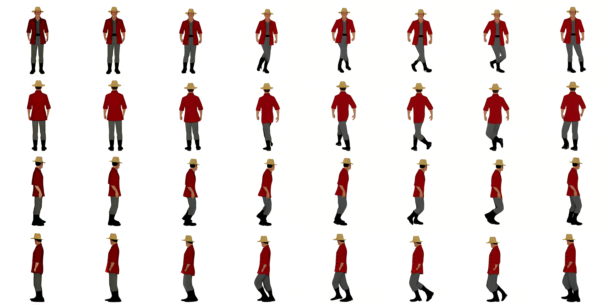

제작용 걷기 에셋으로 사용하지 않는 이유는 다음과 같다.

- 정면·후면 일부 프레임의 자세 변화가 작아 걷기 phase가 선명하게 구분되지 않는다.
- 이후 프레임에서는 다리 교차와 신체 기울기가 갑자기 커져 프레임 사이 변화량이 고르지 않다.
- 엄격한 정면·후면·좌우 측면과 동일 카메라를 전 프레임에서 유지했다고 보기 어렵다.
- 네 방향의 같은 인덱스가 동일한 걷기 순간으로 보이는지 제작 기준으로 확인되지 않았다.
- 따라서 32장을 순서대로 재생했을 때 자연스럽고 반복 가능한 4방향 걷기 cycle이라는 HARD GATE를 통과하지 못했다.

## Motion Adapter 디버그

adapter가 생성한 전체 4방향 17프레임 pose 미리보기다.

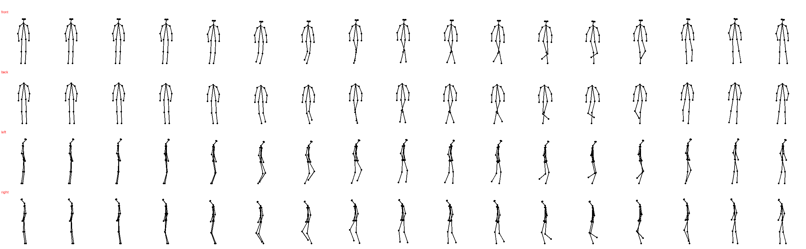

대표 control은 시작, 중간, 마지막인 `000`, `008`, `016`을 보존했다.

| 방향 | frame 000 | frame 008 | frame 016 |
|---|---|---|---|
| front | 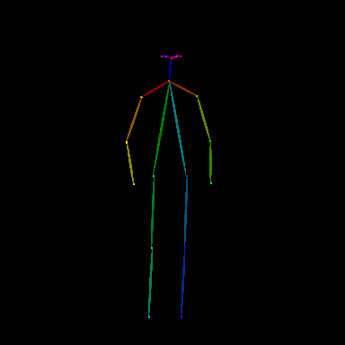 | 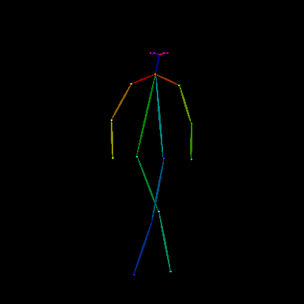 | 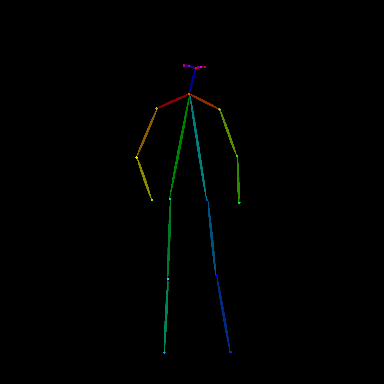 |
| back | 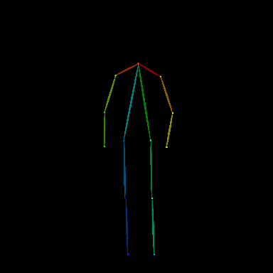 | 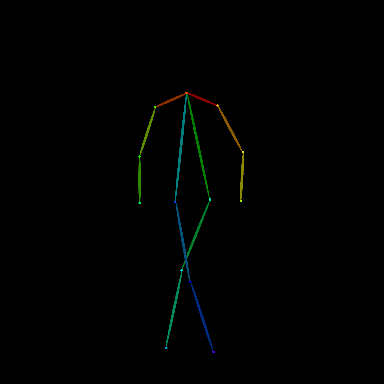 | 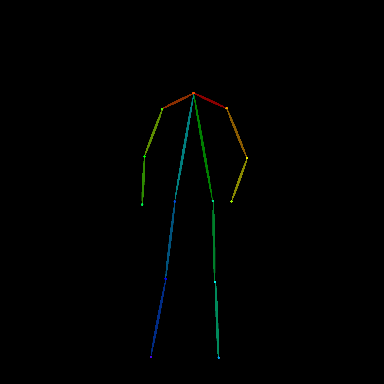 |
| left | 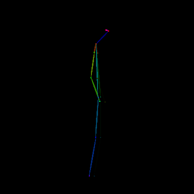 | 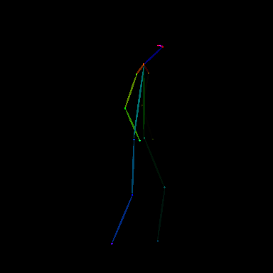 | 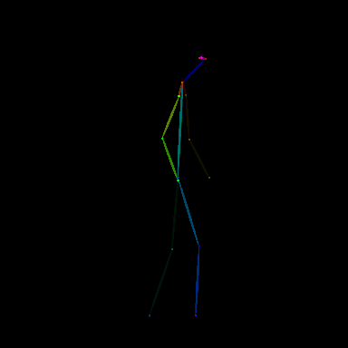 |
| right | 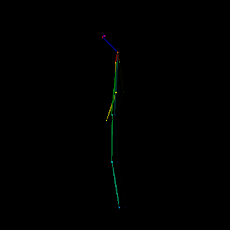 | 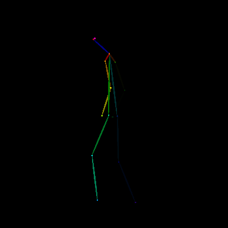 | 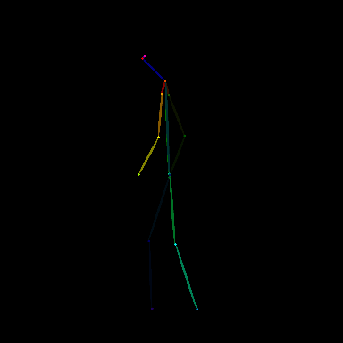 |

## 자동 validation과 실제 판정의 차이

[`adapter_validation.json`](assets/kimodo-pose-attempt-2026-08-16/adapter_validation.json)은 다음 네 개의 방향 부호 검사를 통과해 `ok: true`를 반환했다.

```json
{
  "front_right_minus_left_shoulder_x": -0.16708588600158691,
  "back_right_minus_left_shoulder_x": 0.16708588600158691,
  "left_nose_minus_neck_x": 0.07141870260238647,
  "right_nose_minus_neck_x": -0.07141873240470886
}
```

이 검사는 정면과 후면 어깨의 좌우 부호, 좌우 측면 머리 방향만 확인한다. 다음 항목은 검사하지 않는다.

- 프레임별 보폭과 변화량
- Contact, Down, Passing, Up phase의 순서와 구분
- 동일 phase의 4방향 동기화
- ground baseline과 화면상 크기 고정
- One-to-All 출력에서의 방향 유지와 외형 일관성
- 마지막 프레임에서 첫 프레임으로 이어지는 cycle 연속성

따라서 이번 기록에서는 `adapter validation 성공`과 `최종 에셋 실패`가 동시에 성립한다. 자동 validation의 `ok: true`를 제작 승인으로 사용하면 안 된다.

## 추가로 확인할 값

[`adapter_meta.json`](assets/kimodo-pose-attempt-2026-08-16/adapter_meta.json)에 기록된 canonical heading은 `0.12186977169296304` rad다. 약 7도에 해당하지만, 이 값만으로 최종 방향 이탈의 원인이라고 단정하지 않는다. 다음 시도에서는 동일 입력으로 아래 항목을 분리해 비교한다.

1. 17개 control pose 자체의 phase 순서와 보폭
2. 방향별 reference detector score와 target confidence
3. One-to-All 입력 control과 실제 생성 결과의 대응
4. canonical heading 보정 전후 결과
5. 최종 8프레임 선택 인덱스와 cycle 연결부

## 보존한 원본 디버그

- [원본 `latest_pose_debug.zip`](assets/kimodo-pose-attempt-2026-08-16/latest_pose_debug.zip)
- [adapter 메타데이터](assets/kimodo-pose-attempt-2026-08-16/adapter_meta.json)
- [adapter validation](assets/kimodo-pose-attempt-2026-08-16/adapter_validation.json)
- [전체 pose preview](assets/kimodo-pose-attempt-2026-08-16/pose_preview.png)
- 방향별 `control_000.png`, `control_008.png`, `control_016.png` 12장
- [실패한 최종 sprite sheet](assets/kimodo-pose-attempt-2026-08-16/generated-sprite-sheet.png)

## 다음 상태

이번 실패로 Kimodo, Motion Adapter, One-to-All, FastAPI queue와 4방향 입력 구조를 폐기하지 않는다. 현재 실행 가이드와 최신 V2 서버 ZIP도 활성 상태로 유지한다. 다음 시도에서 control pose와 validation 범위를 보강한 뒤 같은 입력으로 결과를 비교한다.

