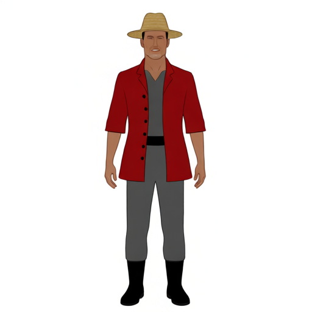
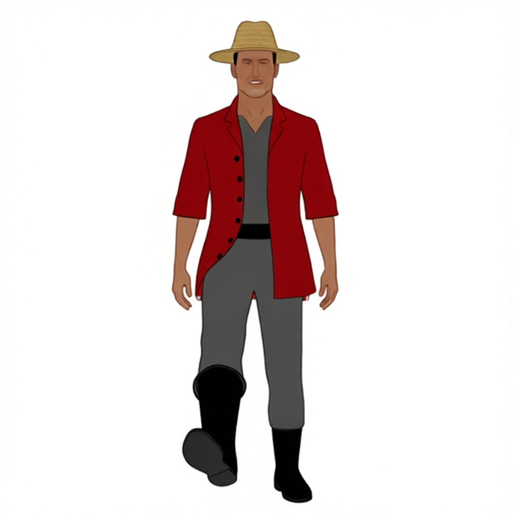
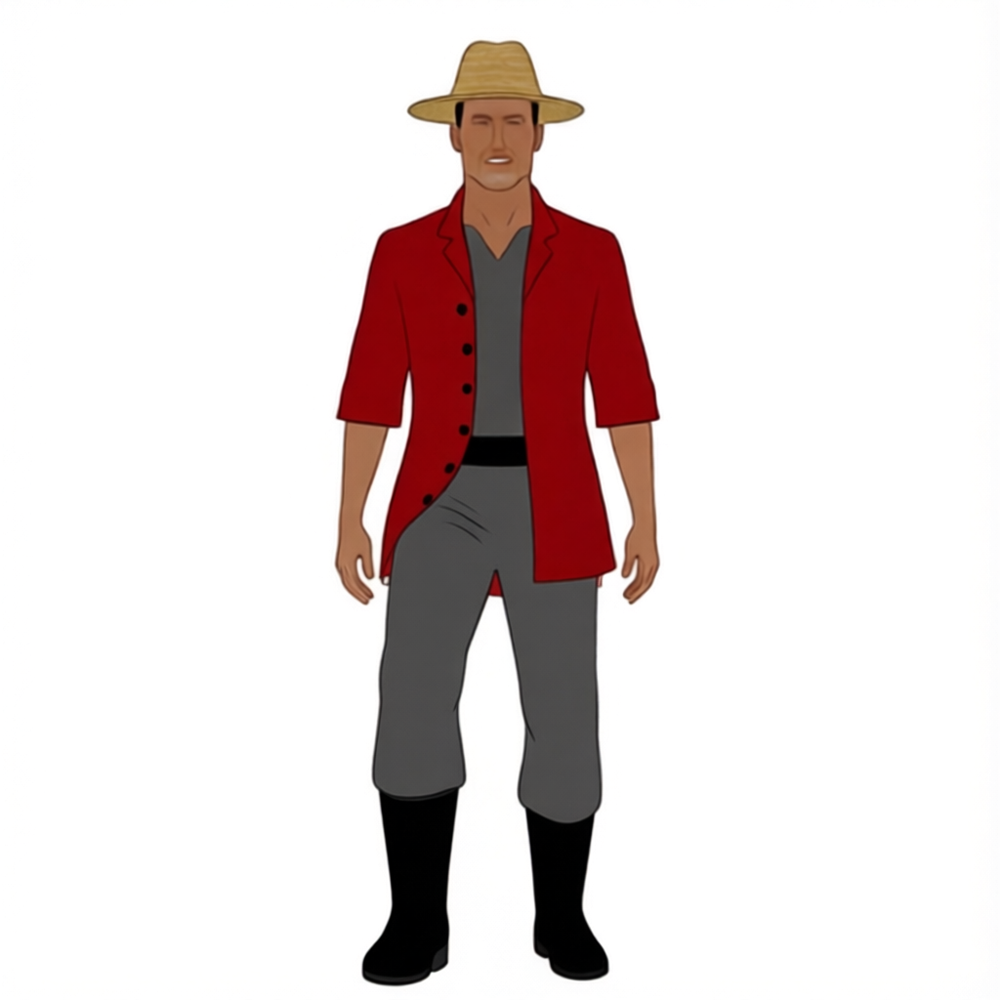
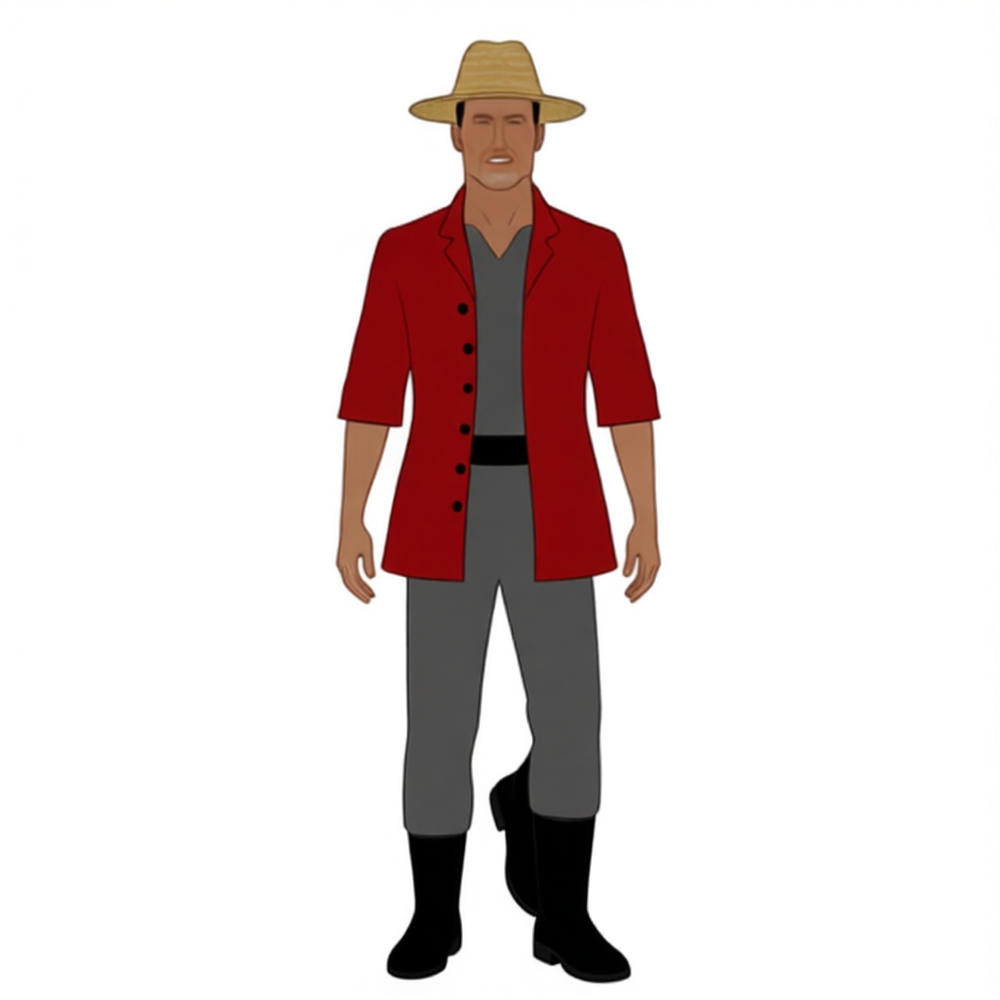
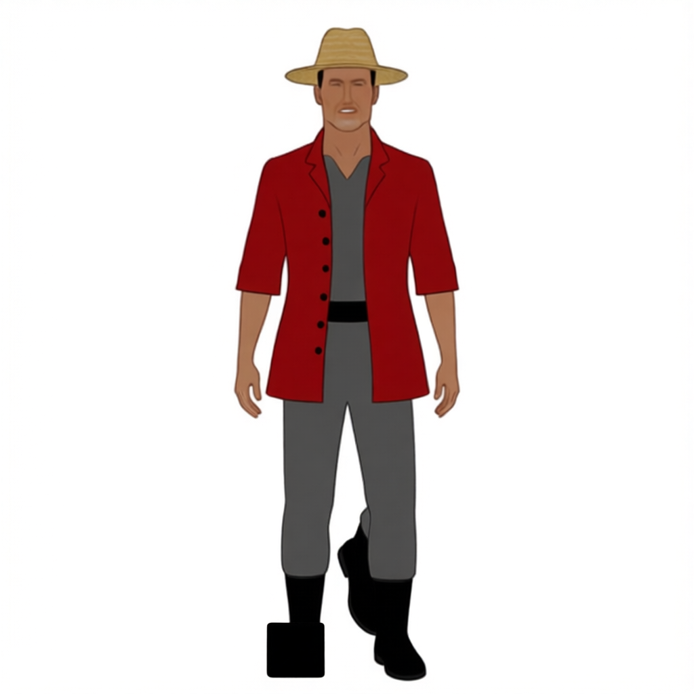
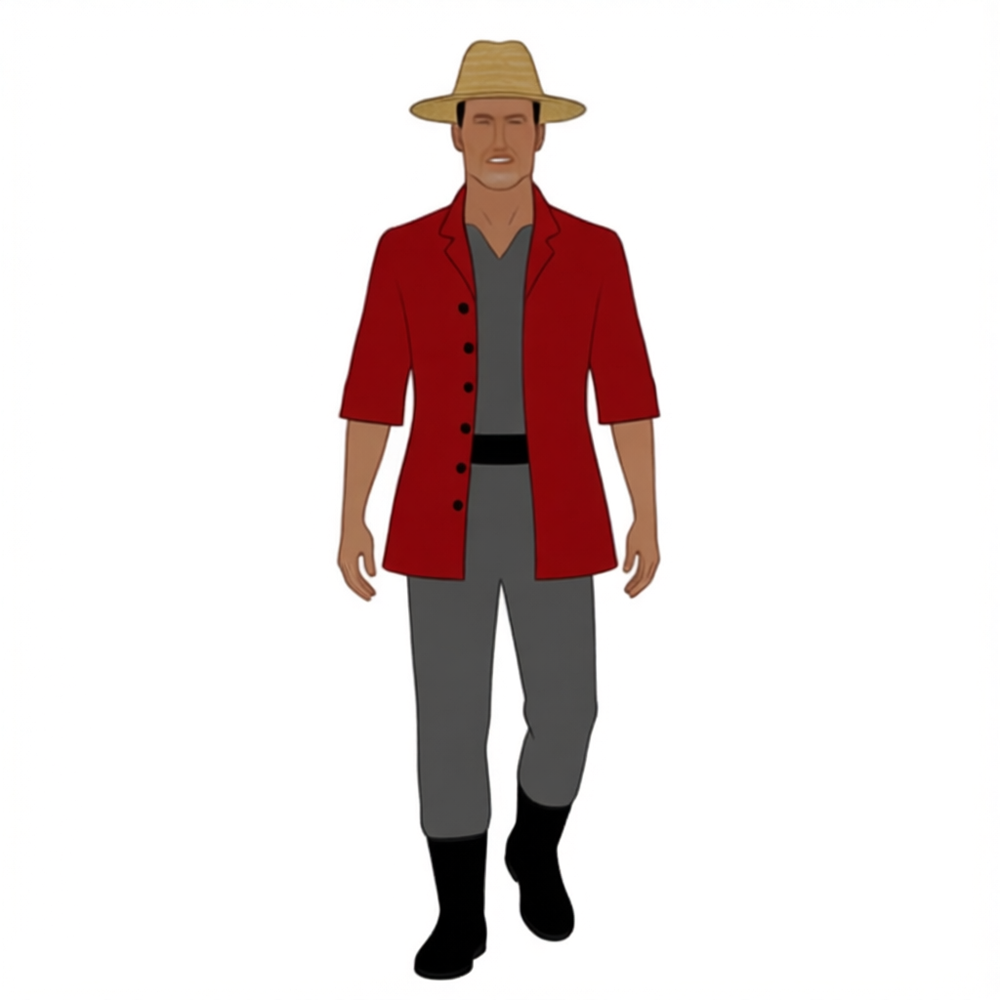

# Qwen 정면 걷기 프레임 실패 기록

2026-08-08에 `Qwen-Image-Edit-2511`과 로컬 디버거를 사용해 정면 걷기 8장을 한 프레임씩 생성했습니다. 이 실험은 완성되거나 승인된 결과가 아닙니다. 8프레임 전체의 자세 순서와 캐릭터 일관성을 확보하지 못해 중단했습니다.

## 목표

- 입력은 승인된 정면 캐릭터 이미지 한 장과 프레임별 prompt만 사용
- 앞발이 몸 중심 앞으로 들리고 착지하는 정면 원근 보행
- 다리를 좌우로 벌리는 자세가 아니라 앞뒤 깊이로 겹치는 자세
- 1~4와 5~8이 서로 반대발인 한 보행 주기
- 얼굴, 모자, 의상, 색상, 비율과 출력 크기 유지

## 중단 시점의 프레임 순서

| 프레임 | 의도한 자세 |
|---:|---|
| 1 | 본인 오른발(화면 왼쪽)이 앞으로 들린 착지 직전 |
| 2 | 같은 발이 바닥에 착지하고 체중을 받음 |
| 3 | 본인 왼발(화면 오른쪽)이 지지발을 통과하며 공중에 있음 |
| 4 | 왼발이 다음 착지 직전까지 전진한 높은 자세 |
| 5 | 왼발이 앞으로 들린 착지 직전 |
| 6 | 같은 발이 바닥에 착지하고 체중을 받음 |
| 7 | 오른발이 지지발을 통과하며 공중에 있음 |
| 8 | 오른발이 다음 착지 직전까지 전진한 높은 자세 |

## 확인된 실패

| 방식 | 결과 |
|---|---|
| 이전 생성 프레임을 다음 Reference로 연결 | 작은 자세 변경을 무시하고 중립 자세로 복원하거나 앞선 자세와 거의 같은 이미지 생성 |
| 프레임마다 같은 정면 원본을 독립 Reference로 사용 | 단일 자세는 생성되지만 앞발 좌우와 순서가 일정하지 않음 |
| `viewer-left`, `screen-left`로 발 지정 | 반대쪽 발이 전진하거나 다리가 옆으로 벌어짐 |
| `his right leg, visible on viewer's left`로 해부학과 화면 좌표를 같이 지정 | 좌우 해석은 일부 개선됐지만 8프레임 전체 재현 전 중단 |
| 착지 발의 밑창을 평평하게 지정 | 중립 자세로 복원하거나 부츠가 사각형으로 왜곡됨 |
| 두 번째 포즈 이미지와 실루엣 입력 실험 | 요청 범위를 벗어났고 포즈 제어에도 실패하여 코드와 환경설정에서 전부 제거 |

## 실패 결과 이미지

아래 이미지는 생성 ID만 남긴 요약본이 아니라 당시 실제 입력과 출력 원본을 실패 기록 폴더에 복사한 것이다.

| 정면 기준 입력 | 1번 자세에 가장 가까웠던 출력 |
|---|---|
|  |  |

첫 출력은 앞발이 들린 모습까지는 만들었지만, 이 한 장을 이후 2~8번의 연속된 phase로 안정적으로 이어 가지 못했다.

| 2번 요청이 중립 자세로 복원됨 | 요청한 발과 반대쪽 발이 전진함 |
|---|---|
|  |  |

| 착지 발이 검은 사각형으로 왜곡됨 | 2번에 가장 가까웠지만 전체 주기는 미검증 |
|---|---|
|  |  |

### 폐기한 Reference B 레이아웃 실험

이 화면은 Reference A에 캐릭터, Reference B에 포즈·윤곽 레이아웃을 함께 전송하던 실험이다. 출력 크기와 캐릭터 배치가 입력 레이아웃과 일치하지 않았고, 이후 프롬프트만 사용하는 실험으로 전환하면서 제거했다.

## 마지막 로컬 원본

전체 원본은 `tools_test/public/generated/` 아래의 로컬 기록이며 `.gitignore` 대상이다. 위에서 확인 가능한 대표 입력·출력은 `docs/failures/assets/qwen-walk/`에 별도로 복사했고, 나머지 생성 ID와 판정은 아래 표에 남긴다.

| 생성 ID | 판정 |
|---|---|
| `MOTION-FRAME-20260808082212-FRONT-01-308dc7e7` | 1번 착지 직전 자세에 가장 가까움. 화면 왼쪽 앞발이 공중에 있음 |
| `MOTION-FRAME-20260808082422-FRONT-02-ca89ce49` | 2번 실패. 중립 자세로 복원 |
| `MOTION-FRAME-20260808082643-FRONT-02-a9f301b8` | 2번 실패. 최소 편집 지시를 무시하고 중립 자세로 복원 |
| `MOTION-FRAME-20260808083102-FRONT-02-6816d7cd` | 2번 실패. 원본 독립 참조에서도 착지 자세가 불명확 |
| `MOTION-FRAME-20260808083340-FRONT-02-c0fd1a26` | 2번 실패. 반대쪽 발이 앞으로 나옴 |
| `MOTION-FRAME-20260808083623-FRONT-02-913a23a2` | 2번 실패. 발이 사각형으로 왜곡됨 |
| `MOTION-FRAME-20260808083904-FRONT-02-e5dd2657` | 2번에 가장 가까운 결과. 화면 왼쪽 발 착지와 반대발 들림은 보이지만 전체 주기는 미검증 |

## 현재 코드 상태

- 포즈 이미지, 실루엣, 마스크 입력은 사용하지 않음
- 원본 방향 이미지 한 장과 프레임별 prompt만 전송
- 1~8은 모두 같은 방향 원본을 독립 Reference로 사용
- 각 프레임 prompt는 화면에서 직접 수정 가능
- 생성 결과 자동 후처리 없음
- 8프레임 전체 결과는 승인되지 않음

이 기록은 성공 사례가 아니라 실패 원인과 중단 지점을 보존하기 위한 문서입니다.
