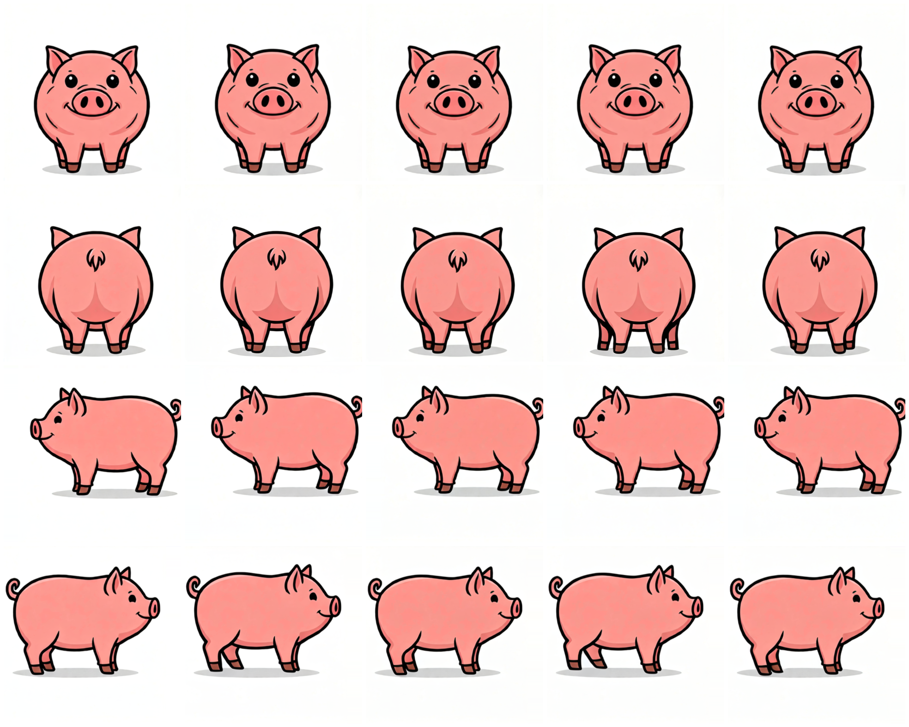
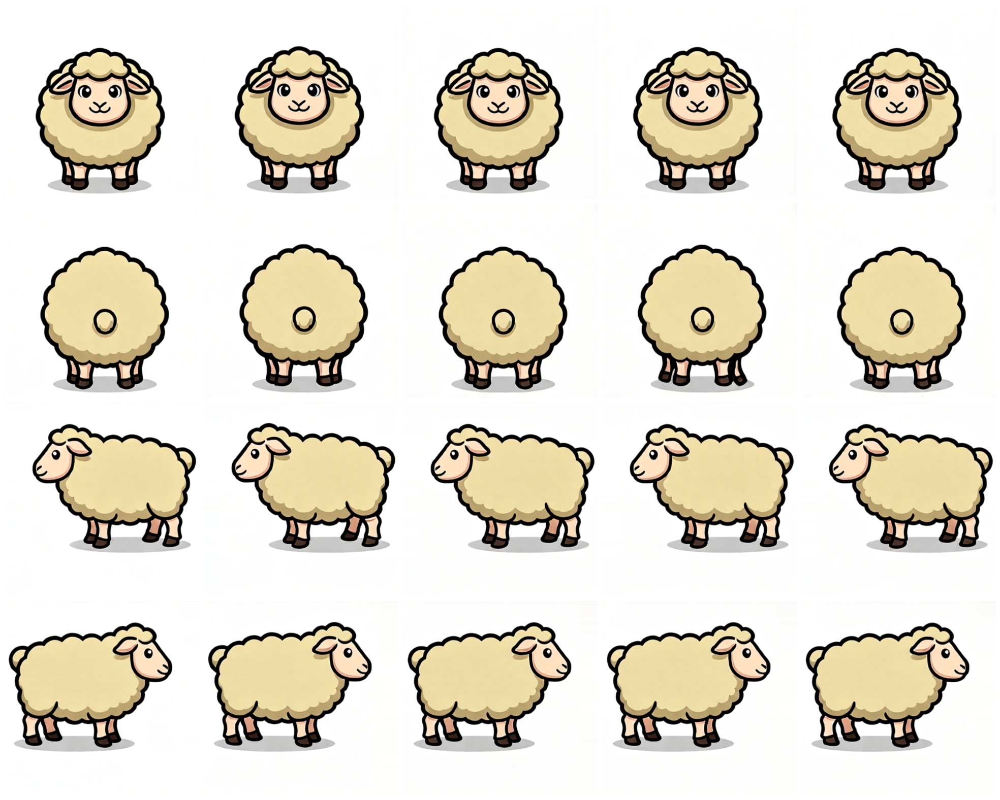
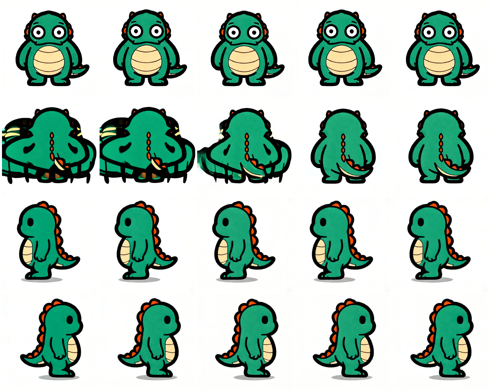

# V9 동물 4방향 GPU 실생성 실패 기록

테스트 날짜: 2026-08-23

대상: V9 동물 독립 라우팅 (`quadruped` / `biped_animal`)

입력 규격: 한 개체의 `front`, `back`, `left`, `right` RGB 4장

동작 backend: `animal_procedural`

seed: `4821`

RunPod endpoint와 인증 token은 저장소에 기록하지 않았다. 디버깅 페이지에서 2×2 시트를 직접 분할하고, 방향별 입력을 확인한 뒤 요청했다.

## 결론

V9의 사람·동물 분리와 동물 motion 라우팅은 실제 서버에서 작동했다. 세 작업 모두 요청한 profile과 `animal_procedural` backend로 처리됐고 Kimodo 사람 경로를 타지 않았다. 그러나 올바른 4방향 동물 입력으로 수행한 실제 GPU 렌더 `3/3`이 두 차례의 자동 시도 뒤 QC에서 실패했다.

따라서 V9는 API·라우팅·실패 산출물 보존까지는 검증됐지만, 동물 걷기 출력 품질은 아직 프로덕션 기준을 통과하지 못했다. 이 기록은 V9 구조 전체를 기각하는 문서가 아니라 실제 동물 생성 단계의 남은 실패를 보존하는 문서다.

| 입력 | profile | job ID | 최종 판정 |
|---|---|---|---|
| 돼지 | `quadruped` | `4667a7195a514239aaa82b20cddf12e6` | 실패: transition ratio `3.203 > 2.250`, left canvas edge 접촉 |
| 양 | `quadruped` | `2689b2952e3b42028e6e1eb597a91ea8` | 실패: transition ratio `6.812 > 2.250` |
| 공룡 | `biped_animal` | `dc90a852e3ea462eb3526a7d39ceec7f` | 실패: transition ratio `4.451 > 2.250`, back chroma·crop·loop seam 오류 |

모든 몽타주는 위에서부터 `front`, `back`, `left`, `right`이며 각 행은 2차 렌더의 `000`, `004`, `008`, `012`, `016` 프레임이다.

## 돼지 · quadruped

[입력 4방향 시트](../../tools_test/public/assets/catalog/creatures/CREATURE-20260804112223-0b24d435.png)

- 요청 profile: `quadruped`
- 실제 profile: `quadruped`
- 실제 backend: `animal_procedural`
- 두 번째 attempt에서도 정체성, 분홍색과 네 방향은 대체로 유지됐다.
- 측면 원본의 좌우 여백이 좁았고, 생성 프레임 일부가 왼쪽 canvas edge에 닿았다.
- 프레임 전이 비율도 허용치를 초과해 결과 ZIP 대신 실패 디버그 ZIP이 제공됐다.
- [실패 디버그 ZIP](assets/v9-animals-2026-08-23/pig/failure-debug.zip)
- SHA-256: `f8c0075b6b7ad6b3bc97197be8a23a347099b4790e71fbcea0b79175c10b6c6e`

## 양 · quadruped

[입력 4방향 시트](../../tools_test/public/assets/catalog/creatures/CREATURE-20260804112022-8739ad23.png)

- 요청 profile: `quadruped`
- 실제 profile: `quadruped`
- 실제 backend: `animal_procedural`
- 돼지보다 측면 여백이 넓어 canvas edge 오류는 재현되지 않았다.
- 정체성, 털 색상과 네 방향은 유지됐지만 선택된 보행 프레임의 최악 전이 비율이 `6.812`로 허용치 `2.250`을 크게 초과했다.
- [실패 디버그 ZIP](assets/v9-animals-2026-08-23/sheep/failure-debug.zip)
- SHA-256: `85c55a31d9b883eaa81730db3bf271ba70d0fc327a9f7080824db82815354dd2`

## 공룡 · biped_animal

[입력 4방향 시트](../test-records/v8-creatures/dinosaur/source.png)

- 요청 profile: `biped_animal`
- 실제 profile: `biped_animal`
- 실제 backend: `animal_procedural`
- 정면과 측면은 외형이 비교적 유지됐지만 후면 초반 프레임에서 몸체가 크게 증식·왜곡되고 canvas 밖으로 잘렸다.
- 최악 전이 비율 `4.451`, back temporal chroma spread `21.920`, back crop과 loop shape seam `0.230`으로 실패했다.
- [실패 디버그 ZIP](assets/v9-animals-2026-08-23/dinosaur/failure-debug.zip)
- SHA-256: `6d4ad90fc60a86b1b8cf5ca3685fad9477748b16bbbd2ccb2cac9b7e9059203a`

## 검증에서 제외한 예비 요청

- 개 작업 `54577117f8e442b3acbe025b7490432e`은 API상 완료됐지만 원본 시트의 정면·후면 칸이 실제 정면·후면이 아니었다. V9 동물 4방향 품질 성공으로 집계하지 않는다.
- 소 작업 `262fecb208ef4a0b95652ae0ee0d3916`도 정면·후면이 엄격한 직교 방향이 아닌 3/4 시점이라 최종 통계에서 제외했다.
- 사람 대조 작업 `f1ad1799253e48ffaa38989998f39e9f`은 기존 `character + kimodo` V8 호환 경로로 완료됐다. 동물 실패와 사람 경로의 회귀를 혼동하지 않는다.

## 다음 개선 기준

- 동물 요청 전에 네 입력이 실제 정면·후면·왼쪽·오른쪽인지 검증해야 한다.
- 측면처럼 폭이 넓은 동물은 원본과 렌더 모두 안전 여백을 확보해야 한다.
- `animal_procedural`의 phase 변화가 지나치게 작거나 특정 구간에 몰리지 않도록 보행 변위를 재조정해야 한다.
- 이족동물 후면에서 발생한 증식·crop·chroma 변화를 별도 hard gate 이전에 줄여야 한다.
- 결과가 실패해도 이번 V9처럼 두 attempt의 프레임, pose, profile 분류와 QC 원문을 디버그 ZIP으로 계속 보존한다.
