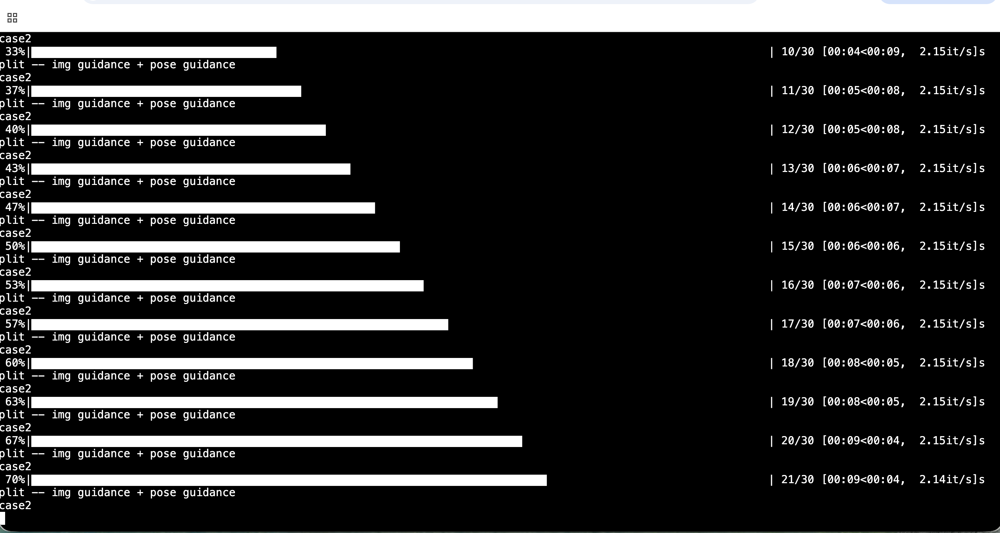
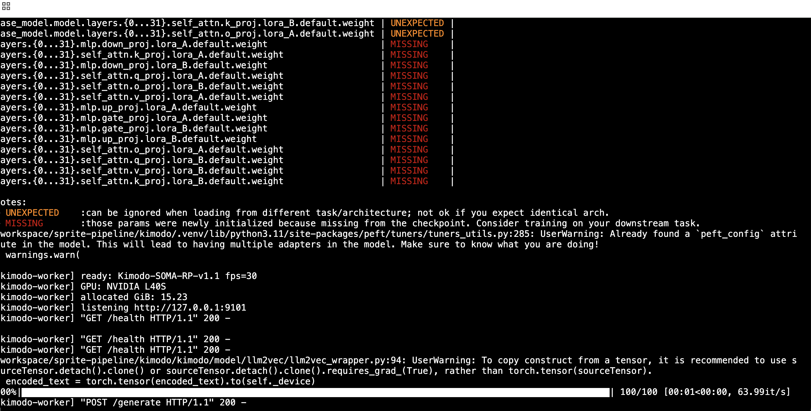
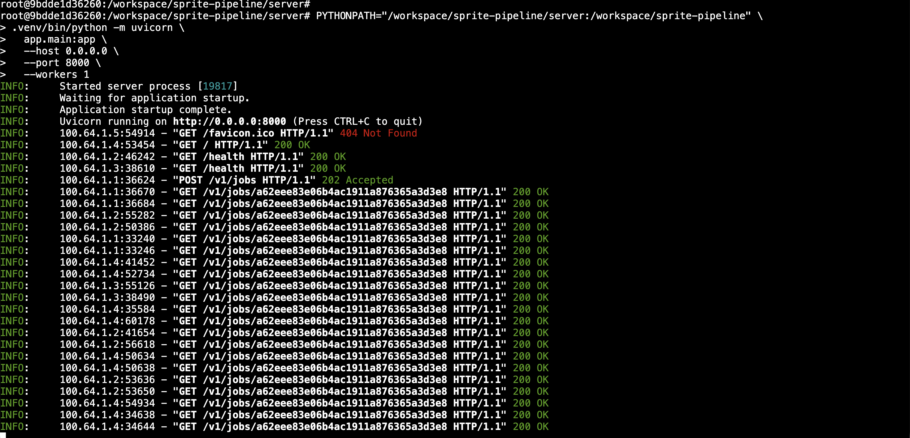
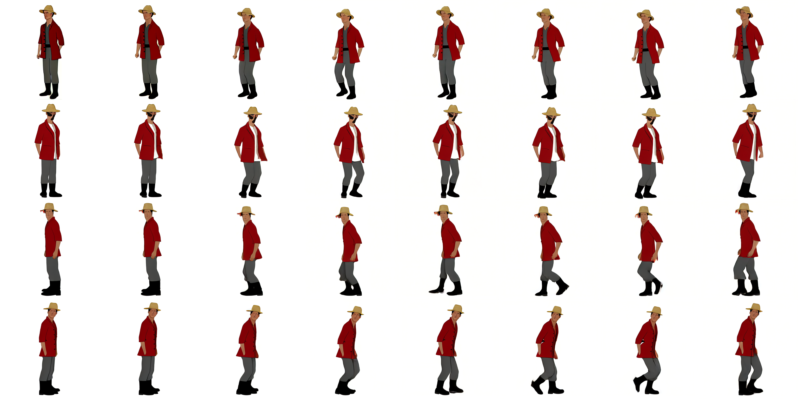

# Kimodo + Motion Adapter + One-to-All 종단 테스트 기록 — 2026-08-15

이 문서는 RunPod에서 Kimodo, Motion Adapter, One-to-All과 FastAPI queue를 연결해 `4방향 RGB → 32 PNG + sprite sheet + metadata` 흐름을 처음으로 끝까지 실행한 기록이다.

이번 테스트는 **서버 파이프라인과 결과 archive 생성 성공**을 확인한 것이다. 생성된 캐릭터의 방향, 외형과 자세 품질까지 승인했다는 의미는 아니다.

후속 검토에서 현재 `custom 3D→2D pose adapter`가 OTA에 전달하는 visibility/confidence와 방향별 독립 생성의 identity drift를 우선 수정 대상으로 정했다. 이 경로를 기각한 것은 아니며 세부 순서는 [추후 개선 사항](../KIMODO_ONE_TO_ALL_FUTURE_IMPROVEMENTS.md)에 기록한다.

## 테스트 범위

1. 로컬 `:3000` 화면에서 저장된 `2×2` 캐릭터 시트를 선택
2. `1024×1024` 시트를 정면·후면·왼쪽·오른쪽 `512×512` RGB 네 장으로 분할
3. 로컬 Next API proxy가 RunPod의 `POST /v1/jobs`에 multipart 요청
4. Kimodo가 걷기 motion 생성
5. Motion Adapter가 같은 motion을 네 방향 pose로 변환
6. One-to-All이 방향별 결과 생성
7. 방향별 8장, 총 32 PNG와 `sprite_sheet.png`, `metadata.json` 패킹
8. `GET /v1/jobs/{job_id}/result`로 결과 ZIP 수신

RunPod HTTP Proxy 주소와 공인 IP는 Pod를 생성할 때마다 바뀌므로 이 기록에 고정값으로 남기지 않는다. 토큰도 저장소에 기록하지 않는다.

## 실행 정보

| 항목 | 값 |
|---|---|
| 실행일 | 2026-08-15 KST |
| GPU | NVIDIA L40S 48GB |
| 작업 ID | `a62eee83e06b4ac1911a876365a3d3e8` |
| seed | `4821` |
| 최종 상태 | `succeeded` |
| 생성 시간 | 약 67초 |
| Kimodo GPU 할당 | 약 15.24GiB |
| One-to-All GPU 할당 | 약 14.95GiB, reserved 약 17.53GiB |
| 결과 ZIP | 약 3.4MB, HTTP 200 |
| 결과 파일 | 방향별 8 PNG × 4방향 + sprite sheet + metadata, 총 34개 |

전송한 동작 설명은 다음과 같다.

```text
Create one natural, seamless in-place walk cycle. Keep the supplied character identity, clothing, colors, proportions, scale, framing, and ground baseline consistent across all four directions.
```

## 실행 화면

### One-to-All 생성 진행

방향별 생성 과정에서 30-step 추론이 진행되는 것을 확인했다.



### Kimodo worker

Kimodo worker가 L40S에서 모델을 로드하고 `127.0.0.1:9101`에서 대기한 뒤 `POST /generate`에 HTTP 200을 반환했다.

로그에는 LoRA parameter의 `UNEXPECTED`, `MISSING` 경고와 multiple adapter 경고가 표시됐다. 이번 요청은 완료됐지만, 이 경고가 원하는 checkpoint 적용에 영향을 주지 않는지는 별도로 확인해야 한다.



### FastAPI queue와 polling

FastAPI는 `POST /v1/jobs`에 HTTP 202를 반환했고, 로컬 클라이언트는 작업 ID로 상태를 반복 조회했다. 최종 서버 상태는 `succeeded`였다.



## 생성 결과

결과 ZIP에는 아래 파일들이 포함됐다.

```text
front/0.png ... front/7.png
back/0.png  ... back/7.png
left/0.png  ... left/7.png
right/0.png ... right/7.png
sprite_sheet.png
metadata.json
```



## 확인된 결과

- Kimodo와 One-to-All worker가 한 L40S에서 동시에 상주했다.
- FastAPI queue가 작업을 접수하고 worker들을 순서대로 호출했다.
- 네 방향 모두 8장씩 생성됐고 파일 수와 폴더 구조가 계획과 일치했다.
- 최종 ZIP을 RunPod endpoint에서 로컬로 내려받을 수 있었다.
- 흰 배경과 동일한 방향별 캔버스 구조가 유지됐다.

## 남은 문제

### 생성 품질

- 정면과 후면이 엄격한 정투영 방향으로 유지되지 않았다.
- 방향 사이에서 얼굴, 체형, 각도와 의상 표현이 일부 달라졌다.
- 일부 프레임의 변화량이 작고, 네 방향에서 같은 phase가 정확히 대응하는지 추가 검수가 필요하다.
- 따라서 이번 출력은 제작 승인 에셋이 아니라 파이프라인 연결 검증 결과다.

### 로컬 `:3000` 클라이언트 API 규격

서버 생성은 성공했지만 현재 로컬 화면의 상태와 다운로드 규격은 서버 응답과 다르다.

| 서버 응답 | 현재 클라이언트가 기대하는 값 | 영향 |
|---|---|---|
| `status: succeeded` | `completed` | 완료 작업을 계속 대기열로 표시 |
| `result_url` | `output_url` | 다운로드 버튼 비활성화 |
| `/v1/jobs/{id}/result` | `/v1/jobs/{id}/output` | 로컬 다운로드 proxy에서 HTTP 404 |
| `kimodo_worker`, `ota_worker`, `queue_size` | `kimodo_state`, `one_to_all_state`, `queue_depth` | 화면에 worker 상태를 `unknown`으로 표시 |

서버는 정상 완료했으므로 다음 작업에서는 모델 파이프라인을 다시 구성하지 않고 로컬 클라이언트의 응답 매핑과 다운로드 경로를 맞춘다.

## 결론

`4방향 RGB → Kimodo motion → Motion Adapter → One-to-All → 32 PNG와 ZIP`의 종단 실행은 성공했다. 다음 검증 대상은 로컬 완료·다운로드 표시 수정과 캐릭터 방향·정체성·phase 일관성 개선이다.
