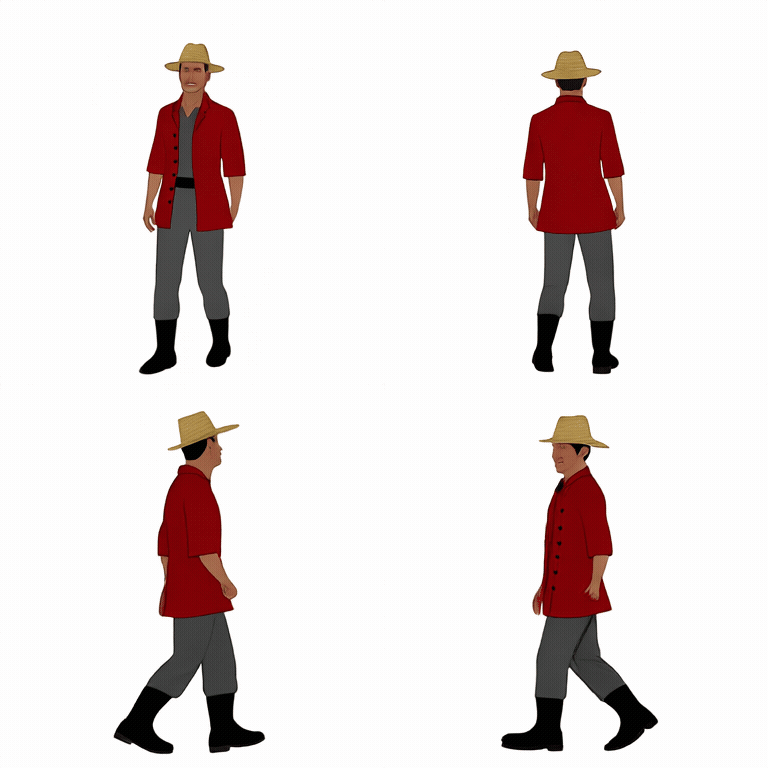
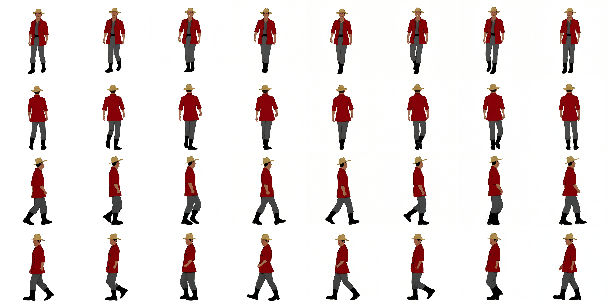
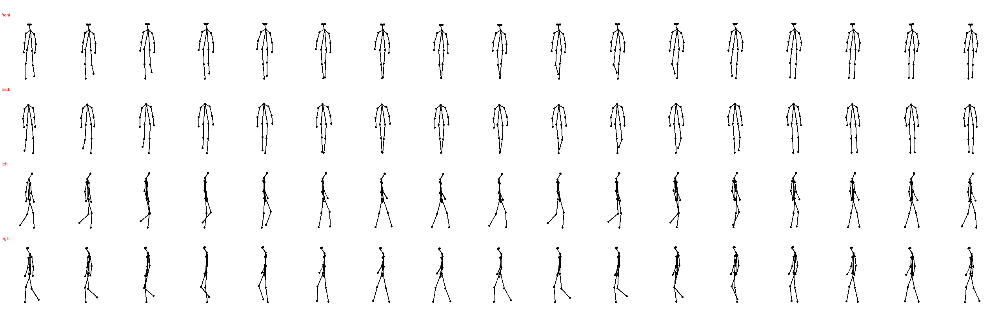

# Kimodo + Motion Adapter + One-to-All V5 성공 기록 — 2026-08-16

이 문서는 Kimodo 공식 walk fixture를 사용하는 V5 파이프라인으로 `4방향 RGB → 4방향 pose → One-to-All → 32 PNG + sprite sheet + metadata` 작업을 끝까지 실행하고, 결과 ZIP을 RunPod에서 로컬로 내려받은 기록이다.

이번 결과는 **V5 파이프라인 실행, 공식 motion cycle 선택, 4방향 pose 검증과 archive 수신 성공**을 의미한다. 한 캐릭터에 대한 성공 사례이며, 다양한 캐릭터와 생명체에 대한 제작 승인 기준을 모두 통과했다는 의미는 아니다. V2/V3 실패 기록은 비교 자료로 그대로 보존한다.

## 실행 정보

| 항목 | 값 |
|---|---|
| 실행일 | 2026-08-16 KST |
| 파이프라인 | `5.0.0` |
| GPU | NVIDIA L40S 48GB |
| 작업 ID | `a8ca133b4a7f49dcb530703365ce0dee` |
| 최종 상태 | `succeeded` |
| 총 실행 시간 | 약 65초 |
| 입력 | 정면·후면·왼쪽·오른쪽 RGB 4장, 각 `512×512` |
| 출력 | 방향별 8 PNG × 4방향, 총 32 PNG |
| 프레임 규격 | 전부 `384×384`, RGB |
| 결과 ZIP | 약 5.1MB, 무결성 검사 통과 |
| 정확히 같은 프레임 | 0장 |

RunPod HTTP Proxy 주소는 Pod를 만들 때마다 달라지므로 기록하지 않는다. API token도 저장소에 남기지 않는다.

## 사용한 motion

새 Kimodo diffusion 생성을 실행하지 않고 공식 저장소에 포함된 아래 fixture를 사용했다.

```text
kimodo-soma-rp/05_root_path/motion.npz
```

공식 prompt와 motion 정보는 다음과 같다.

```text
A person is casually walking forward slowly
300 frames · 30 joints · seed 42 · duration 10s
```

공식 NPZ에는 `posed_joints`, `global_rot_mats`, `foot_contacts`가 있고 기존 V5 worker가 요구한 `root_positions`는 없었다. 이 실행에서는 SOMA30의 joint 0 `Hips` 좌표를 `root_positions`로 추가하는 1회 schema normalization 후 원래 3D pose와 contact 데이터를 그대로 사용했다. 이는 motion을 새로 생성한 후처리가 아니라 worker 입력 계약을 공식 fixture 형식에 맞춘 변환이다.

## 실행 흐름

```text
4 RGB multipart upload
  → POST /v1/jobs · 202 Accepted
  → official Kimodo fixture
  → Motion Adapter cycle 선택과 4방향 projection
  → render_front
  → render_back
  → render_left
  → render_right
  → succeeded
  → GET /v1/jobs/{job_id}/result
  → result.zip 로컬 다운로드
```

API 프로세스에 이전 비ASCII token이 남아 있을 때 `hmac.compare_digest`가 500을 반환한 적이 있다. FastAPI 프로세스만 ASCII token으로 다시 시작한 뒤 같은 요청이 정상 접수됐으며 Kimodo와 One-to-All worker는 종료하거나 다시 로드하지 않았다.

## 4방향 걷기 GIF

배치는 `좌상=front`, `우상=back`, `좌하=left`, `우하=right`다. 서버가 만든 방향별 8프레임을 수정하지 않고 5fps 반복 GIF로 묶었다.



## 스프라이트 시트



## Motion Adapter pose preview

공식 300프레임 motion에서 선택한 cycle은 `254..291`이며, 17 source phase 중 `[0, 2, 4, 6, 8, 10, 12, 14]`를 최종 8프레임으로 사용했다.



## 자동 검증 결과

| 항목 | 결과 |
|---|---:|
| Adapter validation | `ok: true` |
| Gait quality | `ok: true` |
| 발 중심선 교차 비율 | `0.0` |
| 최대 crossover | `0.0m` |
| 최소 step width | 약 `0.0789m` |
| 최대 ankle lift | 약 `0.2228m` |
| 최대 knee flex | 약 `68.8°` |
| 최대 lateral root drift | 약 `0.0568m` |
| heading 표준편차 | 약 `3.02°` |
| heading 범위 | 약 `12.59°` |

원본 자동 검증 파일도 함께 보존한다.

- [metadata.json](kimodo-one-to-all-v5-2026-08-16/metadata.json)
- [motion-qc.json](kimodo-one-to-all-v5-2026-08-16/motion-qc.json)
- [adapter-validation.json](kimodo-one-to-all-v5-2026-08-16/adapter-validation.json)

## 화면 검수

- 네 방향 모두 밀짚모자, 붉은 외투, 회색 바지와 검은 장화가 유지됐다.
- front와 back의 방향이 분리됐고 left와 right profile도 서로 반대 방향을 본다.
- 이전 V2/V3 결과에서 보였던 X자 다리와 큰 측면 drift는 pose preview와 자동 수치에서 재현되지 않았다.
- 32장 모두 동일한 `384×384` 캔버스이고 정확히 같은 이미지 hash는 없었다.
- 프레임마다 보행 자세 변화가 보이며 GIF가 반복 재생된다.

## 남은 검증

- 다른 체형, 의상과 생명체 입력에서도 같은 품질이 재현되는지 반복 실행해야 한다.
- front/back에서 좌우 다리 phase가 시각적으로 충분히 구분되는지 캐릭터별로 확인해야 한다.
- 배경 제거, 최종 픽셀화와 Unity import는 모든 생성·선별이 끝난 뒤 별도 후처리 단계에서 검증한다.

## 결론

V5 공식 motion 경로에서 `4방향 RGB 입력 → 공식 walk fixture → Motion Adapter → One-to-All → 32 PNG → result.zip 다운로드`가 한 작업으로 성공했다. 이 결과는 V2/V3 실패를 삭제하거나 덮어쓰지 않으며, 공식 motion을 기준으로 연결부를 분리 검증한 첫 성공 기록으로 유지한다.
