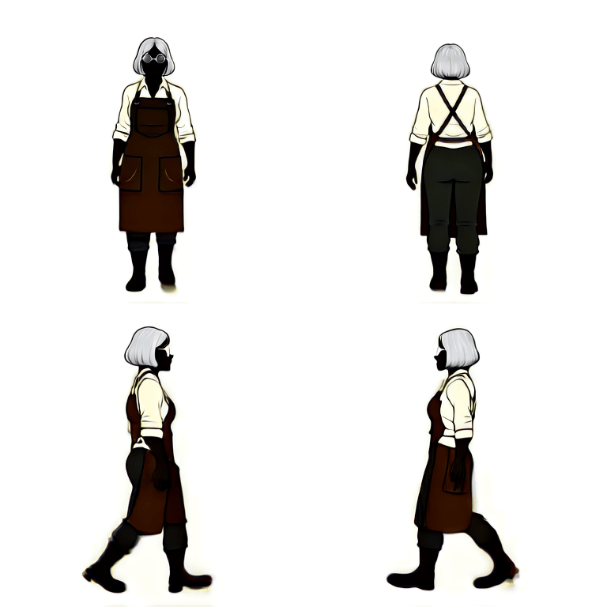
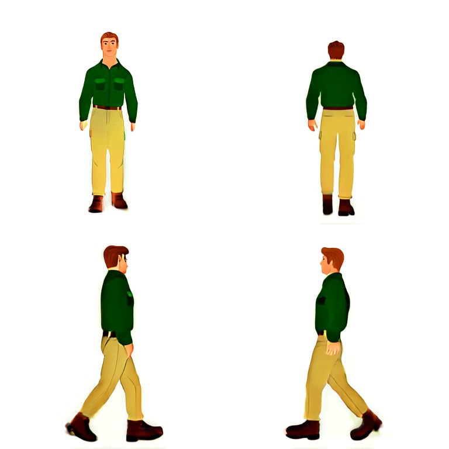
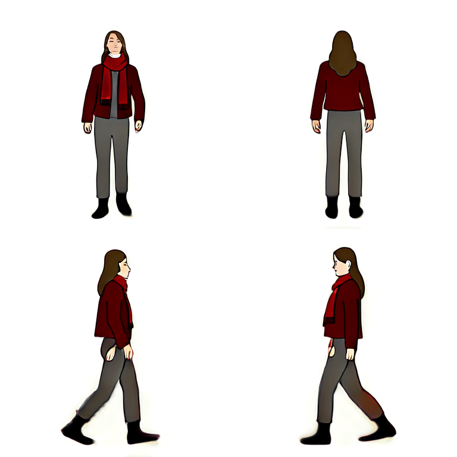

# V6 다른 캐릭터 3종 검증 기록

이 문서는 Kimodo 공식 걷기 fixture와 V6 Motion Adapter, One-to-All을 연결한 파이프라인을 서로 다른 외형과 체형의 캐릭터 3종에 적용한 결과를 보존합니다. 결과 ZIP 생성과 동작·방향 검증은 통과했지만, 캐릭터 외형 보존은 아직 제작 승인 수준이 아닙니다.

## 공통 실행 결과

- pipeline version: `6.0.0`
- 방향: `front`, `back`, `left`, `right`
- 방향별 프레임: 8장
- 전체 프레임: 32장
- 선택 phase: `0, 2, 4, 6, 8, 10, 12, 14`
- Motion Adapter validation: 통과
- gait quality validation: 통과
- front/back mirror error: `0.0`
- left/right mirror error: `0.0`
- post-canonical hip mean: 약 `0.0000249°`
- front/back torso yaw p95: 약 `2.5°`
- front/back head yaw p95: 약 `5.0°`

동일한 공식 motion fixture를 사용했기 때문에 세 작업의 동작·방향 검증 수치는 같습니다. 이 수치는 3D motion과 cardinal projection을 검증하며, 얼굴·액세서리·체형 같은 캐릭터 외형 일관성을 보장하지는 않습니다.

## 1. 은색 단발 대장장이

- source asset: `CHARACTER-20260804113857-738e8125`
- job ID: `5979461b08a34d88a4712451925ae9f6`
- result ZIP SHA-256: `3c88a608975af33249e86c585e65a18b1141d331e77f27f55e839c81708ce494`
- 관찰: 은색 머리와 앞치마·의상은 대체로 유지됐지만, 정면 프레임 사이에서 얼굴과 둥근 안경이 바뀌고 일부 프레임은 얼굴이 마스크처럼 보입니다.
- [결과 ZIP](v6-other-characters/blacksmith/result.zip)

## 2. 짧고 다부진 여행자

- source asset: `CHARACTER-20260804113611-028b7836`
- job ID: `c81de857e0e047539330a171dff50c93`
- result ZIP SHA-256: `7bdcb65721db2fea523cacc6d8c5c63d78f4db0d6e88393ad8cd3a2368a84816`
- 관찰: 초록색 상의와 베이지색 하의는 유지되지만, 원본의 짧고 다부진 체형이 출력에서 더 길고 날씬하게 변했습니다. 체형·신체 비율 보존이 약합니다.
- [결과 ZIP](v6-other-characters/short-traveler/result.zip)

## 3. 키가 크고 마른 붉은 코트 여행자

- source asset: `CHARACTER-20260804113221-249c4eb8`
- job ID: `c632d0e762834ecb9bff53647ca693e2`
- result ZIP SHA-256: `c582bcfaf8ec50af9dfedebfbf5880897e9c9fa19c38ba4125a9c6a9ebb14e84`
- 관찰: 세 작업 중 캐릭터 정체성 보존이 가장 양호했습니다. 붉은 스카프와 코트는 대체로 유지되지만 작은 의상 디테일은 프레임마다 달라집니다.
- [결과 ZIP](v6-other-characters/tall-traveler/result.zip)

## V7에서 추가할 검증

V6 hard gate가 모두 통과해도 실제 캐릭터 외형은 달라질 수 있었습니다. 따라서 V7에서는 동작 검증과 별도로 다음 항목을 원본 방향 이미지와 각 출력 프레임 사이에서 검사해야 합니다.

- 얼굴과 머리 형태
- 안경, 모자, 스카프 같은 액세서리
- 상·하의 색상과 주요 의상 경계
- 전체 키, 머리 대 몸 비율, 어깨 폭과 체형
- 같은 방향의 연속 프레임 사이 외형 변화량

이 기록은 V6를 최종 성공으로 선언하기 위한 자료가 아니라, 동작·방향 제어와 외형 보존을 분리해서 평가해야 한다는 근거입니다.
