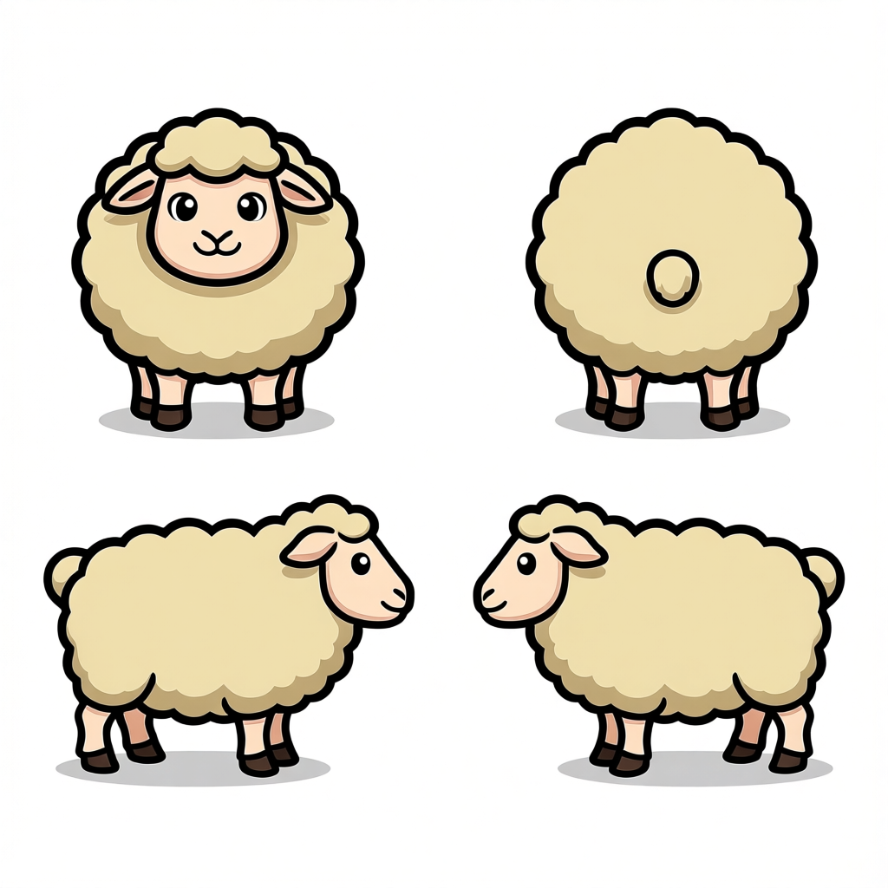
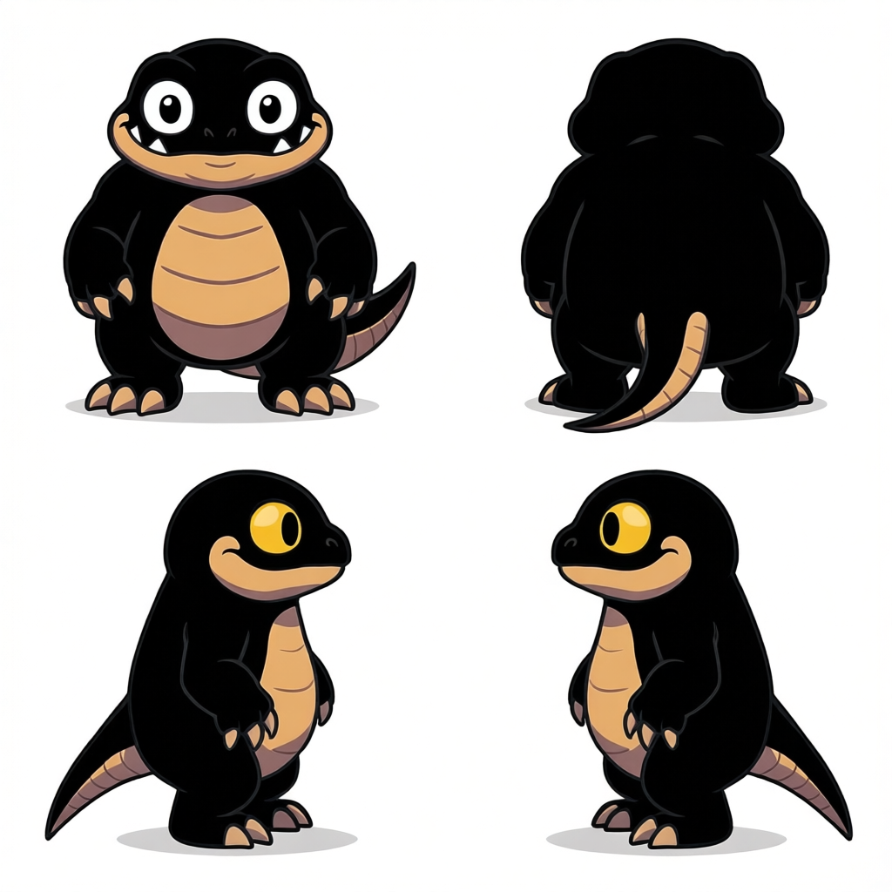

# V8 동물·생물 8종 종단 검증 기록

테스트 날짜: 2026-08-20

서버 pipeline: `8.0.0`

GPU: NVIDIA L40S 48GB

motion: Kimodo 공식 `kimodo-soma-rp/05_root_path` 사람 걷기 fixture

seed: `4821`

입력 규격: 기존 2×2 방향 시트를 `front`, `back`, `left`, `right` 4장으로 분할

출력 규격: 방향별 8 PNG, 총 32 PNG + `sprite_sheet.png` + `metadata.json`

RunPod endpoint와 인증 token은 저장소에 기록하지 않았다. 모든 입력은 같은 prompt와 seed로 요청했다.

```text
Create one natural, seamless in-place walk cycle for this exact animal.
Keep the supplied animal identity, species, markings, colors, body proportions,
scale, framing, and ground baseline consistent across all four directions.
```

## 결론

동물·생물 8종을 실제 V8 서버에 요청했다. API hard gate는 돼지·개·공룡 3건을 통과시키고 소·양·고양이·녹색 생물·도마뱀 5건을 거절했다. 그러나 통과한 3건을 직접 확인한 결과 모두 사람형 골격에 끌려가거나 한 프레임에 개체가 복제됐다. 실제 동물 걷기 에셋으로 사용할 수 있는 결과는 `0/8`이다.

| 입력 | job ID | API 결과 | 육안 판정 |
|---|---|---|---|
| 소 | `d195e9ee473d4aee94ee46b34a199aff` | 거절, 2차 렌더 후 종료 | 결과 ZIP 미제공 |
| 양 | `01ed62b5e8d34aa088534d919c7d533d` | 거절, 2차 렌더 후 종료 | 결과 ZIP 미제공 |
| 돼지 | `18d0e927978144a6980a2d1fd4b08752` | 통과, 2차 렌더 | 사람형 직립 체형으로 변형됨 |
| 개 | `c46177ca73884447a5b5fb8977f830bc` | 통과, 1차 렌더 | 개체 복제 및 사람형 직립 변형 |
| 녹색 생물 | `74b1a84cccc14028b08e157453584dd1` | 거절, 2차 렌더 후 종료 | 결과 ZIP 미제공 |
| 공룡 | `107c69e3ab994431af50e1fa88d821a2` | 통과, 1차 렌더 | 사람형 보행자와 공룡 외형이 분리됨 |
| 도마뱀 | `df1b153833d245b3b630090e70e6ee64` | 거절, 2차 렌더 후 종료 | 결과 ZIP 미제공 |
| 고양이 | `9d27acd478694e3c9f3cd489e327e718` | 거절, 2차 렌더 후 종료 | 결과 ZIP 미제공 |

V8의 appearance·loop QC는 프레임 간 색상, 밝기, 위치, 발 기준선과 루프 연결을 검사한다. 종(species), 사족 형태, 개체 수, 원본과의 의미적 동일성은 검사하지 않으므로 동물에 대해서는 API 성공만으로 품질을 판정할 수 없다.

## API를 통과했지만 사용할 수 없는 결과

배치는 `좌상=front`, `우상=back`, `좌하=left`, `우하=right`이다.

### 돼지


- [입력 4방향 시트](v8-creatures/pig/source.png)
- [결과 스프라이트 시트](v8-creatures/pig/sprite-sheet.png)
- [전체 결과 ZIP](v8-creatures/pig/result.zip)
- ZIP SHA-256: `be6a21edd03d4c44070b56cae2222e946e09a27d7ade5f405a3d05e35f9b0704`
- ZIP 무결성: 72개 파일, CRC 오류 없음
- appearance score: `4.140449`
- loop score: `1.939506`
- worst seam ratio: `0.882613`
- mean seam ratio: `0.761594`
- worst transition ratio: `1.358783`
- 선택 attempt: `1`, seed `104824`

수치상 루프는 안정적이지만 돼지의 사족 체형이 사라지고 정면과 측면 모두 사람처럼 두 발로 걷는 형태가 됐다.

### 개


- [입력 4방향 시트](v8-creatures/dog/source.png)
- [결과 스프라이트 시트](v8-creatures/dog/sprite-sheet.png)
- [전체 결과 ZIP](v8-creatures/dog/result.zip)
- ZIP SHA-256: `3c8ab2b599f98d8550a80e8f34a49f987fda602df81cf85ea1c4e9baaa340bc5`
- ZIP 무결성: 72개 파일, CRC 오류 없음
- appearance score: `4.427395`
- loop score: `2.071666`
- worst seam ratio: `0.943165`
- mean seam ratio: `0.764289`
- worst transition ratio: `1.727911`
- 선택 attempt: `0`, seed `4821`

정면·후면·측면에서 사족 개와 직립한 개가 동시에 나타나거나 한 프레임에 두 개체가 생성됐다. 색상과 루프 수치는 통과했지만 개체 수와 골격이 보존되지 않았다.

### 공룡


- [입력 4방향 시트](v8-creatures/dinosaur/source.png)
- [결과 스프라이트 시트](v8-creatures/dinosaur/sprite-sheet.png)
- [전체 결과 ZIP](v8-creatures/dinosaur/result.zip)
- ZIP SHA-256: `8c4767b9a9d4e38ffc0cc943114fff90a5031dc6aa25c31a37424ff83bb8c2c8`
- ZIP 무결성: 72개 파일, CRC 오류 없음
- appearance score: `5.538810`
- loop score: `2.187068`
- worst seam ratio: `1.072528`
- mean seam ratio: `0.777500`
- worst transition ratio: `1.701107`
- 선택 attempt: `0`, seed `4821`

정면은 사람형 캐릭터로 바뀌었고 측면에서는 사람형 보행자와 공룡 꼬리·몸체가 분리됐다. 이 결과도 실제 에셋으로 사용할 수 없다.

## hard gate가 거절한 결과

### 소


- job ID: `d195e9ee473d4aee94ee46b34a199aff`
- 오류: worst transition ratio `4.114`가 허용치 `2.250` 초과
- [서버 상태 원문](v8-creatures/cow/status.json)

### 양



- job ID: `01ed62b5e8d34aa088534d919c7d533d`
- 오류: back centroid seam ratio `0.0112672`가 허용치 `0.0110` 초과
- [서버 상태 원문](v8-creatures/sheep/status.json)

### 고양이


- job ID: `9d27acd478694e3c9f3cd489e327e718`
- 오류: back centroid seam ratio `0.0125236`이 허용치 `0.0110` 초과
- [서버 상태 원문](v8-creatures/cat/status.json)

### 녹색 생물


- job ID: `74b1a84cccc14028b08e157453584dd1`
- 오류: worst transition ratio `2.627`이 허용치 `2.250` 초과
- 추가 오류: back·left·right luma spread가 각각 `17.099`, `17.081`, `15.722`로 허용치 `12.000` 초과
- [서버 상태 원문](v8-creatures/green-blob/status.json)

### 도마뱀



- job ID: `df1b153833d245b3b630090e70e6ee64`
- 오류: front·right luma spread가 각각 `12.095`, `15.714`로 허용치 `12.000` 초과
- [서버 상태 원문](v8-creatures/lizard/status.json)

## 거절 렌더 원본 보존 상태

V8 서버는 거절된 작업도 다음 경로에 두 번의 One-to-All 렌더와 QC 보고서를 남긴다.

```text
/workspace/sprite-pipeline/jobs/<JOB_ID>/loop_qc_failed.json
/workspace/sprite-pipeline/jobs/<JOB_ID>/rendered/attempt_00/
/workspace/sprite-pipeline/jobs/<JOB_ID>/rendered/attempt_01/
```

그러나 현재 인증 API의 `GET /v1/jobs/<JOB_ID>/result`는 작업 상태가 `failed`이면 HTTP `409`와 오류 JSON만 반환한다. 실패 작업의 렌더 디렉터리를 내려받는 endpoint도 없다. 따라서 이 기록에는 입력과 상태 원문을 우선 보존했고, 거절 렌더 원본은 RunPod 작업 디렉터리에만 남아 있다.

현재 Pod에서 5건을 한 번에 묶을 대상은 다음과 같다.

```text
d195e9ee473d4aee94ee46b34a199aff
01ed62b5e8d34aa088534d919c7d533d
9d27acd478694e3c9f3cd489e327e718
74b1a84cccc14028b08e157453584dd1
df1b153833d245b3b630090e70e6ee64
```

다음 서버 패키지에서는 인증된 실패 산출물 다운로드 endpoint를 추가해야 한다. 성공·실패 판정 자체는 바꾸지 않고 `loop_qc_failed.json`, 두 attempt의 raw·stabilized·appearance 결과와 방향별 metadata를 별도 ZIP으로 제공하는 방식이 적합하다.

## 현재 판단

- 현재 사람용 Kimodo fixture와 Motion Adapter를 사족 동물에 그대로 적용하는 방식은 사용할 수 없다.
- 돼지·개·공룡처럼 API QC를 통과해도 종, 골격과 개체 수가 깨질 수 있다.
- 동물은 동물용 motion fixture·skeleton mapping·pose projection을 분리해야 한다.
- 다음 QC에는 원본 대비 개체 수, 사족/이족 분류, 종·실루엣 유사도 같은 의미적 검사가 필요하다.
- 이번 기록은 V8 사람 캐릭터 경로를 기각하는 것이 아니라, 현재 사람용 경로의 동물 적용을 기각하는 근거다.
- V6·V7과 기존 V8 캐릭터 결과·ZIP은 삭제하거나 덮어쓰지 않았다.
