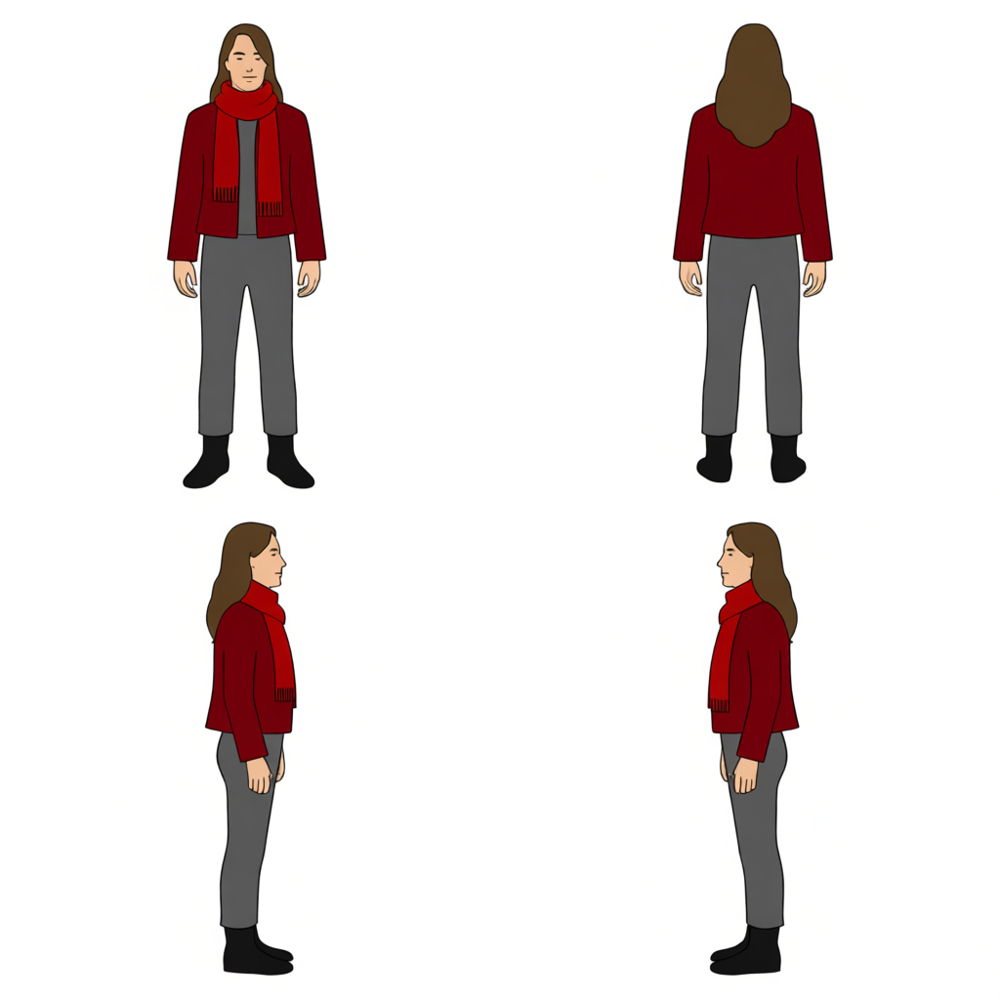
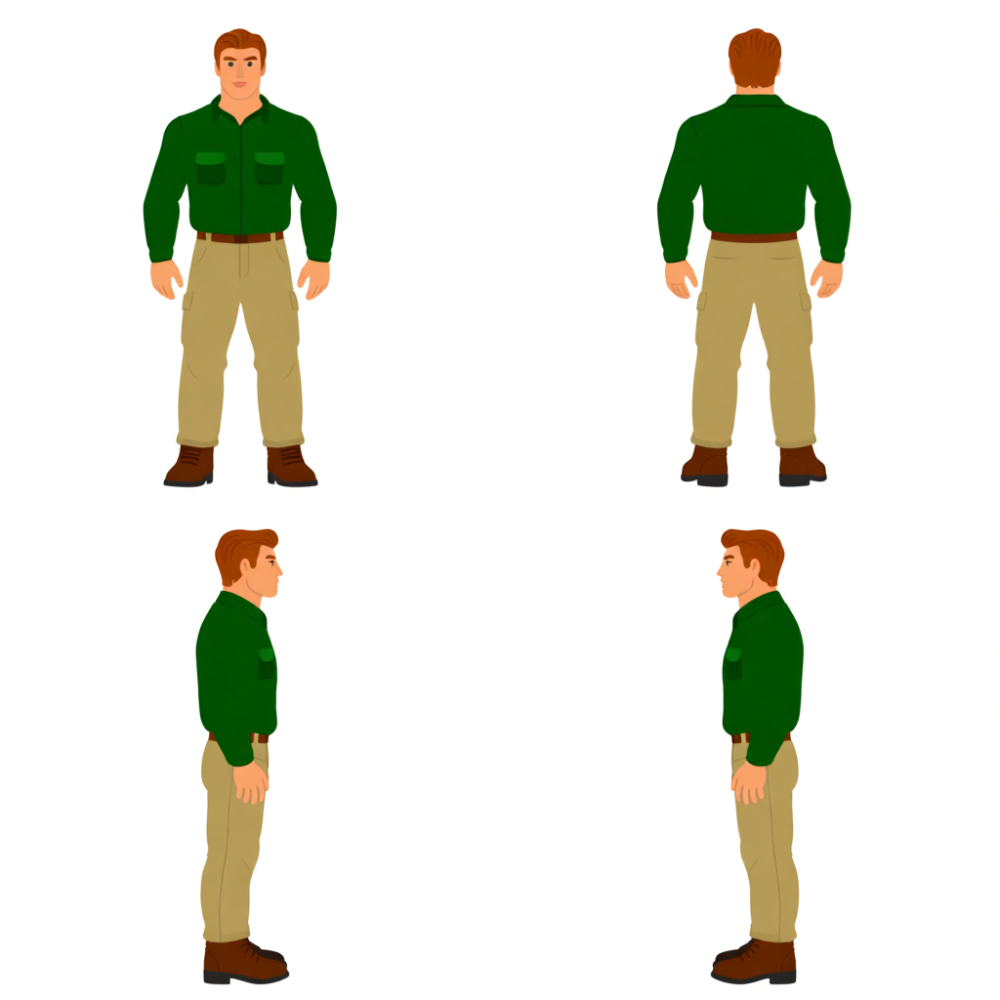

# V8 다른 캐릭터 종단 검증 기록

테스트 날짜: 2026-08-20

서버 pipeline: `8.0.0`

GPU: NVIDIA L40S 48GB

motion: Kimodo 공식 `kimodo-soma-rp/05_root_path` fixture

seed: `4821`

출력 규격: 방향별 8 PNG, 총 32 PNG + `sprite_sheet.png` + `metadata.json`

RunPod endpoint는 Pod를 다시 만들 때마다 바뀌므로 저장소에 기록하지 않았고, 인증 token도 저장하지 않았다. 모든 요청은 같은 prompt와 seed를 사용했다.

```text
Create one natural, seamless in-place walk cycle.
Keep the supplied character identity, clothing, colors, proportions,
scale, framing, and ground baseline consistent across all four directions.
```

## 요약

서로 다른 체형·복장·색상 조합 네 종을 V8 서버에 보냈다. 은색 단발 대장장이와 밀짚모자 상점 주인은 종단 생성과 V8 appearance·loop QC를 통과했다. 빨간 스카프 여행자와 초록색 여행자는 One-to-All을 두 번 렌더했지만 최종 hard gate를 통과하지 못했다.

| 입력 | job ID | 결과 | 판정 |
|---|---|---|---|
| 은색 단발 대장장이 | `00107aa16d7a48f1abc6e998b6f4af5a` | 성공, 1차 렌더 | appearance·loop QC 통과 |
| 밀짚모자 상점 주인 | `50e32e9d154d47228d0bf1097be9b95e` | 성공, 1차 렌더 | appearance·loop QC 통과 |
| 빨간 스카프 여행자 | `173bd23fad654e68893919d32242406c` | 실패, 2차 렌더 후 종료 | 후면 centroid seam hard gate 초과 |
| 초록색 여행자 | `01eba03295b94b5abd384e7eb89bc8cc` | 실패, 2차 렌더 후 종료 | 정면 centroid seam 및 세 방향 luma hard gate 초과 |

이번 표본의 성공률은 `2/4`다. V8은 모든 입력을 성공시키지는 못했지만, 위치나 밝기 일관성이 허용치를 벗어난 결과를 성공 ZIP으로 내보내지 않고 명확한 오류로 거부했다.

## 성공 결과

배치는 `좌상=front`, `우상=back`, `좌하=left`, `우하=right`이다.

### 은색 단발 대장장이


- [입력 4방향 시트](v8-other-characters/blacksmith/source.png)
- [결과 스프라이트 시트](v8-other-characters/blacksmith/sprite-sheet.png)
- [전체 결과 ZIP](v8-other-characters/blacksmith/result.zip)
- ZIP SHA-256: `455bec04e0ca8da280549c99b2ac7e156d8eb18ffd8a6b8f2c7f1cbf08c94f5e`
- ZIP 무결성: 72개 파일, CRC 오류 없음
- appearance score: `10.525442`
- loop score: `2.363654`
- worst seam ratio: `1.087066`
- mean seam ratio: `0.765966`
- worst transition ratio: `1.561722`
- 선택 후보: `even_end`, phase `[16, 2, 4, 6, 8, 10, 12, 14]`

네 방향 모두 은색 머리, 크림색 상의, 갈색 앞치마와 어두운 피부색을 유지했다. 정면의 최종 chroma spread는 `12.3771`, luma spread는 `11.1330`이었고 나머지 방향은 이보다 낮았다.

### 밀짚모자 상점 주인


- [입력 4방향 시트](v8-other-characters/shopkeeper/source.png)
- [결과 스프라이트 시트](v8-other-characters/shopkeeper/sprite-sheet.png)
- [전체 결과 ZIP](v8-other-characters/shopkeeper/result.zip)
- ZIP SHA-256: `73e509d2a4b8c6a6ae63a5a9c24e7b3552ada7c432e2187f1ee72aadf0a62706`
- ZIP 무결성: 72개 파일, CRC 오류 없음
- appearance score: `7.243102`
- loop score: `2.238270`
- worst seam ratio: `1.199173`
- mean seam ratio: `0.735416`
- worst transition ratio: `1.439208`
- 선택 후보: `even_end`, phase `[16, 2, 4, 6, 8, 10, 12, 14]`

밀짚모자, 빨간 재킷, 회색 바지와 검은 장화가 네 방향에 유지됐다. 최종 luma spread는 `2.8453~4.5296`, chroma spread는 `2.9884~6.0528` 범위로 appearance QC를 통과했다.

## hard gate가 거부한 입력

### 빨간 스카프 여행자



- job ID: `173bd23fad654e68893919d32242406c`
- 종료 stage: `loop_qc_attempt_2`
- 오류 코드: `LOOP_QC_FAILED`
- 원인: 후면 centroid seam ratio `0.0192177`이 허용치 `0.0110`을 초과
- [서버 상태 원문](v8-other-characters/red-scarf-traveler/status.json)

### 초록색 여행자



- job ID: `01eba03295b94b5abd384e7eb89bc8cc`
- 종료 stage: `loop_qc_attempt_2`
- 오류 코드: `LOOP_QC_FAILED`
- 원인: 정면 centroid seam ratio `0.0123976`이 허용치 `0.0110`을 초과
- 추가 원인: back luma spread `13.972`, left `20.443`, right `17.390`으로 허용치 `12.000` 초과
- [서버 상태 원문](v8-other-characters/green-traveler/status.json)

실패 작업은 `/result` ZIP을 제공하지 않는다. 입력 이미지와 서버가 반환한 구조화된 실패 상태를 그대로 보존했다.

## 현재 판단

- V8 전체 서버 경로와 결과 ZIP 다운로드는 실제 L40S에서 동작한다.
- V8의 공통 팔레트 안정화와 위치·밝기 hard gate는 성공 결과 두 건에서 통과했다.
- 입력 네 종 중 두 종은 두 번의 One-to-All 재시도 후에도 거부됐으므로, V8을 모든 캐릭터에 안정적으로 성공하는 상태로 보기는 어렵다.
- 실패가 발생한 stage와 수치가 명확하므로 다음 버전에서는 centroid seam과 방향별 luma 변동을 분리해 개선할 수 있다.
- 성공 ZIP과 실패 상태를 모두 보존하며 V6·V7 기록과 ZIP은 삭제하거나 덮어쓰지 않는다.
