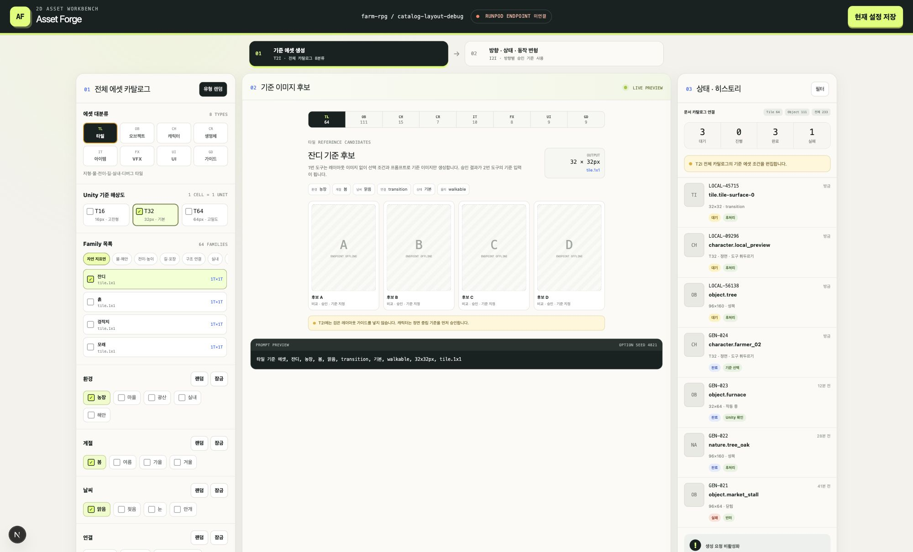
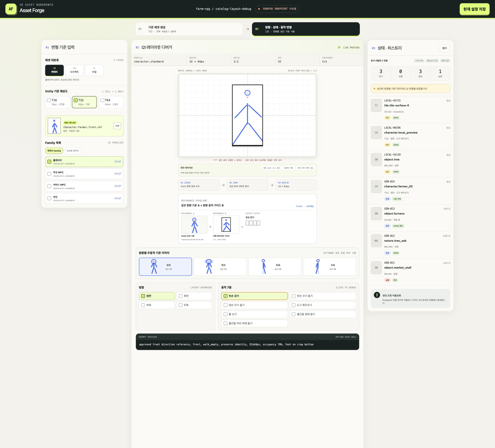
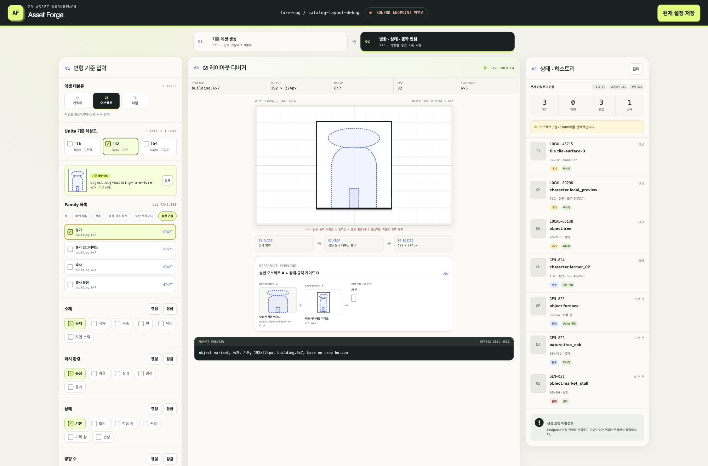
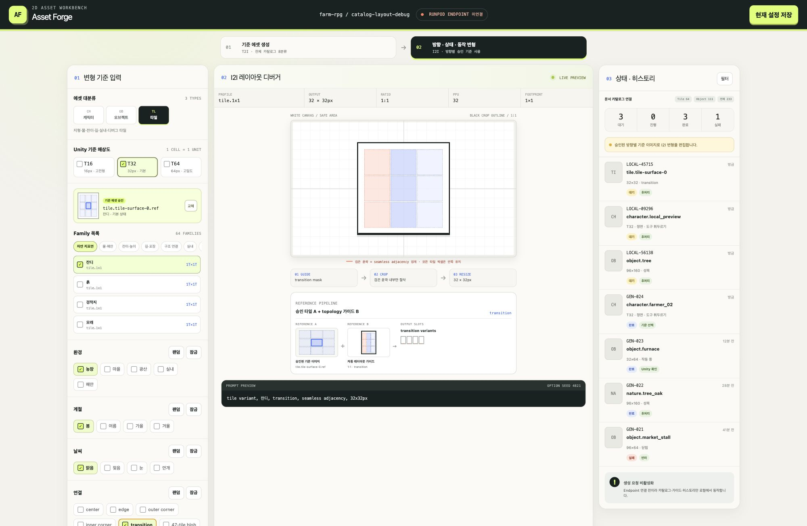

# 로컬 에셋 생성 디버깅 도구

RunPod endpoint를 연결하기 전에 에셋 생성 흐름, 체크박스, 실제 출력 비율의 검은 윤곽 레이아웃, 접지선, 생성 슬롯, 로컬 히스토리를 확인하는 Next.js 도구다.

## 실행

```bash
npm install
npm run dev
```

브라우저에서 `http://localhost:3000`을 연다. Node.js 22.13 이상을 사용한다.

## 화면 구조

- `기준 에셋 생성`: 문서 카탈로그의 타일, 오브젝트, 캐릭터, 생명체, 아이템, VFX, UI, 가이드 8분류와 세부 family를 선택한다. 이 단계에는 레이아웃 이미지를 사용하지 않는다.
- `방향 · 동작 변형`: 캐릭터·오브젝트·타일만 다룬다. 캐릭터는 방향별 무동작 승인 기준(Reference A)과 선택한 방향·동작의 자동 레이아웃 가이드(Reference B)를 사용한다.
- `캐릭터 방향 기준`: 정면 중립 기준으로 front/back/left/right 기준을 먼저 승인하고, 동작은 같은 방향 기준에서 파생한다. 정면·후면과 좌·우 측면은 같은 rect를 쓰되 내부 점유 폭과 포즈가 다르다.
- `타일 변형`: 캐릭터 포즈 대신 center/edge/corner/transition/47-tile blob topology 가이드를 표시한다.
- 검은 사각형 윤곽은 실제 출력 비율의 크롭 범위다. 생성 대상의 모든 픽셀은 윤곽 안에 있어야 하며, 발이나 오브젝트 밑면은 윤곽 아랫변에 닿는다.
- 후처리는 검은 윤곽 기준 크롭 후 선택된 픽셀 규격으로 리사이즈한다.
- endpoint는 의도적으로 연결하지 않았다. 상태와 히스토리는 브라우저 `localStorage`에서만 동작한다.

## 검사

```bash
npm test
```

소스 규칙 검사와 production build를 함께 실행한다.

## 브라우저 클릭 검증 기록

로컬 `http://localhost:3000`에서 다음 항목을 직접 클릭해 확인했다.

| 구분 | 클릭 항목 | 확인 결과 |
|---|---|---|
| 도구 1 | 타일, 오브젝트, 캐릭터, 생명체, 아이템, VFX, UI, 가이드 | 8분류 모두 해당 family·옵션·후보 화면으로 전환 |
| 캐릭터 방향 | front, back, left, right | 점유 폭 `78%`, `76%`, `56%`, `56%`와 방향별 Reference A 변경 |
| 캐릭터 동작 | `walk_empty`, `weapon_1h`, `weapon_2h`, `tool_swing`, `bow_shoot`, `carry_front`, `carry_overhead` | 프레임 슬롯 `4`, `2`, `2`, `4`, `3`, `1`, `1`과 내부 포즈 변경. 걷기는 골반 연결점을 유지하고 각도별 다리 길이를 보정해 양발의 바닥선 접촉 유지 |
| 오브젝트 | 일반 나무, 농가 | 윤곽 ratio와 출력이 `3:5 / 96×160`, `6:7 / 192×224`로 변경 |
| 타일 | center, edge, outer corner, inner corner, transition, 47-tile blob | 6개 topology 가이드 모두 변경 |
| 히스토리 | 현재 설정 저장 | `LOCAL-*` 항목 추가와 대기 상태 집계 변경 |

## 화면 캡처

### 도구 1 — 전체 대분류와 타일 기준 후보



### 캐릭터 — 방향별 기준과 바닥선에 닿는 빈손 걷기



### 오브젝트 — 농가 6:7 규격 윤곽과 접지선



### 타일 — transition topology 가이드


