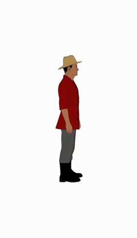
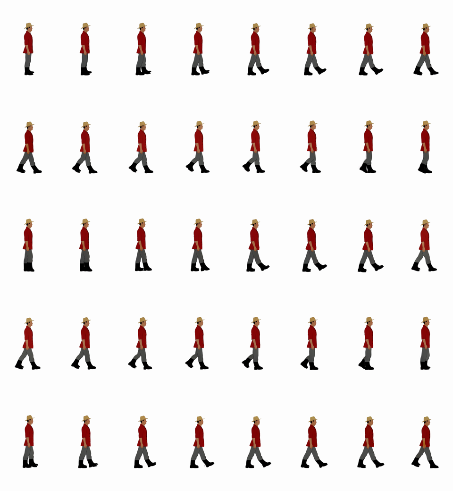

# 로컬 2D 에셋 생성 디버거

RunPod 이미지 모델로 농장 RPG의 캐릭터·타일·오브젝트·생명체·아이템을 만들고 실제 입력, 원본 출력, 상태와 히스토리를 비교하는 로컬 디버거입니다. 비디오에서 동작 프레임을 추출하는 실험은 결과 일관성 부족으로 기각했으며 화면과 코드는 실험 기록으로만 남깁니다.


[생성 에셋 썸네일 갤러리](public/assets/catalog/README.md)에서 종류별 최신 원본과 생성 ID를 바로 확인할 수 있습니다.

정면 걷기 8장 개별 생성은 좌우 발과 착지 순서를 안정적으로 제어하지 못해 중단했습니다. 현재 화면은 성공한 생성기가 아니라 실패 과정을 재현하고 prompt를 비교하기 위한 상태입니다. 세부 생성 ID와 중단 지점은 [Qwen 정면 걷기 프레임 실패 기록](../docs/QWEN_WALK_FRAME_FAILURES.md)에 보존합니다.

SCAIL-2 동작 전이도 현재 제작 경로에서 기각했습니다. SCAIL-2는 정지 캐릭터와 동작 이름에서 걷기 phase를 만드는 모델이 아니라, 이미 동작이 완성된 Driving RGB video를 Reference 캐릭터로 전이하는 모델입니다. 화면의 Reference/Driving RGB·mask와 job 제어 영역은 성공한 기능이 아니라 endpoint 구성 실험 기록으로만 남아 있습니다. 자세한 구조적 이유는 [SCAIL-2 동작 생성 경로 기각 기록](../docs/SCAIL2_WALK_CYCLE_STRATEGY.md)을 확인합니다.

## 실행

```bash
npm install
cp .env.example .env.local
npm run dev
```

브라우저에서 `http://localhost:3000`을 엽니다. Node.js 22.13 이상을 사용합니다.

```dotenv
RUNPOD_BASE_URL=https://<POD_ID>-8000.proxy.runpod.net
RUNPOD_API_KEY=
RUNPOD_MODEL_ID=/data/models/Qwen-Image-Edit-2511
RUNPOD_REQUEST_TIMEOUT_MS=600000
```

`.env.local`은 커밋하지 않습니다.

## 동작 생성 전환 계획

1. 승인한 `2×2` 캐릭터·생명체 시트를 정면·후면·오른쪽·왼쪽 원본으로 분리합니다.
2. 네 방향 원본에 같은 걷기·무기·도구 동작 prompt를 적용해 네 개의 이미지 요청을 batch로 실행합니다.
3. 각 응답 시트에서 반복되는 동일 비율 셀을 찾아 프레임 수와 경계를 계산합니다.
4. 셀별 흰 여백을 감지해 캐릭터 영역을 자동 크롭합니다.
5. 모든 프레임을 공통 발 기준선과 동일한 캔버스 비율에 패딩으로 정렬합니다.
6. 원본과 전처리 결과를 함께 검수하고 승인된 결과만 이후 스프라이트 패킹에 사용합니다.

프레임 수는 고정하지 않습니다. 자동 전처리는 셀 분할, 여백 크롭, 패딩 정렬까지만 담당하며 픽셀화와 최종 리사이즈는 전체 프레임 승인 뒤 별도로 실행합니다.

## 기각된 비디오 실험 현황

| 실험 | 설정 | 결과 |
|---|---|---|
| 직접 제자리, 짧은 길이 | 33~49 frames, flow shift 미지정 | 거의 정지하거나 춤 동작 |
| 실제 이동 | 49 frames, flow shift 미지정 | 위치와 다리 변화가 거의 없는 정지 화면 |
| 직접 제자리, 공식 샘플링 기준 | 81 frames, 50 steps, guidance 4~5, flow shift 12 | 한 측면에서만 보행이 보였고 다른 입력에서 재현 실패 |
| 정면 달리기 반복 | 81 frames, 추출 40장 | 배경·외형 변형, 원형 장면 오해, 정상 1~5장만 남음 |

한 측면에서 좌우 발 교대가 보인 기록은 있지만 정면·후면·다른 캐릭터에서 반복되지 않았습니다. 따라서 아래 GIF와 화면은 성공 사례가 아니라 기각 판단의 근거가 된 실험 기록입니다.





이 실험은 [acatovic/ai-game-studio](https://github.com/acatovic/ai-game-studio)의 흐름에서 영감을 얻었습니다. 실행 방법은 [기각된 RunPod Wan2.2 영상 실험 기록](../docs/RUNPOD_WAN_VIDEO.md)에 보존합니다.

## 화면에서 확인하는 순서

1. `연결 확인`을 눌러 `/health`와 `/v1/models`를 확인합니다.
2. 캐릭터 역할, 성별 표현, 연령, 체형, 머리, 의상, 특징을 선택합니다.
3. 실제 전송 prompt를 확인하거나 직접 수정합니다.
4. `4방향 캐릭터 생성`을 누릅니다.
5. 화면에 표시된 RunPod 원본에서 정면·후면·오른쪽·왼쪽의 정체성과 크기를 비교합니다.
6. 사용할 결과를 `4방향 기준 A로 승인`합니다.
7. 무기·도구·장비 이미지를 Reference B로 올립니다.
8. `아이템 착용 4방향 생성`을 눌러 A의 캐릭터가 유지되는지 확인합니다.
9. 하단 에셋 대분류에서 필요한 목록을 선택해 기준 원본을 생성합니다.
10. 타일은 원본과 `2×2 REPEAT CHECK`를 함께 보고 반복 경계를 확인합니다.
11. 가이드의 셀 비율, 머리·발 접촉, 포즈가 윤곽 내부에 있는지 확인합니다.

## 기준 에셋 대분류

| 분류 | 화면의 기본 검사 |
|---|---|
| 타일 | 2D 표현, 캔버스 전체 채움, 2×2 반복 시 경계·중앙 구도 |
| 오브젝트 | 정면 중심, 측면·3/4 회전 없음, 전체 실루엣, 잘림 없음 |
| 생명체 | 정면·후면·오른쪽·왼쪽, 같은 종·색·크기 |
| 아이템 | 단일 아이템, 넓은 여백, 캐릭터·손 없음 |
| VFX | 같은 효과의 형성·확장·최대·소멸 진행 |
| UI | 읽기 쉬운 단일 아이콘, 충분한 여백 |
| 가이드 | 실제 셀 비율의 검은 윤곽, 포즈의 머리·발 접촉 |

## 2026-08-04 브라우저 검사 결과

| 대상 | 결과 | 확인 내용 |
|---|---|---|
| 4방향 캐릭터 | 통과 | 한 장에서 정면·후면·우측·좌측 생성, 동일 크기 유지 |
| 한손검 기준 원본 | 통과 | 중앙 단일 검, 전체 노출, 넓은 여백 |
| 한손검 착용 | 부분 통과 | 네 방향 모두 손에 부착, 캐릭터 유지. 흰 배경 편집 잔상은 남음 |
| 잔디 타일 | 실패 기록 | 2D 표현과 경계 연속성은 확보했지만 중앙 사각형 반복 구도가 남음 |
| 나무 오브젝트 | 통과 | 단일 2D 오브젝트, 잘림 없음 |
| 닭 4방향 | 부분 통과 | 네 방향은 정확함. 정면과 측면 체형 차이 및 그림자 발생 |
| 먼지 VFX | 부분 통과 | 형성·확장·최대·소멸 순서는 정확함. 미세 입자 질감이 남음 |
| 체력 UI | 통과 | 단일 아이콘과 여백 유지 |
| 점유·방향·동작 가이드 | 통과 | 로컬 렌더러로 12종 생성, 비율 고정, 머리·발 윤곽 접촉 |

카탈로그 선택 UI는 타일 16종, 오브젝트 20종, 생명체 12종, 아이템 19종, VFX 14종, UI 13종, 가이드 12종까지 총 106개 항목을 브라우저에서 하나씩 클릭해 체크 상태와 prompt 갱신을 확인했습니다.

19:39~20:58 추가 반복 검사에서는 오브젝트 18회, 생명체 8회, 캐릭터 4회를 실제 RunPod로 생성했습니다. 오브젝트의 `front three-quarter view`는 제거했고, 일반 오브젝트는 정면, 농가·축사·온실은 정면 입면 전용 prompt를 사용합니다. 농가는 첫 재시도에서 3/4 농장 장면이 나와 실패 기록으로 남겼고, 정면 입면 지시 뒤 단일 건물 스프라이트로 교정했습니다. 온실도 첫 정면 결과가 축사처럼 나와 유리 벽·유리문·유리지붕 조건으로 다시 생성했습니다.

## 실제 요청

### 4방향 기준 생성

- Endpoint: `/v1/images/edits`
- 이미지: 1024×1024 빈 흰 캔버스 1장
- 출력 셀 순서: front, back, right, left
- 출력 저장: `public/generated/character-sheets/`
- 후처리: 없음

빈 캔버스는 Edit 모델의 필수 입력일 뿐 Reference B가 아닙니다.

### 아이템 착용

- Reference A: 승인한 4방향 시트
- Reference B: 업로드한 실제 아이템
- 출력 저장: `public/generated/runpod/`
- 후처리: 없음

### 기준 에셋

- Endpoint: 로컬 `/api/runpod/asset`
- RunPod 사용: 타일, 오브젝트, 생명체, 아이템, VFX, UI
- 로컬 렌더러 사용: 점유, 4방향, 동작, edge-corner 가이드
- 출력 저장: `public/generated/base-assets/<category>/`
- 생성 중 자동 후처리: 없음
- 타일 반복 미리보기: 원본을 CSS로 2×2 표시하며 파일은 바꾸지 않음

### 에셋 갤러리 정리

생성을 마친 뒤 아래 명령을 실행하면 같은 종류의 가장 최근 결과를 카테고리 폴더로 복사하고, 상위 README와 카테고리별 README에 썸네일 표를 만듭니다.

```bash
node scripts/build-asset-gallery.mjs
```

현재 테스트 세션 이후 결과만 정리하려면 생성 ID의 UTC 타임스탬프를 지정합니다.

```bash
ASSET_GALLERY_SINCE=20260804104200 node scripts/build-asset-gallery.mjs
```

- 원본 생성 기록: `public/generated/` — 로컬 기록, Git에서 제외
- 공유용 최신 에셋: `public/assets/catalog/<category>/`
- 전체 갤러리: `public/assets/catalog/README.md`
- 분류: characters, equipment, objects, creatures, tiles, items, vfx, ui, guides

## 디버그 로그

브라우저 콘솔:

- `[AssetForge][HEALTH_*]`
- `[AssetForge][CHARACTER_REQUEST_*]`
- `[AssetForge][CHARACTER_OUTPUT_RENDERED]`
- `[AssetForge][ITEM_REFERENCE_SELECTED]`
- `[AssetForge][EQUIP_REQUEST_*]`

서버 콘솔:

- `[RunPod][HEALTH_*]`
- `[RunPod][IMAGE_EDIT_*]`
- `[CharacterSheet][REQUEST_*]`
- `[BaseAsset][REQUEST_*]`

로그에는 API key와 base64 이미지 본문을 출력하지 않습니다. 요청 ID, 모델, 파일명·bytes, prompt 길이, seed, steps, 크기, 경과 시간과 오류만 기록합니다.

## 검사

```bash
npm run lint
npm run build
npm test
```
