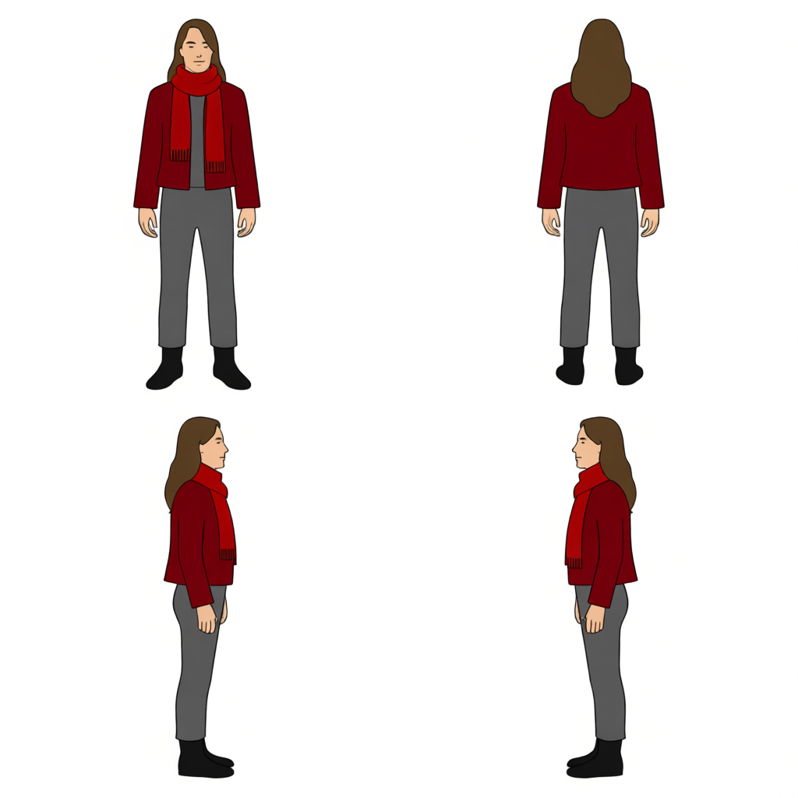
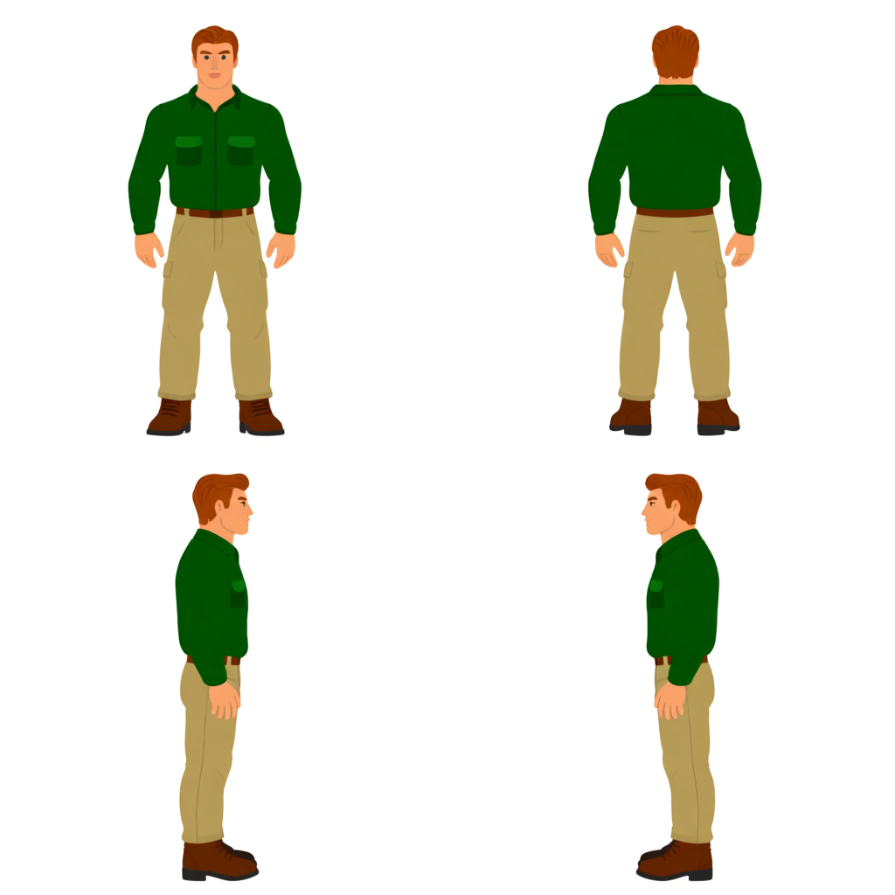
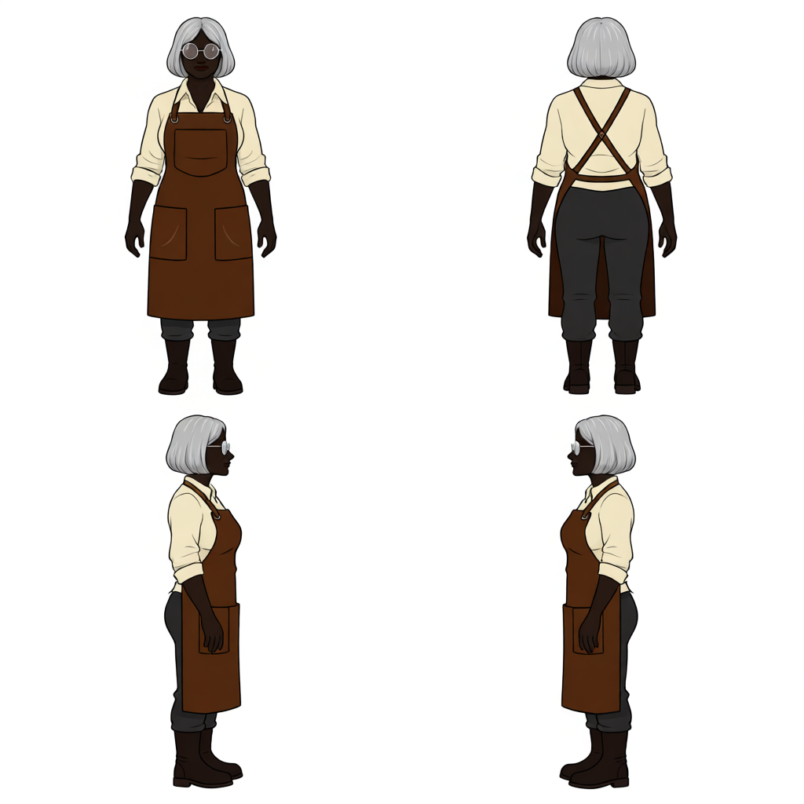
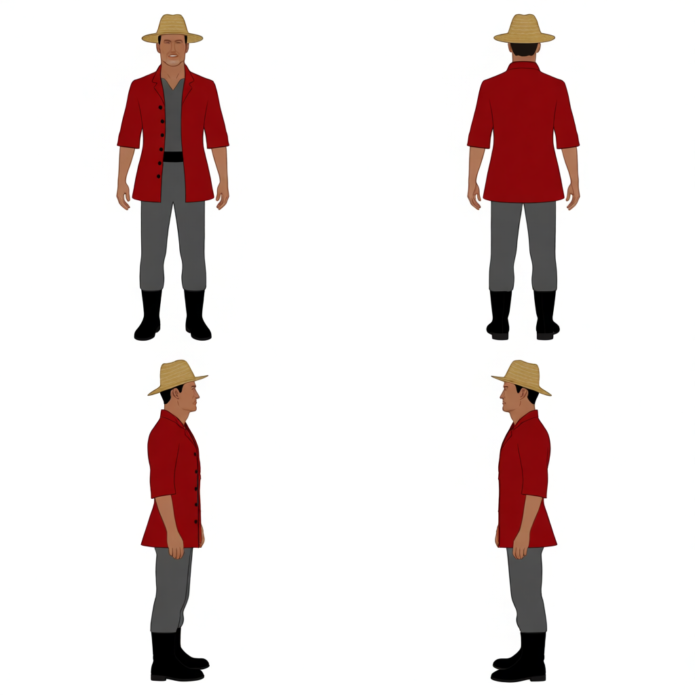

# 캐릭터

[전체 카탈로그로 돌아가기](../README.md)

| 미리보기 | 에셋 | 크기 · 생성 ID |
| --- | --- | --- |
|  | 4방향 기준 캐릭터 | 1024x1024 `CHARACTER-20260804113221-249c4eb8` |
|  | 4방향 기준 캐릭터 | 1024x1024 `CHARACTER-20260804113611-028b7836` |
|  | 4방향 기준 캐릭터 | 1024x1024 `CHARACTER-20260804113857-738e8125` |
|  | 4방향 기준 캐릭터 | 1024x1024 `CHARACTER-20260804114151-6b37261d` |
