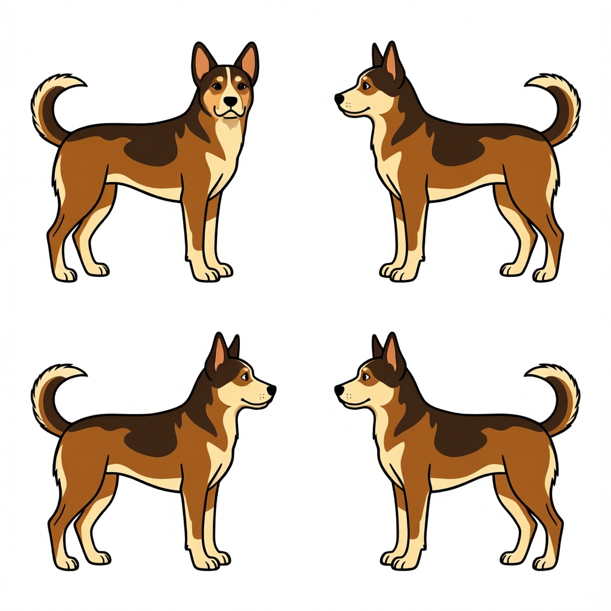
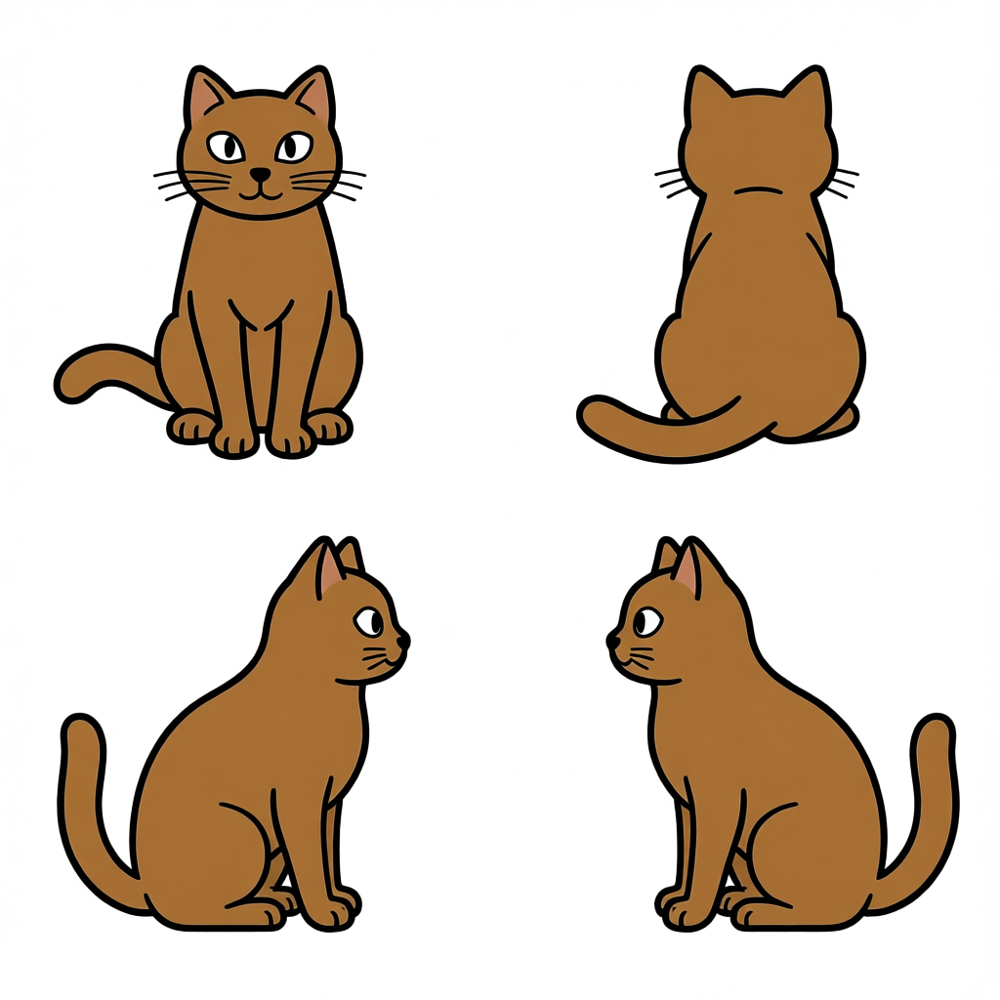
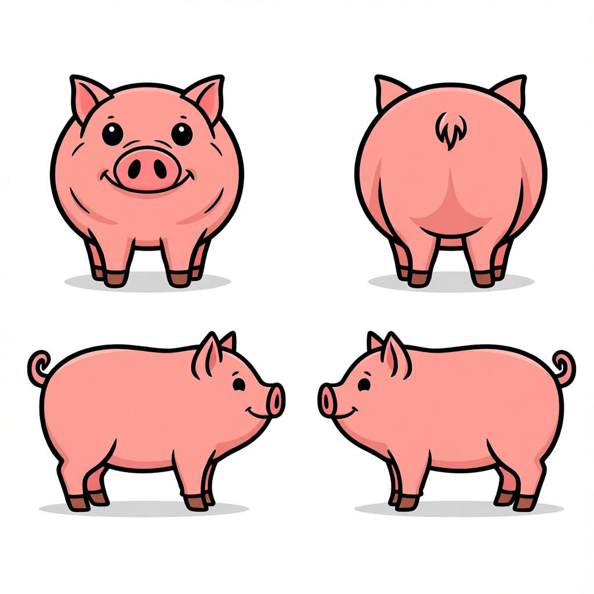
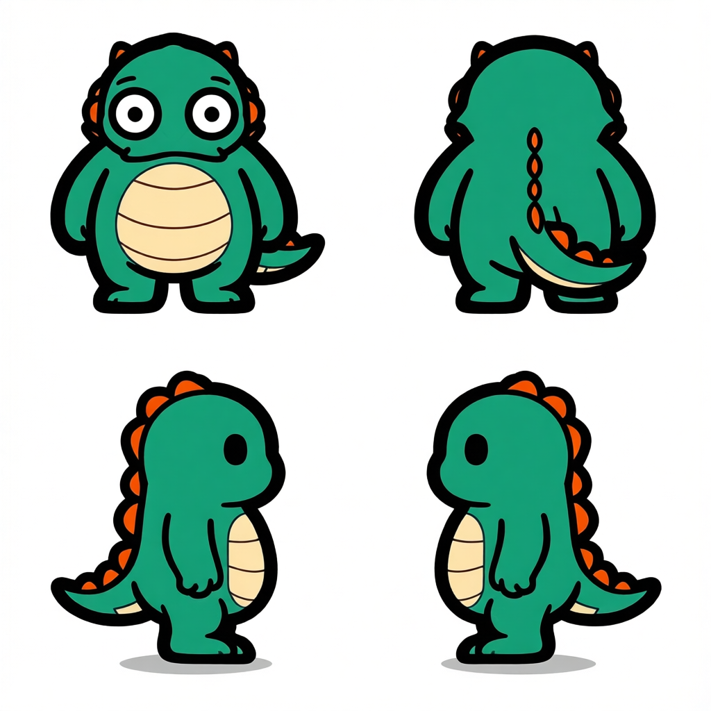
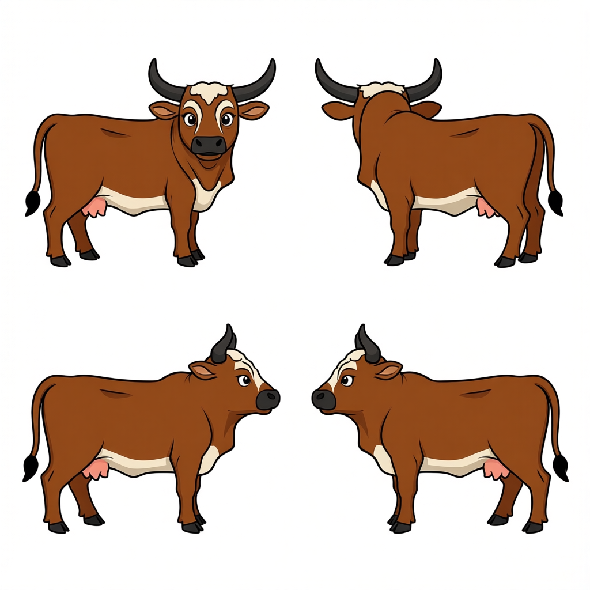
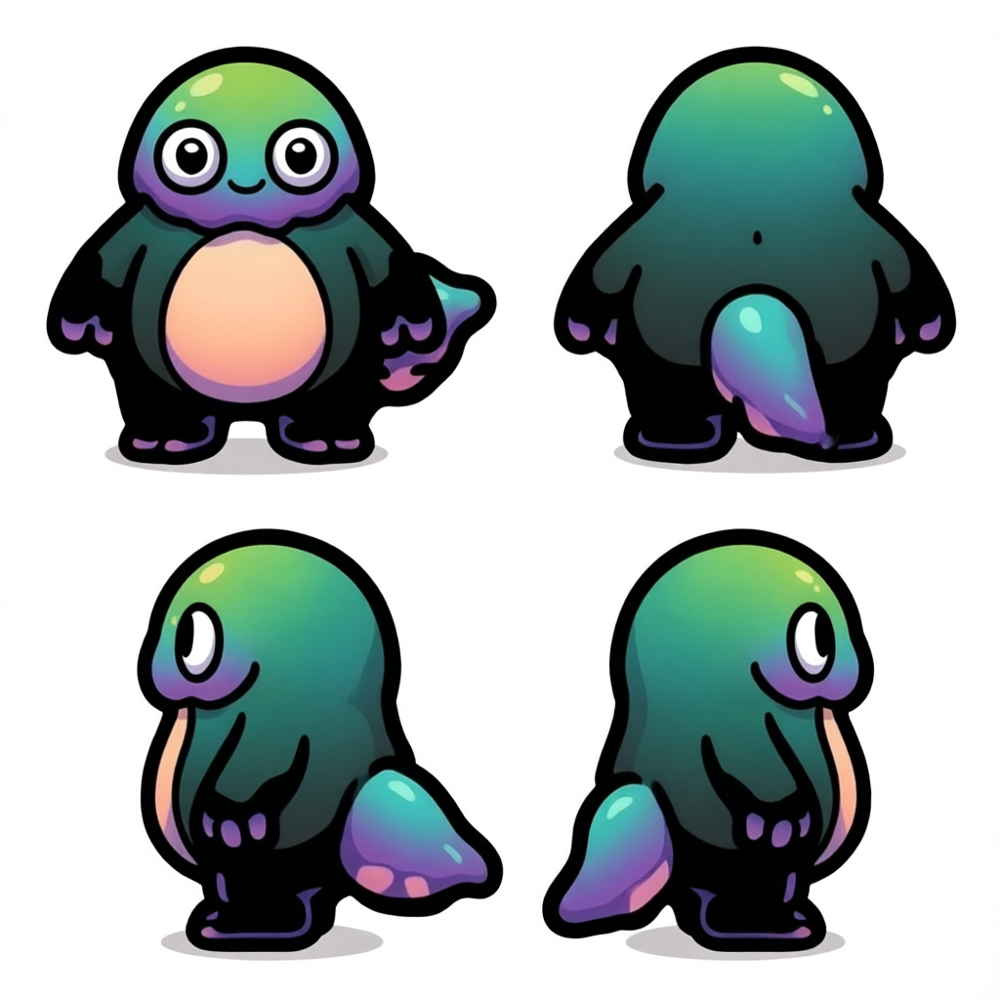

# 생명체

[전체 카탈로그로 돌아가기](../README.md)

| 미리보기 | 에셋 | 크기 · 생성 ID |
| --- | --- | --- |
|  | 개 | 1024x1024 `CREATURE-20260804112411-a8f02719` |
|  | 고양이 | 1024x1024 `CREATURE-20260804114959-abc7c05b` |
|  | 돼지 | 1024x1024 `CREATURE-20260804112223-0b24d435` |
|  | 비행 몬스터 | 1024x1024 `CREATURE-20260804112810-5fad76ce` |
|  | 사족 몬스터 | 1024x1024 `CREATURE-20260804113013-da5e2704` |
|  | 소 | 1024x1024 `CREATURE-20260804105949-dc5c27de` |
|  | 슬라임 | 1024x1024 `CREATURE-20260804112611-af537d77` |
|  | 양 | 1024x1024 `CREATURE-20260804112022-8739ad23` |
