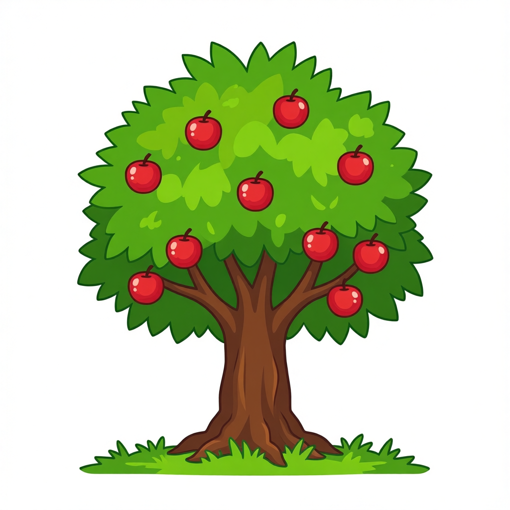
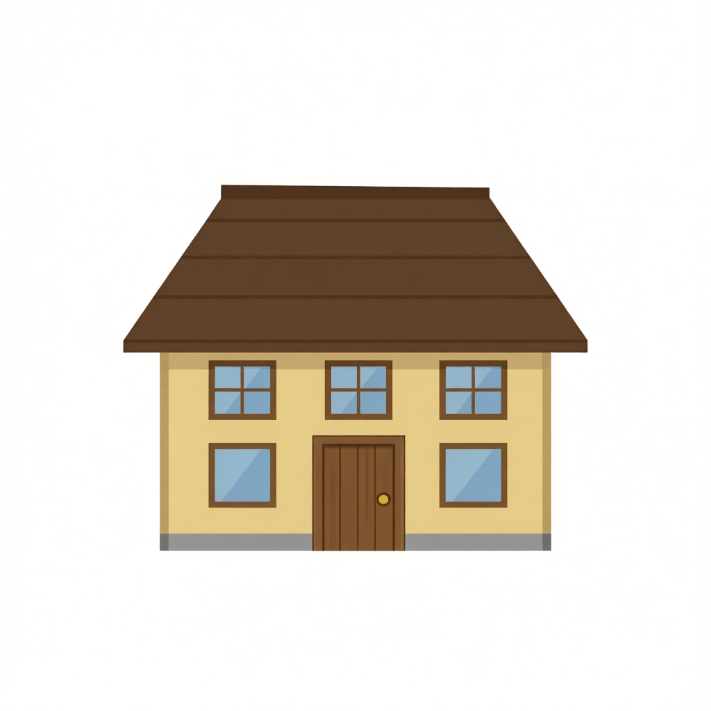
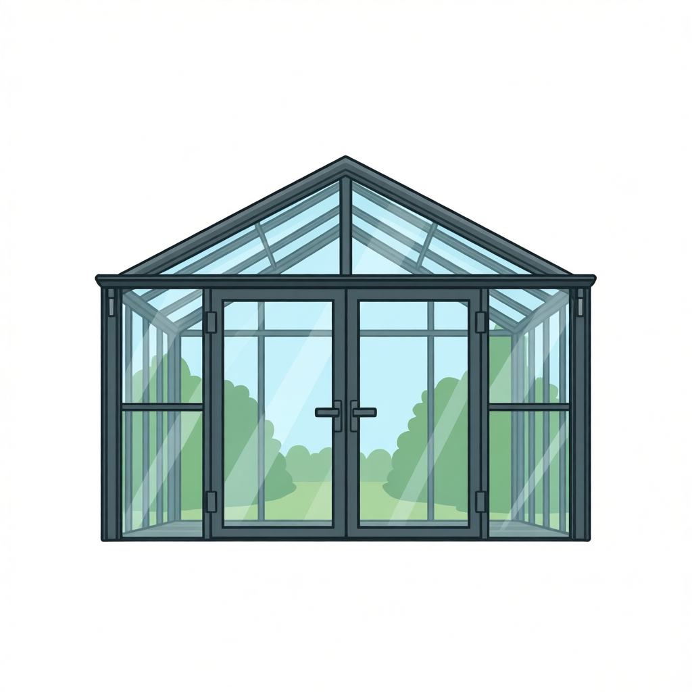
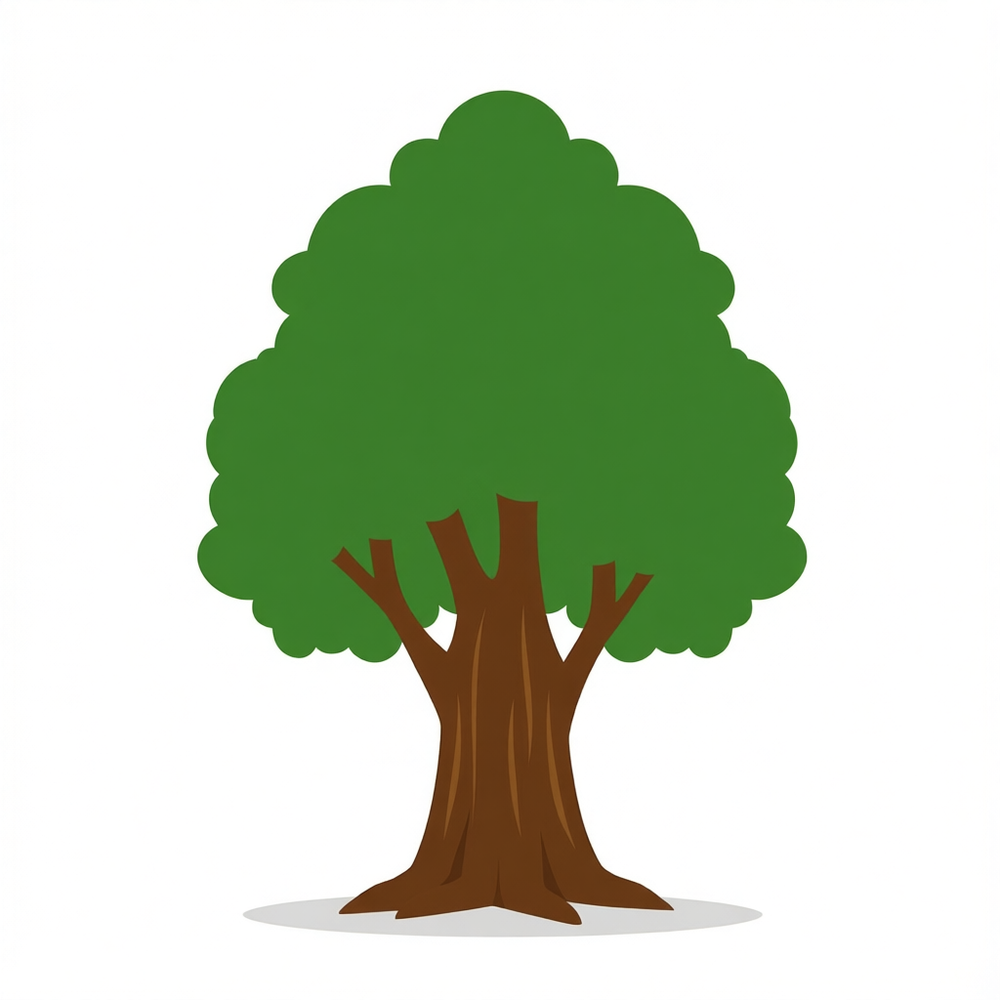
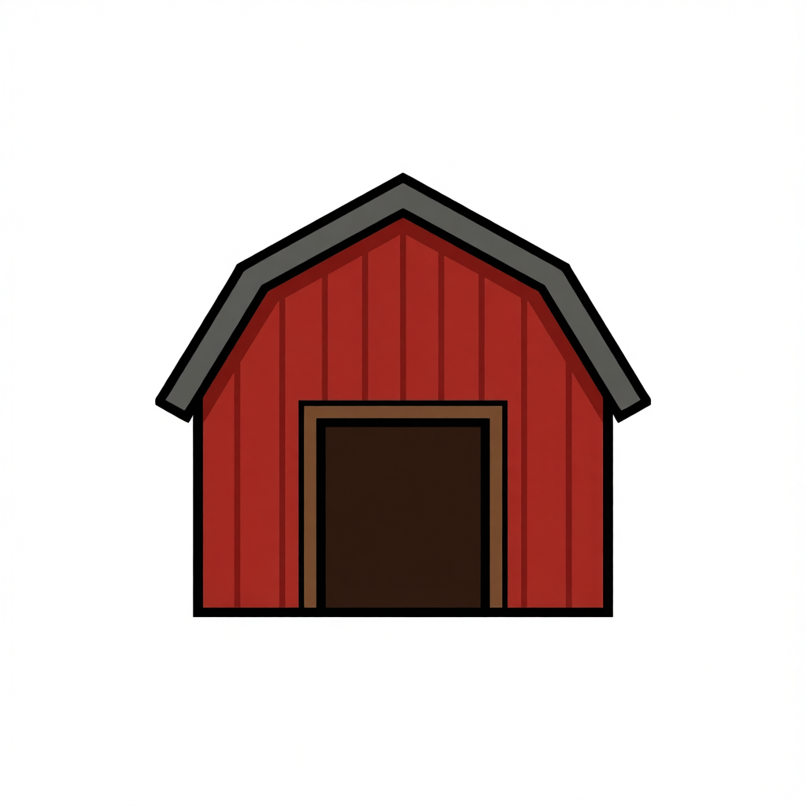
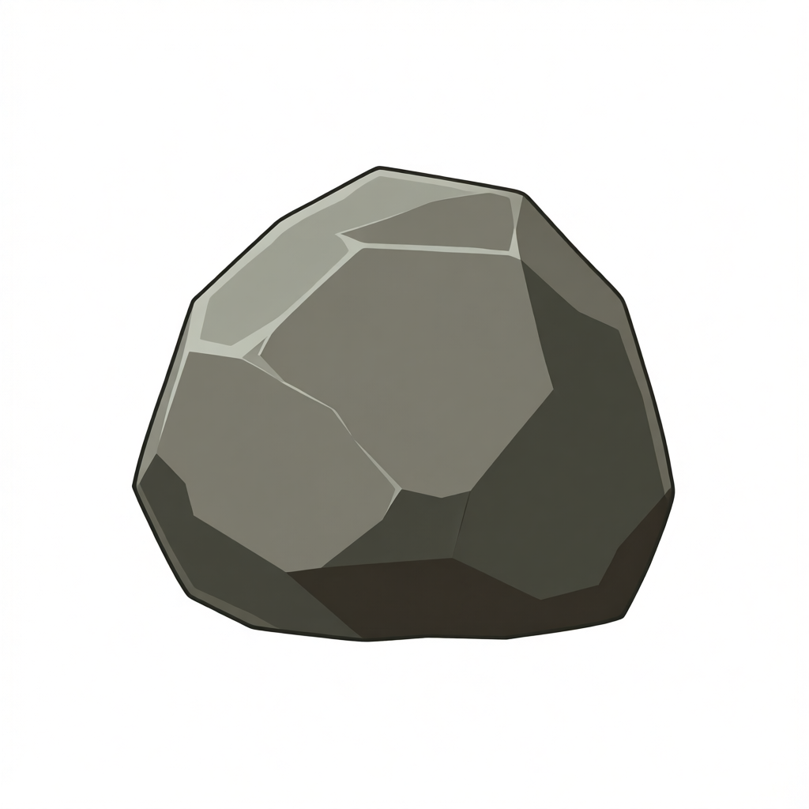

# 오브젝트

[전체 카탈로그로 돌아가기](../README.md)

| 미리보기 | 에셋 | 크기 · 생성 ID |
| --- | --- | --- |
|  | 과실수 | 1024x1024 `OBJECT-20260804114401-03546d1f` |
|  | 농가 | 1024x1024 `OBJECT-20260804110755-f901f610` |
|  | 상자 | 1024x1024 `OBJECT-20260804111600-3c28ddec` |
|  | 온실 | 1024x1024 `OBJECT-20260804111300-303b7d82` |
|  | 용광로 | 1024x1024 `OBJECT-20260804111811-4abecd1d` |
|  | 일반 나무 | 1024x1024 `OBJECT-20260804110124-e77f6461` |
|  | 축사 | 1024x1024 `OBJECT-20260804114751-e17deaa6` |
|  | 큰 바위 | 1024x1024 `OBJECT-20260804104632-eb19e8d2` |
|  | 허수아비 | 1024x1024 `OBJECT-20260804114555-f6282de4` |
